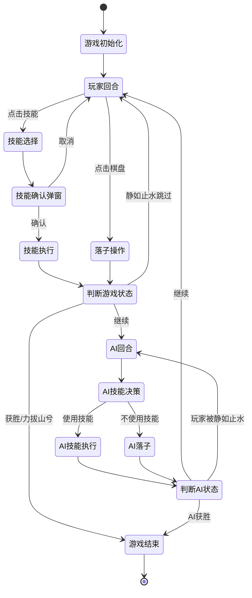
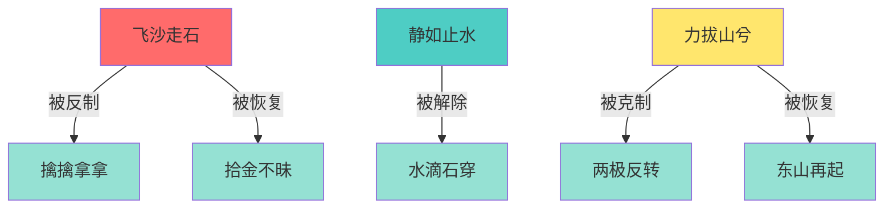
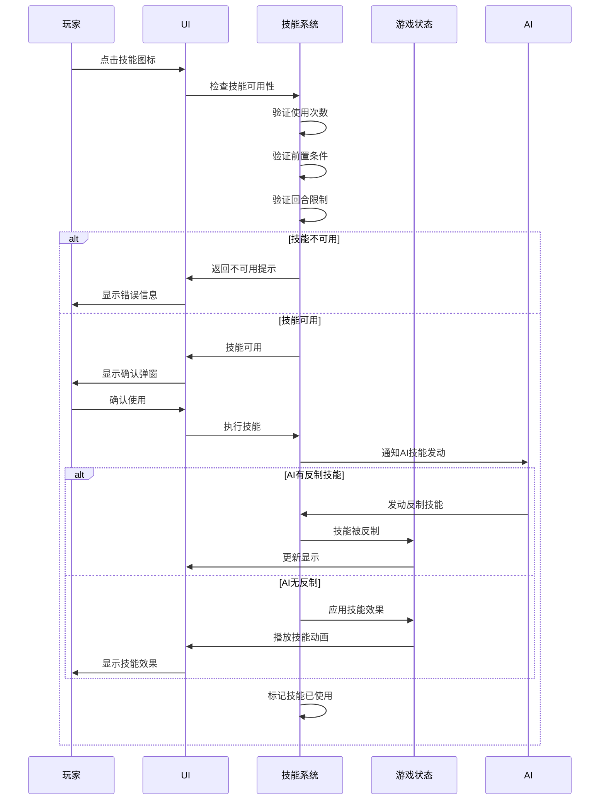
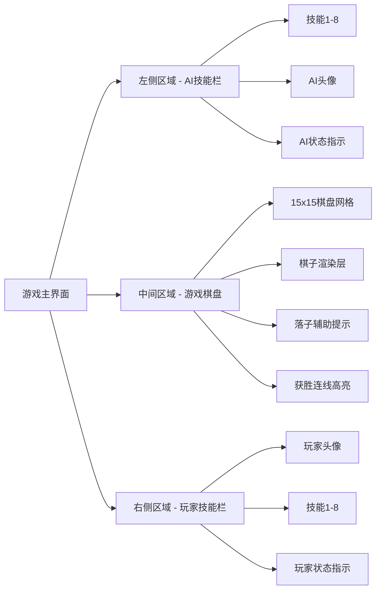
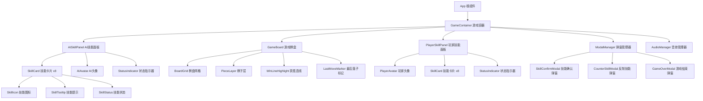
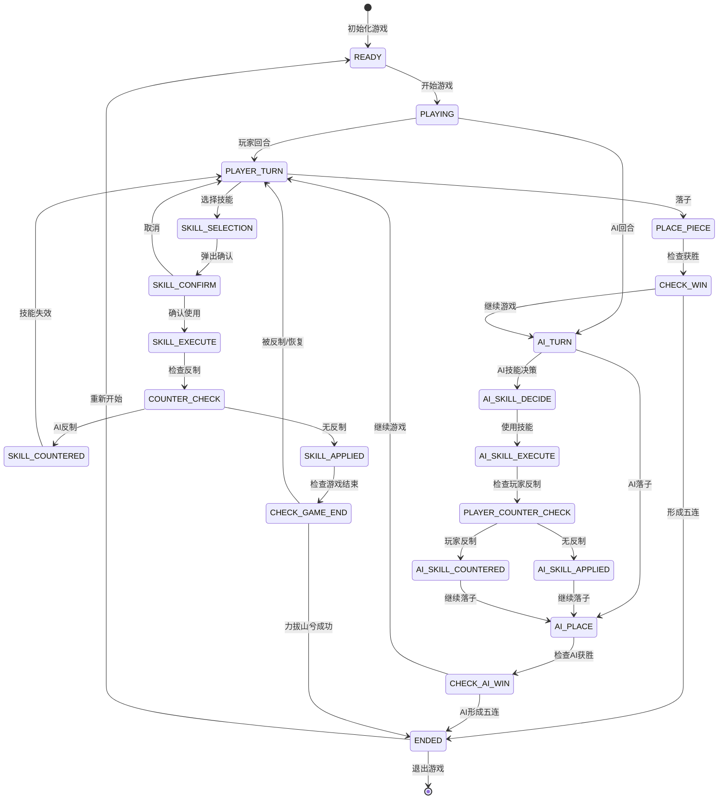
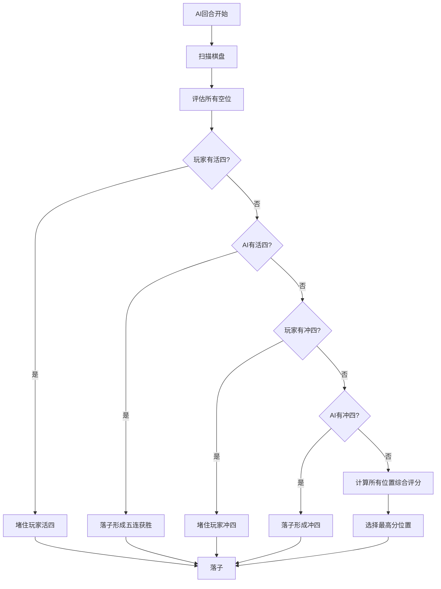
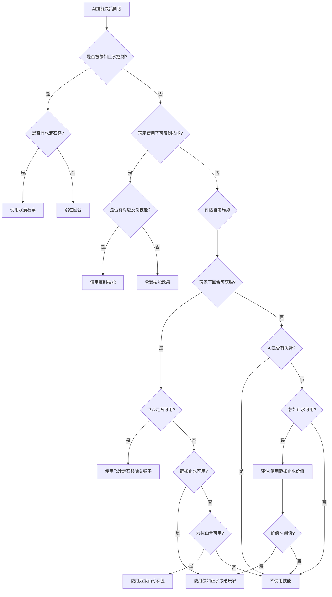

# 技能五子棋游戏设计文档

## 1. 概述

### 1.1 项目简介
《技能五子棋》是一款创新的网页五子棋游戏,在传统五子棋规则基础上引入了独特的技能系统,为游戏增添了策略性和趣味性。玩家可以通过使用各种技能来扭转战局,带来全新的游戏体验。

### 1.2 核心特性
- 15x15标准棋盘的五子棋对战
- 人机对战模式
- 8种独特技能系统,带有克制和联动关系
- 像素风格UI设计
- 技能动画与音效反馈

### 1.3 技术栈
- 前端框架: React
- 状态管理: React Hooks (useState, useEffect, useReducer)
- 样式方案: CSS Modules + 像素风格设计
- 动画库: CSS Animations + React Transition Group
- 音效处理: Web Audio API / Howler.js

## 2. 游戏规则设计

### 2.1 基础规则
- 棋盘规格: 15x15交叉点
- 对战模式: 玩家(黑子) vs AI(白子)
- 获胜条件: 横、竖、斜任一方向形成五子连线
- 落子规则: 棋子放置在交叉点上,黑子先行

### 2.2 游戏流程

## 3. 技能系统设计

### 3.1 技能定义表

| 技能ID | 技能名称 | 技能类型 | 使用次数 | 技能效果 | 触发时机 | 目标对象 |
|--------|---------|---------|---------|---------|---------|---------|
| SKILL_01 | 飞沙走石 | 进攻型 | 1次/局 | 移除对手棋盘上一颗棋子 | 回合开始时 | 对手任意棋子 |
| SKILL_02 | 拾金不昧 | 防御型 | 1次/局 | 恢复被【飞沙走石】移除的棋子 | 对手使用飞沙走石后 | 被移除的棋子 |
| SKILL_03 | 擒擒拿拿 | 反制型 | 1次/局 | 阻止【飞沙走石】生效 | 对手使用飞沙走石时 | 对手技能 |
| SKILL_04 | 静如止水 | 控制型 | 1次/局 | 使对手本回合+下回合无法行动 | 回合开始时 | 对手 |
| SKILL_05 | 水滴石穿 | 解控型 | 1次/局 | 解除【静如止水】效果 | 被静如止水控制时 | 自己 |
| SKILL_06 | 力拔山兮 | 终结型 | 1次/局 | 摔坏棋盘,直接获胜 | 回合开始时 | 游戏状态 |
| SKILL_07 | 两极反转 | 克制型 | 1次/局 | 阻止【力拔山兮】生效 | 对手使用力拔山兮时 | 对手技能 |
| SKILL_08 | 东山再起 | 复活型 | 1次/局 | 恢复被【力拔山兮】摔坏的棋盘 | 对手力拔山兮成功后 | 游戏状态 |

### 3.2 技能使用约束

**全局约束:**
- 每个技能在单局游戏中仅可使用一次
- 每回合只能发动一个技能
- 使用技能不消耗落子机会(技能发动后仍需落子)

**技能链条件约束:**

**条件触发技能:**
| 技能 | 前置条件 | 可用时机 |
|------|---------|---------|
| 拾金不昧 | 己方棋子被【飞沙走石】移除 | 对手发动飞沙走石后立即可用 |
| 擒擒拿拿 | 对手即将使用【飞沙走石】 | 对手选择飞沙走石并确认时 |
| 水滴石穿 | 己方被【静如止水】控制 | 被控制的回合中 |
| 两极反转 | 对手即将使用【力拔山兮】 | 对手选择力拔山兮并确认时 |
| 东山再起 | 对手【力拔山兮】成功触发败局 | 力拔山兮生效后立即弹窗选择 |

### 3.3 技能执行逻辑

**技能执行流程:**

## 4. 界面架构设计

### 4.1 整体布局

**布局结构:**

**布局比例:**
- 左侧AI技能栏: 20%宽度
- 中间棋盘区域: 60%宽度
- 右侧玩家技能栏: 20%宽度

### 4.2 技能栏设计

**技能卡片状态:**

| 状态 | 视觉表现 | 交互反馈 |
|------|---------|---------|
| 可用 | 正常亮度,彩色图标 | hover显示技能说明,可点击 |
| 不可用(条件未满足) | 置灰50%透明度,图标变暗 | hover显示不可用原因,禁用点击 |
| 已使用 | 置灰70%透明度,添加"已使用"标记 | hover显示"已使用",禁用点击 |
| 冷却中 | 半透明,显示倒计时动画 | hover显示剩余回合数 |
| 可反制 | 边框高亮闪烁,橙色提示 | hover显示"可反制对手技能" |

**技能说明提示框:**
- 触发方式: 鼠标悬停
- 显示内容: 技能名称 + 技能效果描述 + 使用条件
- 位置: 技能图标右侧/左侧(根据所在区域)
- 样式: 像素风对话框,黑色背景+白色像素字体

### 4.3 棋盘设计

**棋盘组成元素:**
- 15x15网格线(像素风格细线)
- 交叉点标记(5个天元标记点)
- 棋子渲染(黑白双色像素圆形)
- 最后落子标记(红色方框闪烁)
- 获胜连线高亮(金色粗线)

**交互反馈:**
- hover交叉点时显示半透明预览棋子
- 点击时播放落子动画
- 非法位置点击显示抖动动画

### 4.4 弹窗系统

**技能确认弹窗:**
- 标题: "使用技能: [技能名称]"
- 内容: 技能效果描述
- 操作按钮: "确认" / "取消"
- 关闭方式: 点击按钮或按ESC键

**游戏结束弹窗:**
- 显示内容: 胜负结果 + 获胜方式
- 操作按钮: "重新开始" / "返回主页"

**反制技能弹窗:**
- 触发时机: 对手发动可被反制的技能时
- 显示内容: "对手使用了[技能名],是否使用[反制技能]反制?"
- 倒计时: 3秒自动关闭(不反制)
- 操作: "立即反制" / "放弃"

## 5. 组件架构设计

### 5.1 组件层次结构

### 5.2 核心组件定义

**GameContainer - 游戏容器组件**
- 职责: 管理游戏全局状态,协调各子组件
- 管理状态:
  - 棋盘状态(15x15二维数组)
  - 当前回合(玩家/AI)
  - 技能使用记录
  - 游戏阶段(进行中/已结束)
  - 控制效果状态(静如止水等)
- 对外接口: 
  - 落子操作接口
  - 技能触发接口
  - 游戏重置接口

**GameBoard - 游戏棋盘组件**
- 职责: 渲染棋盘,处理落子交互
- 接收属性:
  - 棋盘状态数组
  - 当前回合
  - 落子回调函数
  - 获胜连线坐标
- 内部状态:
  - hover位置
  - 动画播放状态

**SkillPanel - 技能面板组件**
- 职责: 展示技能列表,处理技能点击
- 接收属性:
  - 所属玩家(AI/玩家)
  - 技能列表配置
  - 技能状态映射
  - 技能点击回调
- 渲染逻辑:
  - 根据技能状态应用不同样式
  - 显示/隐藏技能提示

**SkillCard - 技能卡片组件**
- 职责: 单个技能的展示与交互
- 接收属性:
  - 技能数据(ID,名称,描述,图标)
  - 技能状态(可用/不可用/已使用/可反制)
  - 点击回调
- 状态表现:
  - 根据状态改变透明度和颜色
  - hover时显示SkillTooltip
  - 可反制状态播放闪烁动画

**ModalManager - 弹窗管理器组件**
- 职责: 统一管理所有弹窗的显示与隐藏
- 管理弹窗类型:
  - 技能确认弹窗
  - 反制技能弹窗
  - 游戏结束弹窗
- 管理状态:
  - 当前活动弹窗类型
  - 弹窗数据(技能信息等)
  - 弹窗回调函数

## 6. 状态管理设计

### 6.1 游戏状态模型

**核心状态结构:**

| 状态字段 | 数据类型 | 说明 |
|---------|---------|------|
| boardState | Array[15][15] | 棋盘状态,0=空,1=黑子,2=白子 |
| currentPlayer | Enum | 当前回合玩家: PLAYER / AI |
| gamePhase | Enum | 游戏阶段: READY / PLAYING / PAUSED / ENDED |
| winner | Enum | 获胜方: null / PLAYER / AI / DRAW |
| moveHistory | Array | 落子历史记录 [{x, y, player, turn}] |
| skillStates | Object | 技能状态映射表 |
| effectStates | Object | 效果状态(冻结回合数等) |
| turnCount | Number | 当前回合数 |

**技能状态结构:**

| 字段 | 类型 | 说明 |
|------|------|------|
| skillId | String | 技能唯一标识 |
| owner | Enum | 所属方: PLAYER / AI |
| isUsed | Boolean | 是否已使用 |
| isAvailable | Boolean | 是否当前可用 |
| canCounter | Boolean | 是否可反制当前技能 |
| usedAtTurn | Number | 在哪个回合使用(null表示未使用) |

**效果状态结构:**

| 字段 | 类型 | 说明 |
|------|------|------|
| frozenPlayer | Enum | 被冻结玩家: null / PLAYER / AI |
| frozenTurnsLeft | Number | 剩余冻结回合数 |
| removedPieces | Array | 被移除棋子记录 [{x, y, player, removedAtTurn}] |
| boardBroken | Boolean | 棋盘是否被摔坏 |

### 6.2 状态转换流程

### 6.3 状态更新操作

**落子操作:**
- 输入: {x, y, player}
- 前置校验: 位置是否为空,是否该玩家回合,玩家是否被冻结
- 状态更新: 
  - 更新boardState[x][y]
  - 添加moveHistory记录
  - 切换currentPlayer
  - turnCount +1
- 后续检查: 检查是否获胜

**技能使用操作:**
- 输入: {skillId, targetData}
- 前置校验: 技能是否可用,条件是否满足,是否已使用
- 状态更新:
  - 标记skillStates[skillId].isUsed = true
  - 记录usedAtTurn
  - 应用技能效果到effectStates或boardState
- 反制检查: 触发对手反制技能检查流程

**反制技能操作:**
- 输入: {counterSkillId, targetSkillId}
- 前置校验: 反制技能可用,目标技能可被反制
- 状态更新:
  - 标记counterSkillId已使用
  - 撤销targetSkillId的效果
  - 更新技能状态

## 7. AI决策系统设计

### 7.1 AI难度等级

本版本实现中等难度AI,具备基础五子棋算法和技能使用策略。

**AI能力定义:**
- 识别玩家威胁(连三、连四)
- 寻找自身最佳落子点
- 评估技能使用时机
- 优先级: 防守 > 进攻 > 发展

### 7.2 落子决策算法

**评分系统:**

| 棋型 | 评分 | 说明 |
|------|------|------|
| 活四 | 100000 | 两端未堵,下一步必胜 |
| 冲四 | 10000 | 一端被堵,需连续进攻 |
| 活三 | 5000 | 两端未堵,可形成活四 |
| 眠三 | 1000 | 一端被堵 |
| 活二 | 500 | 两端未堵 |
| 眠二 | 100 | 一端被堵 |
| 单子 | 10 | 孤立棋子 |

**决策流程:**

### 7.3 技能使用策略

**技能优先级决策表:**

| 场景 | 优先使用技能 | 触发条件 | 优先级 |
|------|------------|---------|--------|
| 玩家即将获胜 | 飞沙走石 | 玩家有活四或即将五连 | 最高 |
| 玩家威胁过大 | 静如止水 | 玩家有多个活三 | 高 |
| 绝境反转 | 力拔山兮 | AI无法防守且玩家下回合获胜 | 高 |
| 玩家使用力拔山兮 | 两极反转 | 玩家触发力拔山兮 | 最高(反制) |
| 玩家使用飞沙走石 | 擒擒拿拿 | 玩家移除AI关键棋子 | 高(反制) |
| 被静如止水控制 | 水滴石穿 | AI被冻结且玩家有威胁 | 中 |

**技能决策流程:**

## 8. 动画效果设计

### 8.1 技能动画效果表

| 技能 | 动画效果描述 | 持续时间 | 视觉元素 |
|------|------------|---------|---------|
| 飞沙走石 | 目标棋子旋转缩小消失,沙尘粒子飞散 | 1.2秒 | 旋转+缩放+粒子效果 |
| 拾金不昧 | 金色光芒从天而降,棋子淡入放大 | 1.0秒 | 光效+淡入+缩放 |
| 擒擒拿拿 | 蓝色护盾从棋子位置展开,弹开沙尘 | 0.8秒 | 护盾扩散+震动 |
| 静如止水 | 冰蓝色波纹扩散,对手区域冻结特效 | 1.5秒 | 波纹+冰冻效果 |
| 水滴石穿 | 水滴落下击碎冰层,解冻光效 | 1.0秒 | 水滴+破碎+光效 |
| 力拔山兮 | 棋盘剧烈震动,裂纹扩散,碎片飞溅 | 2.0秒 | 震动+裂纹+碎片 |
| 两极反转 | 照片闪现,红色禁止符号,力拔山兮动画倒放 | 1.5秒 | 图片闪现+禁止符+倒放 |
| 东山再起 | 时光倒流特效,碎片回飞,棋盘复原 | 2.0秒 | 时间倒流+粒子回溯 |

### 8.2 通用动画

**落子动画:**
- 棋子从上方落下,带有下落轨迹
- 接触棋盘时产生小幅震动
- 棋子轻微弹跳后静止
- 持续时间: 0.5秒

**获胜动画:**
- 获胜的五颗棋子依次闪烁
- 金色连线从第一颗延伸到第五颗
- 背景烟花效果
- 持续时间: 3.0秒

**按钮交互动画:**
- hover时轻微放大(105%)
- 点击时缩小(95%)并震动
- 过渡时间: 0.2秒

### 8.3 动画实现策略

**CSS动画:**
- 用于简单的过渡效果(hover,点击反馈)
- 使用CSS keyframes实现循环动画(闪烁,呼吸灯)

**React Transition组件:**
- 管理组件挂载/卸载动画(弹窗出现/消失)
- 控制技能效果的进入/退出

**Canvas粒子系统:**
- 实现粒子飞散效果(飞沙走石,碎片)
- 光效渲染(拾金不昧,水滴石穿)

## 9. 音效设计

### 9.1 音效资源表

| 音效类型 | 触发时机 | 音效特征 | 格式 |
|---------|---------|---------|------|
| 落子音效 | 玩家/AI落子时 | 清脆的敲击声 | MP3/OGG |
| 技能触发音效 | 各技能使用时(每个技能独特音效) | 对应技能特性的音效 | MP3/OGG |
| 反制音效 | 反制技能成功时 | 金属碰撞+回响 | MP3/OGG |
| 胜利音效 | 获胜时 | 欢快的胜利号角 | MP3/OGG |
| 失败音效 | 失败时 | 低沉的失败音效 | MP3/OGG |
| UI点击音效 | 按钮点击时 | 轻快的咔哒声 | MP3/OGG |
| 警告音效 | 不可用操作时 | 短促的错误提示音 | MP3/OGG |

### 9.2 技能专属音效

| 技能 | 音效描述 |
|------|---------|
| 飞沙走石 | 风沙呼啸声 + 棋子飞出音效 |
| 拾金不昧 | 天使光环音效 + 清脆回响 |
| 擒擒拿拿 | 护盾展开音效 + 能量脉冲 |
| 静如止水 | 冰冻音效 + 时间停滞感 |
| 水滴石穿 | 水滴声 + 冰块破碎声 |
| 力拔山兮 | 地震轰鸣 + 棋盘碎裂声 |
| 两极反转 | 照片快门声 + 禁止警报 |
| 东山再起 | 时光倒流音效 + 修复声 |

### 9.3 音效管理策略

**音效预加载:**
- 游戏初始化时预加载所有音效资源
- 使用音频雪碧图(Audio Sprite)减少请求数
- 压缩音频文件大小(目标<50KB/文件)

**音效播放控制:**
- 支持音效开关
- 音量调节(0-100%)
- 同时播放音效数量限制(最多3个)
- 相同音效短时间内不重复触发(防止重叠)

**音效优先级:**
- 高优先级: 技能音效,获胜/失败音效
- 中优先级: 落子音效,反制音效
- 低优先级: UI点击音效

## 10. 测试策略

### 10.1 功能测试用例

**基础五子棋功能测试:**

| 测试场景 | 测试步骤 | 预期结果 |
|---------|---------|---------|
| 落子功能 | 点击空交叉点 | 棋子正确放置,切换回合 |
| 重复落子阻止 | 点击已有棋子位置 | 无响应,显示提示 |
| 横向五连获胜 | 形成横向五子 | 检测获胜,显示获胜动画 |
| 竖向五连获胜 | 形成竖向五子 | 检测获胜,显示获胜动画 |
| 斜向五连获胜 | 形成斜向五子 | 检测获胜,显示获胜动画 |
| AI落子 | 玩家落子后 | AI在合理位置落子 |

**技能系统测试:**

| 测试场景 | 测试步骤 | 预期结果 |
|---------|---------|---------|
| 飞沙走石 | 使用技能移除对手棋子 | 棋子被移除,播放动画 |
| 技能使用限制 | 同一技能使用两次 | 第二次禁用,显示已使用 |
| 回合技能限制 | 同回合使用两个技能 | 第二个技能禁用 |
| 拾金不昧反制 | 对手飞沙走石后使用 | 棋子恢复到原位 |
| 擒擒拿拿反制 | 对手飞沙走石时使用 | 技能被阻止,棋子未移除 |
| 静如止水效果 | 使用后两回合 | 对手无法落子,第三回合恢复 |
| 水滴石穿解控 | 被静如止水时使用 | 立即恢复行动能力 |
| 力拔山兮获胜 | 使用力拔山兮 | 触发获胜判定 |
| 两极反转克制 | 对手力拔山兮时使用 | 技能失效,游戏继续 |
| 东山再起恢复 | 对手力拔山兮成功后使用 | 棋盘恢复,游戏继续 |

**AI决策测试:**

| 测试场景 | 测试步骤 | 预期结果 |
|---------|---------|---------|
| AI防守活四 | 玩家形成活四 | AI堵住活四位置 |
| AI进攻获胜 | AI有活四机会 | AI落子形成五连 |
| AI使用飞沙走石 | 玩家即将获胜 | AI移除关键棋子 |
| AI反制力拔山兮 | 玩家使用力拔山兮 | AI使用两极反转 |

### 10.2 边界测试

**边界条件测试:**
- 棋盘满子未分胜负(和棋判定)
- 第一回合使用技能
- 最后一颗棋子落下获胜
- 技能效果叠加(多个效果同时生效)
- 快速连续点击(防抖测试)

### 10.3 兼容性测试

**浏览器兼容性:**
- Chrome (最新版及前两个版本)
- Firefox (最新版及前两个版本)
- Safari (最新版)
- Edge (最新版)

**响应式测试:**
- 桌面端: 1920x1080, 1366x768
- 平板端: 1024x768
- 手机端: 375x667 (可选)

**性能测试:**
- 页面加载时间 < 2秒
- 落子响应时间 < 100ms
- 技能动画流畅度 >= 60fps
- 内存占用 < 100MB
