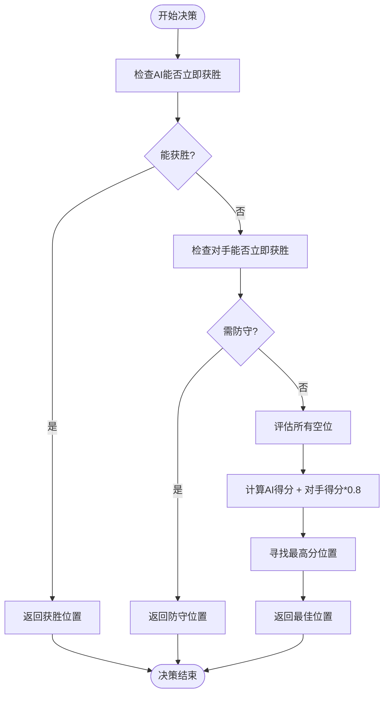
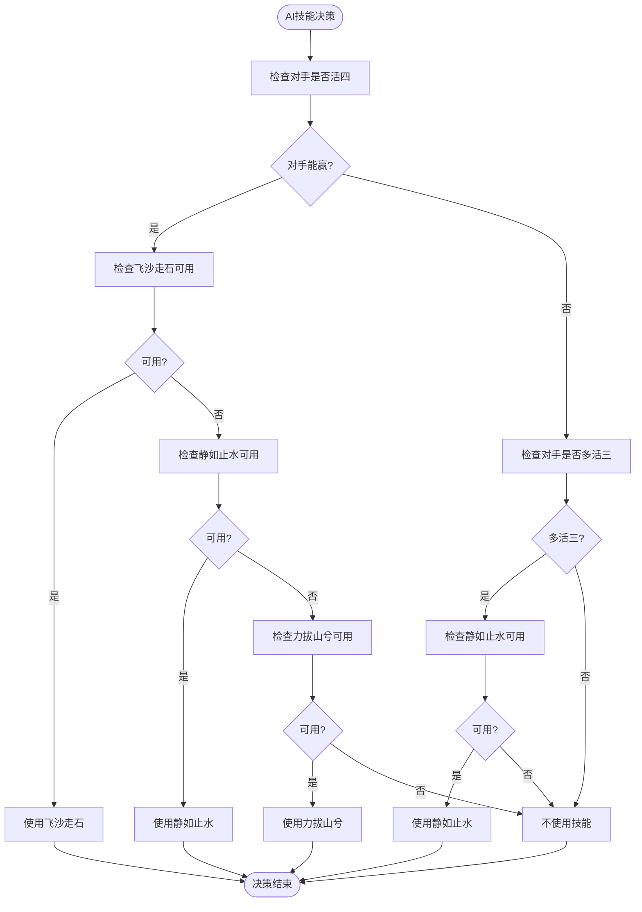
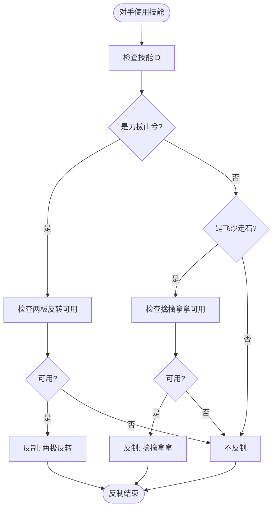
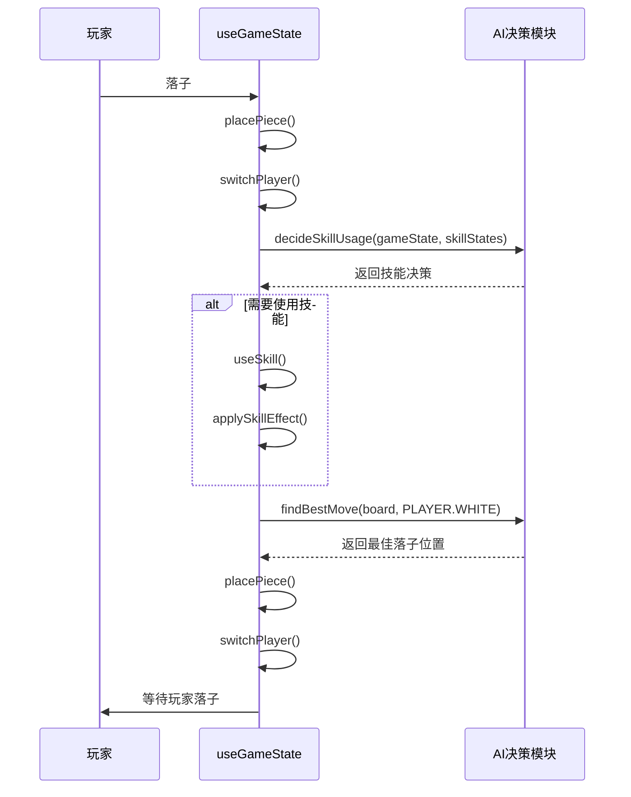

# AI决策系统

<cite>
**本文档中引用的文件**  
- [aiUtils.js](file://src/utils/aiUtils.js)
- [useGameState.js](file://src/hooks/useGameState.js)
- [gameConstants.js](file://src/constants/gameConstants.js)
- [gameUtils.js](file://src/utils/gameUtils.js)
</cite>

## 目录
1. [简介](#简介)
2. [AI落子决策机制](#ai落子决策机制)
3. [AI技能使用决策逻辑](#ai技能使用决策逻辑)
4. [AI反制技能决策逻辑](#ai反制技能决策逻辑)
5. [AI行为在游戏循环中的集成](#ai行为在游戏循环中的集成)
6. [AI难度评估与优化建议](#ai难度评估与优化建议)

## 简介
本文档深入解析五子棋游戏中AI对手的智能决策机制。重点分析`aiUtils.js`中实现的核心AI算法，包括落子评估函数、棋局评分策略、技能使用与反制时机判断逻辑。通过结合`useGameState`中的游戏状态流转，展示AI如何在回合中做出最优决策。同时评估当前AI的智能水平，并提出可改进方向，为后续优化提供参考。

## AI落子决策机制

AI的落子决策由`findBestMove`函数主导，采用启发式评估与威胁优先级判断相结合的策略。该函数综合考虑进攻与防守因素，通过评估每个空位对AI自身和对手的潜在价值，选择最优落子位置。

### 落子评估函数与棋局评分策略

AI使用`evaluatePosition`函数对棋盘上的每个空位进行评分。该函数基于预定义的棋型评分表`PATTERN_SCORE`，识别并量化不同棋型的价值，如活四、冲四、活三等。评分策略遵循以下原则：

- **立即获胜优先**：若某落子能直接形成五连，则立即选择该位置。
- **防守优先级**：若对手存在立即获胜的可能（活四），则优先防守该位置。
- **综合评分机制**：对于一般情况，计算AI自身在该位置的得分与对手在该位置的得分（乘以0.8的防守权重），取总分最高的位置作为最佳落子点。

**图示来源**
- [aiUtils.js](file://src/utils/aiUtils.js#L17-L63)
- [gameUtils.js](file://src/utils/gameUtils.js#L145-L222)

**本节来源**
- [aiUtils.js](file://src/utils/aiUtils.js#L17-L63)
- [gameUtils.js](file://src/utils/gameUtils.js#L145-L222)
- [gameConstants.js](file://src/constants/gameConstants.js#L146-L155)

## AI技能使用决策逻辑

AI的技能使用决策由`decideSkillUsage`函数实现，采用基于威胁等级的优先级判断机制。AI会根据当前棋盘状态和对手的潜在威胁，决定是否使用技能以及使用何种技能。

### 技能使用时机判断逻辑

AI技能决策遵循以下优先级顺序：

1.  **应对对手获胜威胁**：当检测到对手有活四（`findAliveFour`）时：
    *   优先使用“飞沙走石”移除对手的关键棋子，通过`findMostCriticalPiece`函数评估棋子的重要性。
    *   若无法移除，则使用“静如止水”冻结对手（前提是对手未被冻结）。
    *   作为最后手段，使用“力拔山兮”直接获胜。
2.  **应对对手多重威胁**：当检测到对手拥有多个活三（`hasMultipleAliveThree`）时，视为重大威胁，使用“静如止水”冻结对手（前提是对手未被冻结）。
3.  **无紧急威胁**：不使用任何技能。

**图示来源**
- [aiUtils.js](file://src/utils/aiUtils.js#L115-L173)
- [aiUtils.js](file://src/utils/aiUtils.js#L71-L83)
- [aiUtils.js](file://src/utils/aiUtils.js#L91-L107)

**本节来源**
- [aiUtils.js](file://src/utils/aiUtils.js#L115-L173)
- [aiUtils.js](file://src/utils/aiUtils.js#L71-L83)
- [aiUtils.js](file://src/utils/aiUtils.js#L91-L107)
- [aiUtils.js](file://src/utils/aiUtils.js#L181-L207)
- [aiUtils.js](file://src/utils/aiUtils.js#L217-L247)

## AI反制技能决策逻辑

当对手使用技能时，AI会通过`decideCounterSkill`函数决定是否进行反制。该决策逻辑简单而直接，主要基于技能的克制关系。

### 反制逻辑的优先级判断过程

AI的反制逻辑遵循以下规则：

-   **必须反制**：“力拔山兮”是终结技，必须被“两极反转”反制，否则AI将直接失败。因此，只要“两极反转”可用，AI必定反制。
-   **条件反制**：“飞沙走石”可以被“擒擒拿拿”反制。当前实现中，AI采取简化策略，即只要“擒擒拿拿”可用，就总是选择反制。

**图示来源**
- [aiUtils.js](file://src/utils/aiUtils.js#L256-L274)

**本节来源**
- [aiUtils.js](file://src/utils/aiUtils.js#L256-L274)

## AI行为在游戏循环中的集成

AI的决策行为被无缝集成到整体游戏循环中，通过`useGameState` Hook 进行协调。AI的回合由`switchPlayer`动作触发，其决策流程如下：

1.  **回合切换**：当`switchPlayer`被调用时，如果当前玩家是AI（`PLAYER.WHITE`），则进入AI回合。
2.  **技能决策**：首先调用`decideSkillUsage`，根据当前`gameState`和`skillStates`决定是否使用技能。
3.  **执行技能**：如果决定使用技能，则调用`useSkill`动作，触发相应的技能效果。
4.  **落子决策**：如果未使用技能或技能执行完毕，调用`findBestMove`计算最佳落子位置。
5.  **执行落子**：调用`placePiece`动作，在计算出的位置放置棋子。
6.  **切换回玩家**：落子完成后，再次调用`switchPlayer`，将回合交还给玩家。

此流程确保了AI的行为与游戏状态机紧密结合，所有决策和动作都通过统一的`dispatch`机制进行，保证了状态的一致性和可预测性。

**图示来源**
- [useGameState.js](file://src/hooks/useGameState.js#L493-L541)
- [aiUtils.js](file://src/utils/aiUtils.js#L17-L63)
- [aiUtils.js](file://src/utils/aiUtils.js#L115-L173)

**本节来源**
- [useGameState.js](file://src/hooks/useGameState.js#L493-L541)
- [aiUtils.js](file://src/utils/aiUtils.js#L17-L63)
- [aiUtils.js](file://src/utils/aiUtils.js#L115-L173)

## AI难度评估与优化建议

### 当前AI难度水平

当前AI实现了基础的五子棋AI逻辑，具备以下能力：
- **基础攻防**：能识别并完成“五连”获胜，以及防守对手的“活四”。
- **模式识别**：能评估“活三”、“眠三”等棋型，并据此评分。
- **技能运用**：能根据威胁等级合理使用“飞沙走石”、“静如止水”等技能。

然而，其难度水平仍处于中等偏下，主要体现在：
- **评估函数简单**：仅评估单个落子点，未进行多步深度搜索（如Minimax算法），缺乏对后续几步的预判。
-   **技能决策保守**：反制逻辑简单，且未考虑技能使用的时机成本和长期策略。
-   **缺乏学习能力**：决策规则完全硬编码，无法根据玩家习惯进行调整。

### 可改进方向

1.  **引入深度搜索算法**：采用Minimax或Alpha-Beta剪枝算法，结合更深的评估函数，使AI能预判多步之后的棋局，显著提升决策质量。
2.  **优化评估函数**：将评估范围从单点扩展到全局，考虑棋子的连接性、潜在发展区域等更复杂的因素。
3.  **增强技能策略**：实现更复杂的技能决策树，例如在非紧急情况下保留“静如止水”用于关键时刻，或根据对手技能CD时间进行预判。
4.  **增加难度等级**：通过调整搜索深度、评估函数权重或技能使用概率，实现Easy、Medium、Hard等不同难度级别。

**本节来源**
- [aiUtils.js](file://src/utils/aiUtils.js)
- [useGameState.js](file://src/hooks/useGameState.js)