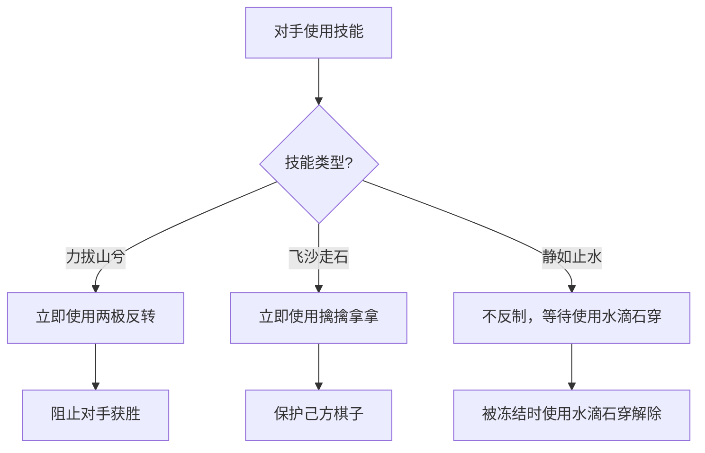

# AI技能决策与反制

<cite>
**Referenced Files in This Document**   
- [aiUtils.js](file://src/utils/aiUtils.js)
- [useGameState.js](file://src/hooks/useGameState.js)
- [gameConstants.js](file://src/constants/gameConstants.js)
- [SKILL_RELATIONSHIPS.md](file://SKILL_RELATIONSHIPS.md)
- [FIX_SKILL_COUNTER_LOGIC.md](file://FIX_SKILL_COUNTER_LOGIC.md)
- [FIX_DOUBLE_FREEZE_BUG.md](file://FIX_DOUBLE_FREEZE_BUG.md)
</cite>

## 目录
1. [AI技能决策机制](#ai技能决策机制)
2. [技能使用条件判定逻辑](#技能使用条件判定逻辑)
3. [技能反制优先级判断流程](#技能反制优先级判断流程)
4. [基于游戏状态的最优响应](#基于游戏状态的最优响应)
5. [实际决策路径示例](#实际决策路径示例)
6. [当前AI技能策略的局限性与改进方向](#当前ai技能策略的局限性与改进方向)

## AI技能决策机制

AI的技能决策系统由`aiUtils.js`中的`decideSkillUsage`函数驱动，该函数根据当前游戏状态和技能冷却时间，评估并选择最优技能。决策过程遵循严格的优先级顺序，确保AI在关键时刻做出最有利的反应。AI决策不仅考虑直接的攻防需求，还综合评估对手的潜在威胁，体现了多层次的智能判断。

**Section sources**
- [aiUtils.js](file://src/utils/aiUtils.js#L115-L173)

## 技能使用条件判定逻辑

AI技能的使用基于对游戏局势的深度分析，主要围绕两个核心威胁：对手的直接获胜威胁和潜在的多重威胁。

### 何时使用‘飞沙走石’移除关键棋子

当AI检测到对手存在“活四”（即下一步即可获胜）时，会优先考虑使用“飞沙走石”来移除对手的关键棋子。这一决策通过`findAliveFour`函数实现，该函数遍历所有空位，模拟对手落子，检查是否能形成五连。一旦确认对手有获胜点，AI会立即启动移除程序。

移除目标的选择并非随机，而是通过`findMostCriticalPiece`函数进行智能判定。该函数的评估逻辑如下：
1.  **威胁消除优先**：遍历对手的所有棋子，临时移除每一颗，然后再次调用`findAliveFour`。如果移除某颗棋子后，对手的获胜威胁消失，则该棋子被认定为“关键棋子”，并立即被选为目标。
2.  **重要性评分次之**：如果移除任何单颗棋子都无法消除获胜威胁，则进入评分阶段。函数会评估每颗棋子被移除后，其周围空位对对手的“活三”、“活四”等威胁模式的贡献度，选择贡献度最高的棋子作为目标。

此逻辑确保了AI的移除行为既能精准打断对手的致命一击，也能在无法完全防守时，最大程度地削弱对手的攻势。

### 何时触发‘力拔山兮’尝试直接获胜

“力拔山兮”是AI的终极手段，其触发条件非常严格。根据代码逻辑，AI仅在以下情况下才会使用此技能：
- **绝境反扑**：当对手即将获胜（存在“活四”），且AI没有可用的“飞沙走石”或“静如止水”技能进行防守时，AI会使用“力拔山兮”强行结束游戏，试图通过摔坏棋盘来获得胜利。

这表明AI将“力拔山兮”视为一种高风险的翻盘策略，而非常规的进攻手段。

### 何时使用‘静如止水’进行控制

“静如止水”的使用条件经过了精心设计，以避免与对手形成“双冻结”的僵局。AI在决定使用此技能时，会进行双重检查：
1.  **对手未被冻结**：通过检查`effectStates.frozenPlayer`，确保对手当前未被冻结。
2.  **存在重大威胁**：满足以下任一条件：
    - **对手即将获胜**：检测到对手存在“活四”。
    - **对手拥有双活三**：通过`hasMultipleAliveThree`函数检测，对手能在下一步同时形成两个“活三”，这将使AI无法同时防守。

这种策略使AI能够在防守压力巨大时，通过冻结对手来争取宝贵的喘息和布局时间。

**Section sources**
- [aiUtils.js](file://src/utils/aiUtils.js#L71-L83)
- [aiUtils.js](file://src/utils/aiUtils.js#L91-L107)
- [aiUtils.js](file://src/utils/aiUtils.js#L181-L207)
- [FIX_DOUBLE_FREEZE_BUG.md](file://FIX_DOUBLE_FREEZE_BUG.md#L1-L424)

## 技能反制优先级判断流程

AI的反制决策由`decideCounterSkill`函数处理，该流程体现了明确的优先级判断。

### 反制决策流程

1.  **最高优先级：阻止直接失败**  
    当对手使用“力拔山兮”时，AI会**无条件**使用“两极反转”进行反制。因为“力拔山兮”会导致游戏立即结束，反制是唯一的生存手段。

2.  **次优先级：阻止关键进攻**  
    当对手使用“飞沙走石”时，AI会使用“擒擒拿拿”进行反制。代码中的逻辑是“总是反制”，这表明AI将阻止对手移除己方棋子视为高优先级的防守动作。

3.  **无反制机制**  
    对于“静如止水”，AI**不会**进行立即反制。根据`SKILL_RELATIONSHIPS.md`文档，`canBeCountered`被设置为`false`。这意味着当对手使用“静如止水”时，不会弹出反制窗口。AI的应对策略是**事后解除**，即在被冻结的回合内，主动使用“水滴石穿”来解除冻结状态。

**Diagram sources**
- [aiUtils.js](file://src/utils/aiUtils.js#L256-L274)
- [gameConstants.js](file://src/constants/gameConstants.js#L1-L181)
- [SKILL_RELATIONSHIPS.md](file://SKILL_RELATIONSHIPS.md#L1-L236)

**Section sources**
- [aiUtils.js](file://src/utils/aiUtils.js#L256-L274)

## 基于游戏状态的最优响应

AI的决策与`useGameState`中的`USE_SKILL`和`COUNTER_SKILL`动作紧密集成，形成一个完整的响应闭环。

### USE_SKILL 动作的触发

当`decideSkillUsage`函数返回一个技能决策对象时，`GameContainer.js`中的`handleAITurn`函数会调用`useSkill`动作。该动作会：
1.  更新AI技能状态，标记技能为已使用。
2.  通过`applySkillEffect`执行技能效果（如冻结对手、移除棋子）。
3.  更新全局游戏状态，影响后续的决策。

### COUNTER_SKILL 动作的触发

当对手使用可反制的技能（“飞沙走石”或“力拔山兮”）时，系统会进入反制流程：
1.  `useGameState`的reducer会设置`pendingCounterSkill`。
2.  `decideCounterSkill`函数被调用，评估是否反制。
3.  如果决定反制，`counterSkill`动作被触发，执行`revertSkillEffect`来撤销对手技能的效果。

整个流程确保了AI能够根据实时的游戏状态、技能冷却情况和对手行为，做出连贯且最优的响应。

**Section sources**
- [useGameState.js](file://src/hooks/useGameState.js#L1-L542)
- [FIX_SKILL_COUNTER_LOGIC.md](file://FIX_SKILL_COUNTER_LOGIC.md#L1-L562)

## 实际决策路径示例

以下是一个AI在真实对局中可能采取的决策路径：

1.  **回合10**：玩家形成“活四”。AI检测到此威胁，但“飞沙走石”已使用。AI检查“静如止水”可用且玩家未被冻结，于是使用“静如止水”冻结玩家两回合。
2.  **回合11**：AI正常落子，巩固优势。
3.  **回合12**：玩家回合，但被冻结，无法行动。
4.  **回合13**：玩家回合，仍被冻结，无法行动。
5.  **回合14**：玩家解冻，但AI已建立巨大优势。玩家使用“飞沙走石”试图移除AI的关键棋子。
6.  **反制**：AI的`decideCounterSkill`被触发，检测到“飞沙走石”，立即使用“擒擒拿拿”进行反制，保护了己方棋子。
7.  **回合15**：AI落子，形成五连，获胜。

此路径展示了AI如何结合控制、防守和反制，将一次防守转化为最终的胜利。

## 当前AI技能策略的局限性与改进方向

尽管当前的AI技能策略已相当完善，但仍存在一些局限性：

### 局限性

1.  **反制逻辑过于简单**：“擒擒拿拿”对“飞沙走石”的反制是“总是反制”，缺乏对移除目标重要性的评估。有时，移除一颗无关紧要的棋子可能对AI有利，但AI仍会无条件反制。
2.  **缺乏主动进攻性**：AI的技能使用主要以防守和控制为主，缺乏主动使用“飞沙走石”来破坏对手长期布局的策略。
3.  **技能组合缺失**：AI没有考虑技能的连招，例如在使用“静如止水”后，是否应立即使用“飞沙走石”来扩大优势。

### 改进方向

1.  **引入价值评估**：在`decideCounterSkill`中，增加对“飞沙走石”目标棋子的评估。如果被移除的棋子对AI的威胁不大，可以选择不反制，从而保留“擒擒拿拿”用于更重要的时刻。
2.  **发展主动进攻策略**：扩展`decideSkillUsage`的逻辑，使其不仅能应对威胁，还能主动寻找机会。例如，当AI判断自己优势巨大时，可以使用“飞沙走石”来清除对手的潜在威胁点。
3.  **实现技能连招**：设计一个技能组合系统，让AI能够规划多步技能使用。例如，在冻结对手后，AI可以安全地使用“飞沙走石”而不用担心被反制。

通过这些改进，AI的技能决策将从被动防守转向更具侵略性和策略性的玩法，为玩家带来更大的挑战。

**Section sources**
- [aiUtils.js](file://src/utils/aiUtils.js#L115-L274)
- [FIX_SKILL_COUNTER_LOGIC.md](file://FIX_SKILL_COUNTER_LOGIC.md#L1-L562)
- [SKILL_RELATIONSHIPS.md](file://SKILL_RELATIONSHIPS.md#L1-L236)