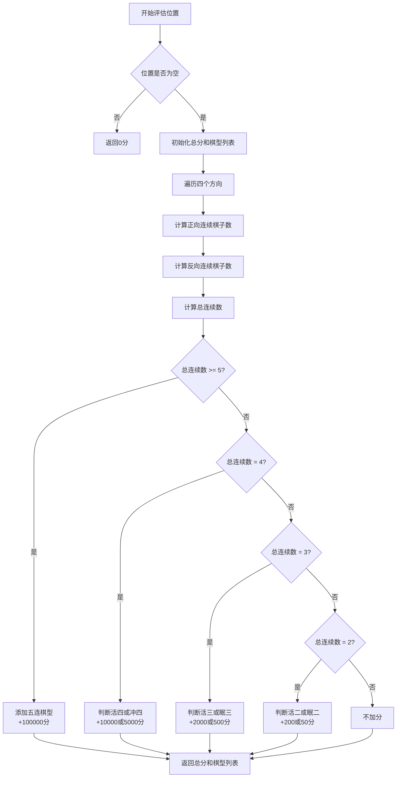
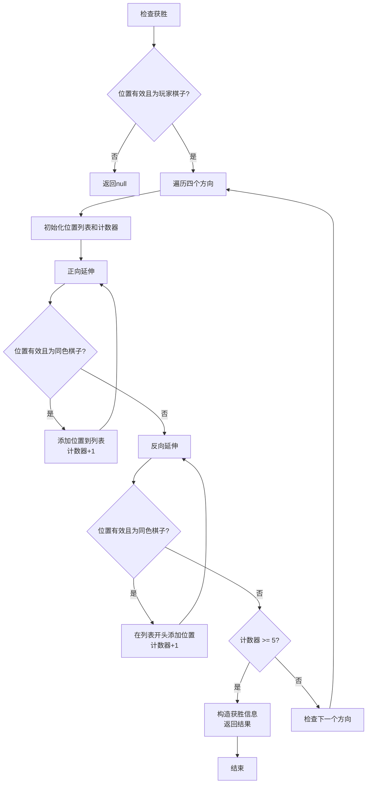
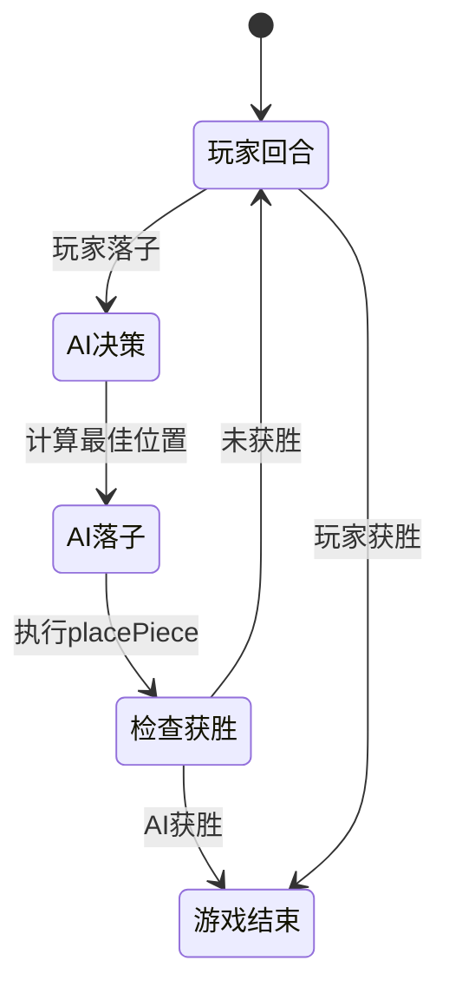

# AI落子决策

<cite>
**Referenced Files in This Document**   
- [aiUtils.js](file://src/utils/aiUtils.js)
- [useGameState.js](file://src/hooks/useGameState.js)
- [gameUtils.js](file://src/utils/gameUtils.js)
</cite>

## 目录
1. [AI落子算法概述](#ai落子算法概述)
2. [评估函数设计原理](#评估函数设计原理)
3. [AI决策流程分析](#ai决策流程分析)
4. [五子连珠模式识别](#五子连珠模式识别)
5. [AI回合调用流程](#ai回合调用流程)
6. [算法性能分析](#算法性能分析)

## AI落子算法概述

AI落子算法的核心是`findBestMove`函数，该函数通过评估棋盘上每个空位的综合得分来确定最佳落子点。算法采用进攻与防守相结合的策略，优先考虑能直接获胜的落子位置，其次考虑阻止对手获胜的关键位置，最后根据评估函数计算每个位置的综合得分。

算法首先获取棋盘上所有空位，然后遍历每个空位进行评估。在评估过程中，算法会检查在该位置落子后是否能形成五子连珠（直接获胜），以及对手在该位置落子后是否能获胜（需要防守）。对于既不能获胜也不需要防守的位置，则通过评估函数计算其进攻和防守价值。

**Section sources**
- [aiUtils.js](file://src/utils/aiUtils.js#L17-L63)

## 评估函数设计原理

评估函数`evaluatePosition`是AI决策的核心，它通过分析棋盘上特定位置在四个方向（水平、垂直、两个对角线）的棋型来计算得分。评估函数的设计原理基于五子棋的棋型价值，不同棋型对应不同的分数。

### 棋型评分标准

评估函数识别多种棋型并赋予相应分数：
- **五连**：100000分，表示已经形成五子连珠，直接获胜
- **活四**：10000分，表示四个连续棋子且两端均未被阻挡
- **冲四**：5000分，表示四个连续棋子但一端被阻挡
- **活三**：2000分，表示三个连续棋子且两端均未被阻挡
- **眠三**：500分，表示三个连续棋子但一端被阻挡
- **活二**：200分，表示两个连续棋子且两端均未被阻挡
- **眠二**：50分，表示两个连续棋子但一端被阻挡

### 进攻与防守权重平衡

AI在决策时采用进攻与防守相结合的策略，但防守权重稍低。具体来说，AI会计算在某个位置落子后的自身得分（进攻价值）和对手在该位置落子后的得分（防守价值），然后通过加权求和得到综合评分：

```
综合评分 = 自身得分 + 对手得分 × 0.8
```

这种设计使得AI在同等情况下更倾向于进攻，但在面临对手即将获胜的威胁时仍会优先防守。



**Diagram sources**
- [gameUtils.js](file://src/utils/gameUtils.js#L145-L222)

**Section sources**
- [gameUtils.js](file://src/utils/gameUtils.js#L145-L222)

## AI决策流程分析

AI的决策流程是一个多层次的判断过程，从最高优先级的直接获胜判断到最低优先级的综合评分选择。决策流程体现了AI在不同棋局态势下的应对策略。

### 决策优先级

AI决策遵循以下优先级顺序：
1. **直接获胜**：如果在某个空位落子能形成五子连珠，则立即选择该位置
2. **关键防守**：如果对手在某个空位落子能获胜，则将该位置标记为必须防守
3. **综合评分**：对于其他位置，计算综合评分并选择最高分的位置
4. **优先防守**：如果有必须防守的位置，则优先选择防守

### 决策流程图

```mermaid
flowchart TD
A[获取所有空位] --> B{空位数量为0?}
B --> |是| C[返回null]
B --> |否| D{空位数量为225?}
D --> |是| E[返回中心位置[7,7]]
D --> |否| F[初始化最佳得分和最佳位置]
F --> G[遍历每个空位]
G --> H[模拟AI落子]
H --> I{是否获胜?}
I --> |是| J[立即返回该位置]
I --> |否| K[模拟对手落子]
K --> L{对手是否获胜?}
L --> |是| M[标记为关键防守位置]
L --> |否| N[计算AI评估分]
N --> O[计算对手评估分]
O --> P[计算综合评分]
P --> Q{综合评分 > 最佳得分?}
Q --> |是| R[更新最佳得分和位置]
Q --> |否| S[继续下一个空位]
M --> S
S --> T{遍历完所有空位?}
T --> |否| G
T --> |是| U{存在关键防守位置?}
U --> |是| V[返回关键防守位置]
U --> |否| W[返回最佳位置]
```

**Diagram sources**
- [aiUtils.js](file://src/utils/aiUtils.js#L17-L63)

**Section sources**
- [aiUtils.js](file://src/utils/aiUtils.js#L17-L63)

## 五子连珠模式识别

五子连珠的模式识别是通过`checkWin`函数实现的，该函数检查在指定位置落子后是否形成五个连续的棋子。模式识别算法采用双向延伸的方法，从落子位置向四个方向的正反两个方向延伸，统计连续同色棋子的数量。

### 模式识别逻辑

1. **方向遍历**：算法遍历四个方向（水平、垂直、两个对角线）
2. **正向延伸**：从落子位置开始，沿方向增量(dx, dy)向前延伸，统计连续棋子数
3. **反向延伸**：从落子位置开始，沿方向减量(-dx, -dy)向后延伸，统计连续棋子数
4. **总数计算**：将正向、反向连续数和落子位置本身相加得到总连续数
5. **获胜判断**：如果总连续数大于等于5，则判定为获胜

### 活棋与死棋判断

评估函数不仅识别五子连珠，还能区分活棋和死棋（被阻挡的棋型）。判断逻辑基于棋型两端的阻挡情况：
- **活四**：四个连续棋子且两端均可落子（未被阻挡）
- **冲四**：四个连续棋子但一端被阻挡
- **活三**：三个连续棋子且两端均可落子
- **眠三**：三个连续棋子但一端被阻挡

这种精细的棋型识别使得AI能够准确评估每个位置的战略价值。



**Diagram sources**
- [gameUtils.js](file://src/utils/gameUtils.js#L42-L85)

**Section sources**
- [gameUtils.js](file://src/utils/gameUtils.js#L42-L85)

## AI回合调用流程

AI回合的调用流程由`useGameState`中的状态管理机制驱动，当轮到AI回合时，系统会触发AI决策和落子动作。整个流程体现了游戏状态与AI决策的紧密集成。

### 调用流程分析

1. **回合切换**：当玩家完成落子后，`switchPlayer`动作被触发，将当前玩家切换为AI
2. **AI决策**：在AI回合，系统调用`findBestMove`函数计算最佳落子位置
3. **落子执行**：通过`placePiece`动作在棋盘上放置AI的棋子
4. **状态更新**：游戏状态更新，包括棋盘状态、移动历史和获胜判断
5. **玩家回合**：再次调用`switchPlayer`将回合切换回玩家

### 状态转换流程



### 代码调用关系

AI决策与游戏状态的调用关系如下：
- `useGameState`提供`switchPlayer`和`placePiece`动作
- 当`currentPlayer`为AI时，触发AI决策逻辑
- `findBestMove`被调用，返回最佳落子位置
- `placePiece`被调用，在棋盘上放置AI的棋子

**Section sources**
- [useGameState.js](file://src/hooks/useGameState.js#L493-L541)
- [aiUtils.js](file://src/utils/aiUtils.js#L17-L63)

## 算法性能分析

AI落子算法的时间复杂度和性能特征直接影响游戏的响应速度和用户体验。算法的性能表现取决于棋盘状态和评估函数的效率。

### 时间复杂度

算法的时间复杂度主要由以下因素决定：
- **空位数量**：最坏情况下需要评估225个空位（15×15棋盘）
- **评估函数复杂度**：每个位置的评估需要检查四个方向，每个方向的检查时间与连续棋子数相关
- **总体复杂度**：O(n²m)，其中n为棋盘边长（15），m为平均连续棋子数

在实际游戏中，随着棋局进行，空位数量逐渐减少，算法的实际运行时间会逐渐缩短。

### 性能优化空间

当前算法存在以下优化空间：
1. **剪枝优化**：在找到直接获胜的位置后立即返回，避免不必要的评估
2. **限制搜索范围**：只评估靠近已有棋子的空位，而非所有空位
3. **缓存机制**：缓存部分评估结果，避免重复计算
4. **并行计算**：利用多核处理器并行评估不同位置的得分

### 性能瓶颈

主要性能瓶颈在于：
- **棋盘复制**：每次评估都需要复制棋盘以模拟落子，产生额外开销
- **重复计算**：相邻位置的评估存在大量重复的棋型分析
- **完整遍历**：即使找到高分位置，仍需遍历所有空位以确保最优

通过针对性优化，可以显著提升AI决策的响应速度，特别是在游戏后期棋盘较满的情况下。

**Section sources**
- [aiUtils.js](file://src/utils/aiUtils.js#L17-L63)
- [gameUtils.js](file://src/utils/gameUtils.js#L145-L222)