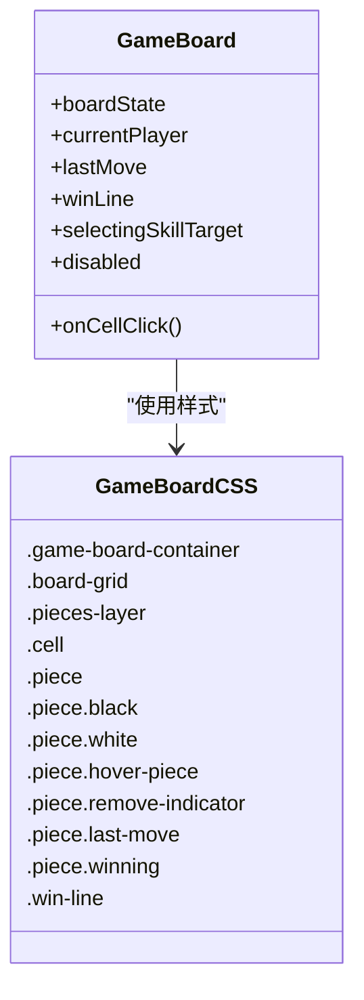
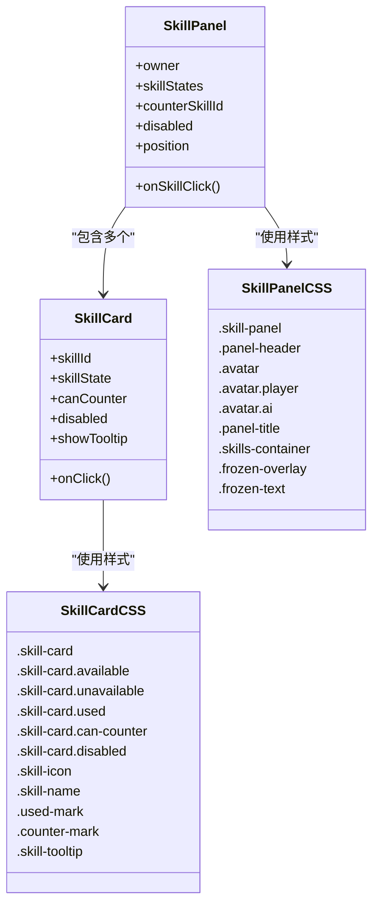
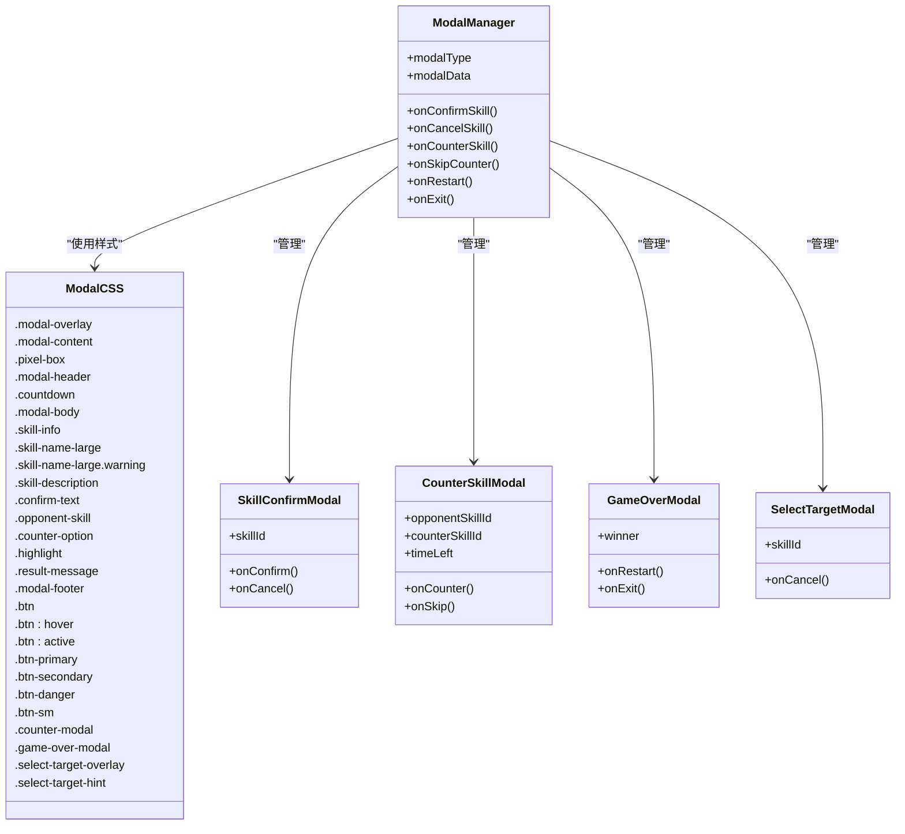
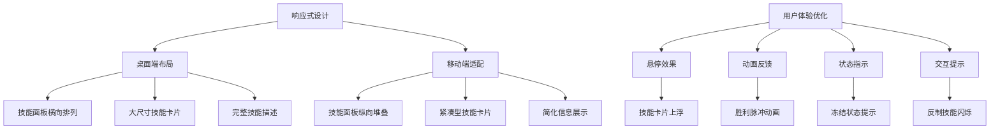
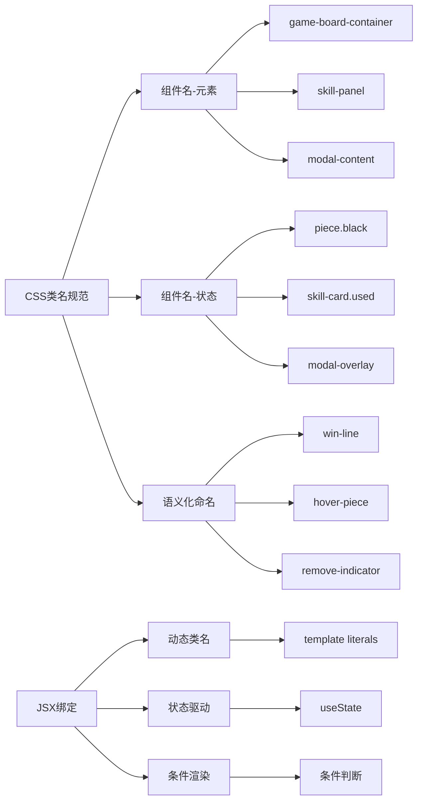

# UI组件与样式

<cite>
**本文档中引用的文件**   
- [GameBoard.css](file://src/components/GameBoard.css)
- [GameBoard.js](file://src/components/GameBoard.js)
- [SkillPanel.css](file://src/components/SkillPanel.css)
- [SkillPanel.js](file://src/components/SkillPanel.js)
- [Modal.css](file://src/components/Modal.css)
- [ModalManager.js](file://src/components/ModalManager.js)
- [SkillCard.css](file://src/components/SkillCard.css)
- [SkillCard.js](file://src/components/SkillCard.js)
- [GameContainer.css](file://src/components/GameContainer.css)
- [GameContainer.js](file://src/components/GameContainer.js)
</cite>

## 目录
1. [棋盘组件样式](#棋盘组件样式)
2. [技能面板与卡片设计](#技能面板与卡片设计)
3. [弹窗交互与动画](#弹窗交互与动画)
4. [响应式布局与用户体验](#响应式布局与用户体验)
5. [CSS类名规范与JSX绑定](#css类名规范与jsx绑定)

## 棋盘组件样式

详细分析了`GameBoard.css`中棋盘网格、棋子渲染和高亮效果的实现方式。通过SVG绘制棋盘网格线与天元标记点，结合绝对定位实现棋子层与交互层分离。棋子使用径向渐变背景与阴影增强立体感，不同状态通过CSS类控制视觉反馈。

**图示来源**
- [GameBoard.css](file://src/components/GameBoard.css#L1-L105)
- [GameBoard.js](file://src/components/GameBoard.js#L5-L152)

**本节来源**
- [GameBoard.css](file://src/components/GameBoard.css#L1-L105)
- [GameBoard.js](file://src/components/GameBoard.js#L5-L152)

## 技能面板与卡片设计

`SkillPanel.css`定义了技能面板的整体布局与状态指示器，采用线性渐变背景与像素边框营造游戏化视觉风格。技能卡片通过`SkillCard.css`实现动态悬停效果与状态标记，包括使用状态、可反制状态等视觉反馈机制。

**图示来源**
- [SkillPanel.css](file://src/components/SkillPanel.css#L1-L124)
- [SkillCard.css](file://src/components/SkillCard.css#L1-L242)
- [SkillPanel.js](file://src/components/SkillPanel.js#L6-L58)
- [SkillCard.js](file://src/components/SkillCard.js#L1-L108)

**本节来源**
- [SkillPanel.css](file://src/components/SkillPanel.css#L1-L124)
- [SkillCard.css](file://src/components/SkillCard.css#L1-L242)
- [SkillPanel.js](file://src/components/SkillPanel.js#L6-L58)
- [SkillCard.js](file://src/components/SkillCard.js#L1-L108)

## 弹窗交互与动画

`Modal.css`实现了多种弹窗类型的动画效果与交互反馈，包括淡入淡出、滑动进入等过渡动画。通过关键帧动画实现计时器脉冲、警告闪烁等动态效果，增强用户对重要事件的感知。

**图示来源**
- [Modal.css](file://src/components/Modal.css#L1-L302)
- [ModalManager.js](file://src/components/ModalManager.js#L155-L207)

**本节来源**
- [Modal.css](file://src/components/Modal.css#L1-L302)
- [ModalManager.js](file://src/components/ModalManager.js#L15-L207)

## 响应式布局与用户体验

系统在多个组件中实现了响应式设计，确保在不同屏幕尺寸下的可用性。通过媒体查询调整布局参数，如技能面板宽度、字体大小等，优化移动端体验。同时，通过视觉反馈（如悬停效果、禁用状态）提升交互体验。

**图示来源**
- [SkillPanel.css](file://src/components/SkillPanel.css#L100-L124)
- [Modal.css](file://src/components/Modal.css#L280-L302)
- [GameContainer.css](file://src/components/GameContainer.css#L100-L169)

**本节来源**
- [SkillPanel.css](file://src/components/SkillPanel.css#L100-L124)
- [Modal.css](file://src/components/Modal.css#L280-L302)
- [GameContainer.css](file://src/components/GameContainer.css#L100-L169)

## CSS类名规范与JSX绑定

项目采用语义化CSS类名命名规范，便于样式定制与主题扩展。类名采用小写字母加连字符的格式，状态类以前缀形式组织。JSX结构与CSS类通过动态类名绑定实现交互状态的视觉反馈。

**图示来源**
- [GameBoard.js](file://src/components/GameBoard.js#L5-L152)
- [SkillPanel.js](file://src/components/SkillPanel.js#L6-L58)
- [SkillCard.js](file://src/components/SkillCard.js#L1-L108)
- [ModalManager.js](file://src/components/ModalManager.js#L15-L207)

**本节来源**
- [GameBoard.js](file://src/components/GameBoard.js#L5-L152)
- [SkillPanel.js](file://src/components/SkillPanel.js#L6-L58)
- [SkillCard.js](file://src/components/SkillCard.js#L1-L108)
- [ModalManager.js](file://src/components/ModalManager.js#L15-L207)