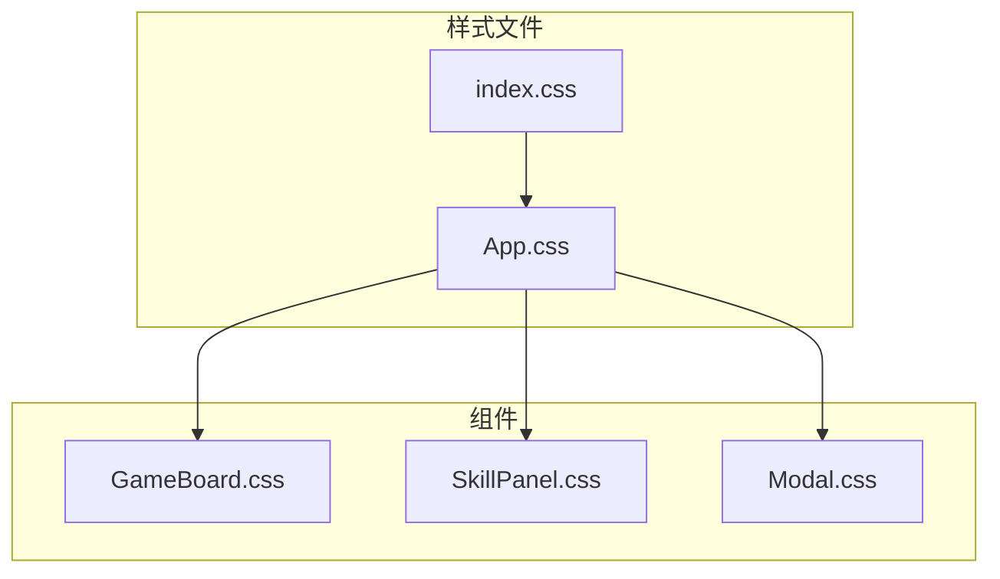
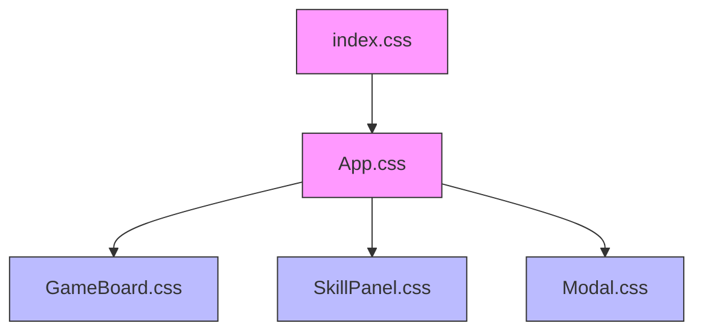
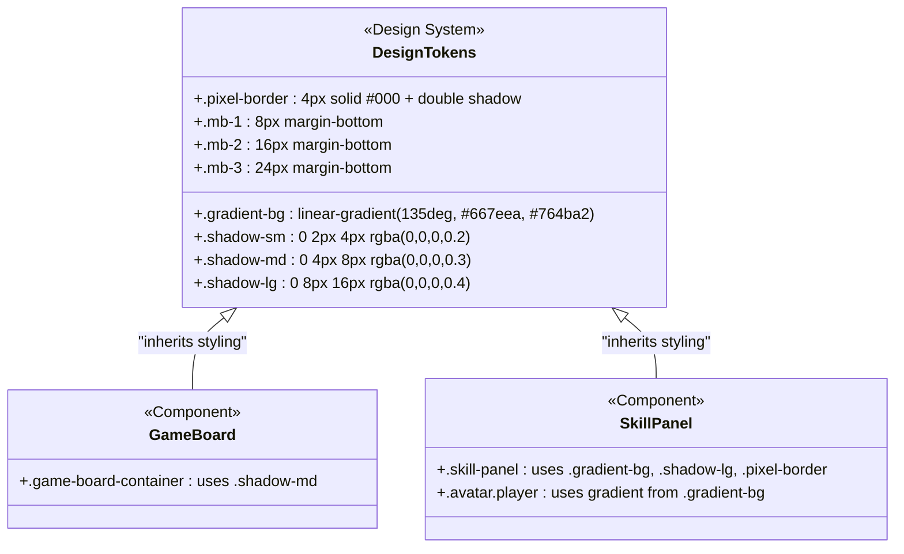
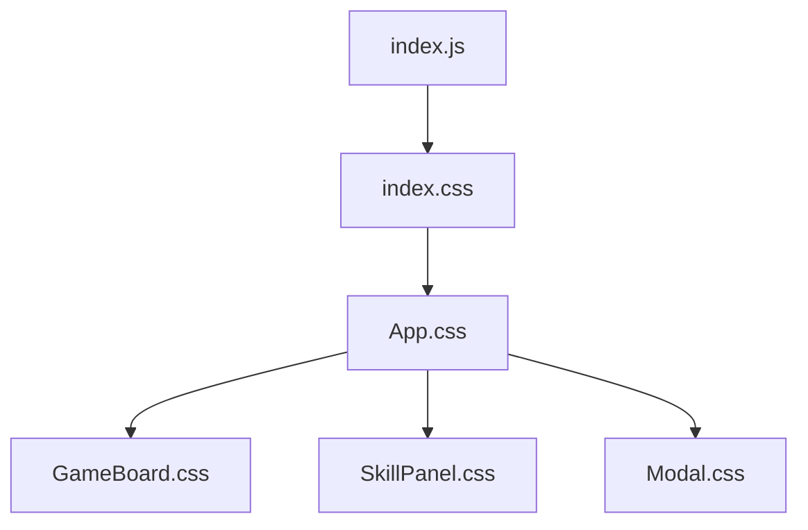

# 全局样式与主题

<cite>
**Referenced Files in This Document**   
- [App.css](file://src/App.css)
- [index.css](file://src/index.css)
- [GameBoard.css](file://src/components/GameBoard.css)
- [SkillPanel.css](file://src/components/SkillPanel.css)
</cite>

## 目录
1. [介绍](#介绍)
2. [项目结构](#项目结构)
3. [核心组件](#核心组件)
4. [架构概述](#架构概述)
5. [详细组件分析](#详细组件分析)
6. [依赖分析](#依赖分析)
7. [性能考虑](#性能考虑)
8. [故障排除指南](#故障排除指南)
9. [结论](#结论)
10. [附录](#附录)（如有必要）

## 介绍
本文档旨在全面分析项目中的全局样式系统与设计规范。通过深入研究 `App.css` 文件中定义的全局样式规则，揭示其如何构建统一的设计系统基础，并确保跨组件的视觉一致性。文档将详细解析全局重置样式、设计令牌、动画机制和CSS类命名规范，为开发者提供清晰的样式架构理解与主题定制指南。

## 项目结构
项目采用典型的React应用结构，将全局样式文件（`App.css` 和 `index.css`）置于 `src` 根目录下，而组件特定的样式文件则位于各自组件目录中。这种组织方式实现了全局样式与组件样式的清晰分离，便于维护和扩展。

**Diagram sources**
- [App.css](file://src/App.css)
- [index.css](file://src/index.css)

**Section sources**
- [App.css](file://src/App.css)
- [index.css](file://src/index.css)

## 核心组件
`App.css` 作为全局样式中心，定义了影响整个应用外观和行为的基础规则。它不仅包含重置样式和辅助类，还通过CSS类实现了颜色、阴影和边框等设计令牌，为所有组件提供了统一的视觉语言。

**Section sources**
- [App.css](file://src/App.css#L1-L130)

## 架构概述
全局样式架构以 `index.css` 提供的最基础HTML元素样式为起点，由 `App.css` 进行扩展和增强。`App.css` 通过定义通用的CSS类（如辅助类、阴影类、边框类）来实现设计系统的复用性，这些类被 `GameBoard`、`SkillPanel` 等具体组件直接引用，从而确保了UI的一致性。

**Diagram sources**
- [index.css](file://src/index.css)
- [App.css](file://src/App.css)
- [GameBoard.css](file://src/components/GameBoard.css)
- [SkillPanel.css](file://src/components/SkillPanel.css)

## 详细组件分析

### 全局重置与基础样式
`App.css` 实施了全面的CSS重置，通过通配符选择器 `*` 统一了所有元素的 `margin` 和 `padding`，并强制使用 `border-box` 盒模型，从根本上解决了跨浏览器的布局差异。同时，它为 `body` 和表单元素设置了统一的 `Courier New` 字体栈，奠定了应用的像素艺术风格基调。

**Section sources**
- [App.css](file://src/App.css#L1-L25)

### 设计令牌与视觉规范
`App.css` 通过定义一系列语义化的CSS类来实现设计令牌系统，替代了原生CSS变量。这些类构成了应用的视觉规范：

- **颜色与渐变**：`.gradient-bg` 类使用 `#667eea` 和 `#764ba2` 定义了主色调渐变，该配色方案也被 `SkillPanel` 组件中的玩家头像所复用。
- **间距系统**：通过 `.mb-1`, `.mb-2`, `.mb-3`, `.mt-1`, `.mt-2`, `.mt-3` 等辅助类，建立了一套基于8px倍数的垂直间距系统。
- **阴影系统**：`.shadow-sm`, `.shadow-md`, `.shadow-lg` 类提供了从小到大的三种阴影效果，统一了组件的深度感。
- **边框系统**：`.pixel-border` 类通过多层 `box-shadow` 模拟出像素风格的双层边框，是应用视觉风格的关键。

**Diagram sources**
- [App.css](file://src/App.css#L105-L130)
- [GameBoard.css](file://src/components/GameBoard.css#L1-L10)
- [SkillPanel.css](file://src/components/SkillPanel.css#L1-L20)

### 全局动画机制
`App.css` 定义了基础的交互反馈，但具体的动画效果（如脉冲、闪烁）是在组件级别的CSS文件中通过 `@keyframes` 规则实现的。例如，`GameBoard.css` 定义了 `pulse` 和 `winning-flash` 动画，用于高亮最后一步和胜利棋子。这种设计将全局样式与组件特定的动态效果分离，保证了动画的针对性和复用性。

**Section sources**
- [GameBoard.css](file://src/components/GameBoard.css#L65-L95)
- [SkillPanel.css](file://src/components/SkillPanel.css#L75-L85)

### CSS类命名规范
项目主要采用一种简化BEM（Block Element Modifier）的命名约定。组件作为一个“块”（Block），如 `game-board` 或 `skill-panel`，其内部元素作为“元素”（Element），用双连字符 `__` 连接（如 `panel__header`）。状态或变体作为“修饰符”（Modifier），用单连字符 `-` 连接（如 `piece--black`, `skill-panel--frozen`）。这种规范确保了类名的可读性和可维护性。

**Section sources**
- [GameBoard.css](file://src/components/GameBoard.css)
- [SkillPanel.css](file://src/components/SkillPanel.css)

### 组件视觉协调性
全局样式通过多种方式确保了 `GameBoard` 和 `SkillPanel` 的视觉协调：
1.  **字体统一**：两者均继承了 `App.css` 定义的 `Courier New` 字体。
2.  **阴影统一**：`GameBoard` 使用 `.shadow-md`，`SkillPanel` 使用 `.shadow-lg`，形成有层次的深度。
3.  **色彩关联**：`SkillPanel` 中玩家头像的渐变色直接取自 `.gradient-bg` 的定义，建立了色彩联系。
4.  **风格一致**：`SkillPanel` 的 `.pixel-border` 和 `GameBoard` 的厚实边框都体现了像素艺术风格。

**Section sources**
- [App.css](file://src/App.css)
- [GameBoard.css](file://src/components/GameBoard.css)
- [SkillPanel.css](file://src/components/SkillPanel.css)

## 依赖分析
全局样式文件 `App.css` 是整个应用UI的基石，被所有组件CSS文件所依赖。`index.css` 则作为最底层的样式入口，被 `index.js` 引入，为 `App.css` 提供了基础的HTML元素样式。

**Diagram sources**
- [index.js](file://src/index.js)
- [index.css](file://src/index.css)
- [App.css](file://src/App.css)

**Section sources**
- [index.js](file://src/index.js)
- [index.css](file://src/index.css)
- [App.css](file://src/App.css)

## 性能考虑
当前的全局样式实现是高效的。通过在 `App.css` 中定义可复用的CSS类，避免了在多个组件中重复编写相同的样式规则，减少了CSS文件的总体积。然而，通配符选择器 `*` 可能带来轻微的性能开销，尽管在现代浏览器中这种影响通常可以忽略不计。

## 故障排除指南
- **样式未生效**：检查组件是否正确导入了 `App.css`，或确认类名拼写是否正确。
- **字体不一致**：确保所有文本元素都继承了 `App.css` 中定义的 `font-family`，或检查是否有其他CSS规则覆盖了该设置。
- **动画不播放**：确认 `@keyframes` 规则的名称与 `animation` 属性中引用的名称完全匹配。

**Section sources**
- [App.css](file://src/App.css)
- [GameBoard.css](file://src/components/GameBoard.css)

## 结论
`App.css` 成功地构建了一个结构清晰、可复用的全局样式系统。它通过重置规则、设计令牌、辅助类和统一的命名规范，为应用提供了坚实的设计基础。开发者在进行主题定制时，应优先修改 `App.css` 中的 `.gradient-bg`、阴影类和颜色值，并确保在所有相关组件中更新对这些类的引用，以安全地实现品牌化或暗色模式。