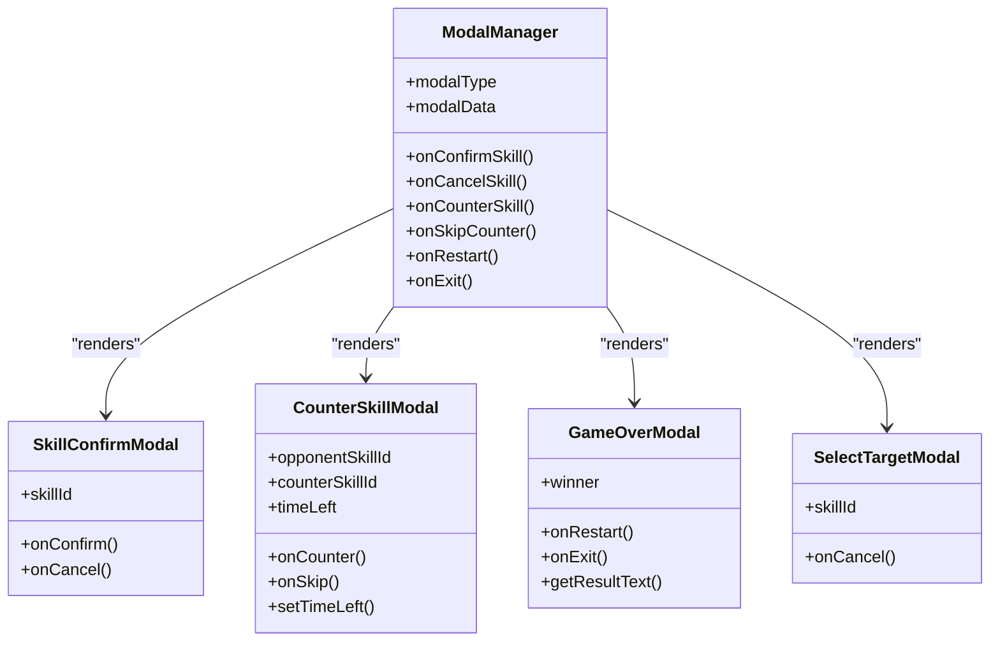
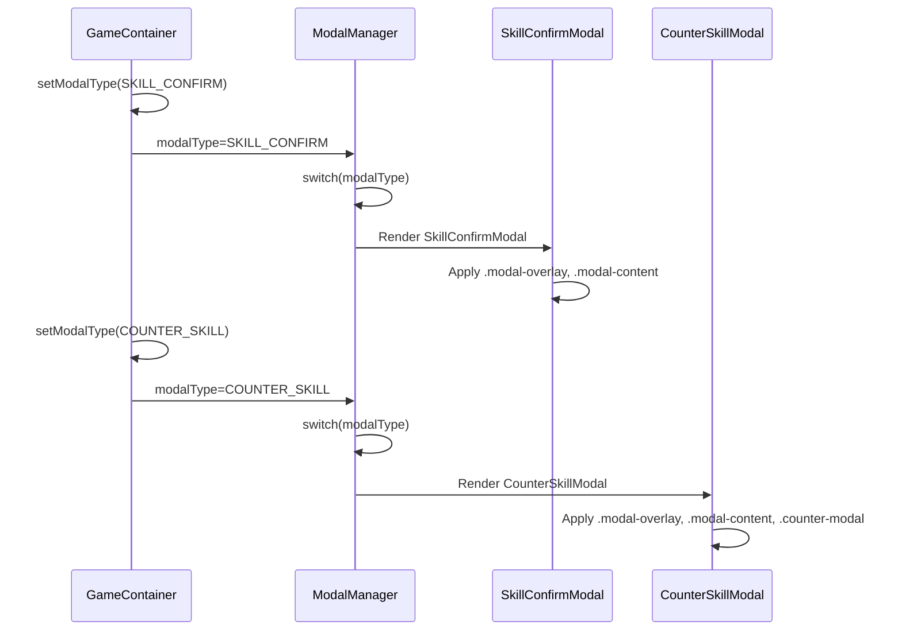

# 弹窗系统样式

<cite>
**Referenced Files in This Document**   
- [Modal.css](file://src/components/Modal.css)
- [ModalManager.js](file://src/components/ModalManager.js)
- [gameConstants.js](file://src/constants/gameConstants.js)
- [GameContainer.js](file://src/components/GameContainer.js)
</cite>

## 目录
1. [引言](#引言)
2. [核心样式架构](#核心样式架构)
3. [弹窗类型与视觉特征](#弹窗类型与视觉特征)
4. [CSS类与状态关联机制](#css类与状态关联机制)
5. [动画效果实现](#动画效果实现)
6. [响应式布局策略](#响应式布局策略)
7. [扩展新弹窗类型的最佳实践](#扩展新弹窗类型的最佳实践)
8. [结论](#结论)

## 引言
本文档系统性地解析了游戏系统中弹窗组件的样式架构。重点分析了`.modal-overlay`背景遮罩的半透明实现与点击穿透处理，以及`.modal-container`的居中定位与圆角设计。文档详细阐述了不同弹窗类型（技能确认、反制选择、游戏结束）的通用样式框架与差异化视觉特征，并结合`ModalManager.js`中的条件渲染逻辑，说明了CSS类与`modalType`状态的关联机制。同时，文档深入探讨了动画效果（如淡入淡出、缩放）的`transition`实现，以及响应式布局在移动设备上的适配策略，为未来扩展新弹窗类型提供了样式规范与最佳实践。

## 核心样式架构

弹窗系统的样式架构由两个核心部分构成：背景遮罩（`.modal-overlay`）和内容容器（`.modal-content`）。

### 背景遮罩 `.modal-overlay`
`.modal-overlay`类负责创建覆盖整个视口的半透明背景。其关键样式包括：
- **定位与尺寸**：使用`position: fixed`确保遮罩固定在视口上，`top: 0; left: 0; width: 100%; height: 100%`使其完全覆盖屏幕。
- **半透明效果**：通过`background: rgba(0, 0, 0, 0.7)`实现深色半透明背景，`rgba`的第四个参数（0.7）控制透明度，营造出聚焦于弹窗内容的视觉效果。
- **居中布局**：利用`display: flex`配合`align-items: center`和`justify-content: center`，将内部的`.modal-content`在视口中完美居中。
- **层级控制**：`z-index: 2000`确保遮罩和其内容位于所有其他页面元素之上。
- **点击穿透处理**：在`SkillConfirmModal`等组件中，通过在`.modal-overlay`上绑定`onClick={onCancel}`事件，并在`.modal-content`上绑定`onClick={(e) => e.stopPropagation()}`来阻止事件冒泡，实现了点击遮罩区域关闭弹窗，而点击内容区域则不关闭的交互逻辑。

### 内容容器 `.modal-content`
`.modal-content`类定义了弹窗主体的外观和行为。
- **基础样式**：拥有白色背景、最小和最大宽度限制（`min-width: 400px; max-width: 500px`），以及`border-radius: 8px`的圆角设计，赋予其现代感和柔和的视觉边缘。
- **视觉增强**：通过`box-shadow: 0 8px 32px rgba(0, 0, 0, 0.5)`添加了深度感强烈的阴影，使弹窗从背景中“浮起”。
- **像素化边框**：通过`pixel-box`类应用多层`box-shadow`，模拟出复古的像素化边框效果，增强了游戏的整体视觉风格。

**Section sources**
- [Modal.css](file://src/components/Modal.css#L1-L50)

## 弹窗类型与视觉特征

系统定义了多种弹窗类型，每种类型在共享通用样式的基础上，通过特定的CSS类和内联样式实现差异化视觉特征。

### 通用样式框架
所有弹窗类型共享以下通用结构和样式：
- **头部区域**：`.modal-header`使用线性渐变背景（`linear-gradient(135deg, #667eea 0%, #764ba2 100%)`），并配有黑色边框（`border-bottom: 4px solid #000`）和白色居中标题。
- **主体区域**：`.modal-body`提供内容填充（`padding: 30px`），背景为浅灰色（`#f5f5f5`），用于放置技能信息、描述文本等。
- **底部区域**：`.modal-footer`包含操作按钮，同样配有黑色边框（`border-top: 4px solid #000`），并使用`flex`布局居中对齐按钮。

### 差异化视觉特征
不同弹窗类型通过以下方式实现视觉区分：

#### 技能确认弹窗
这是最基础的弹窗类型，主要展示技能名称和描述，并提供“确认”和“取消”按钮。其样式完全由通用框架定义，无特殊视觉特征。

#### 反制选择弹窗
此弹窗通过`.counter-modal`类进行视觉强化：
- **头部动画**：`.counter-modal .modal-header`应用了`header-pulse`动画，使其背景色在橙色和亮橙色之间循环变化，营造出紧迫感。
- **倒计时显示**：包含一个`.countdown`元素，显示剩余的反制时间，其醒目的橙色背景和脉冲动画（`pulse`）进一步强调了时间压力。

**Diagram sources**
- [ModalManager.js](file://src/components/ModalManager.js#L155-L207)
- [Modal.css](file://src/components/Modal.css#L100-L150)

**Section sources**
- [ModalManager.js](file://src/components/ModalManager.js#L20-L150)
- [Modal.css](file://src/components/Modal.css#L150-L200)

## CSS类与状态关联机制

弹窗的显示与类型由`ModalManager.js`中的条件渲染逻辑和`modalType`状态共同控制，CSS类与之紧密关联。

### 状态驱动的渲染
`ModalManager`组件接收一个`modalType` prop，该prop的值来自`gameConstants.js`中定义的`MODAL_TYPE`常量（如`SKILL_CONFIRM`, `COUNTER_SKILL`等）。组件通过`switch`语句，根据`modalType`的值决定渲染哪个具体的弹窗组件。

### CSS类的动态应用
- **基础类**：所有弹窗都应用了`.modal-overlay`和`.modal-content`等基础类。
- **类型特定类**：特定的弹窗类型会应用额外的CSS类。例如，`CounterSkillModal`在其`.modal-content`上添加了`counter-modal`类，从而激活其特有的动画和样式。
- **状态特定样式**：某些样式直接与游戏状态关联。例如，在`GameOverModal`中，`.modal-header`的边框颜色和标题颜色会根据`winner`状态动态设置为绿色（胜利）、红色（失败）或金色（力拔山兮）。

**Diagram sources**
- [ModalManager.js](file://src/components/ModalManager.js#L155-L207)
- [GameContainer.js](file://src/components/GameContainer.js#L18-L18)

**Section sources**
- [ModalManager.js](file://src/components/ModalManager.js#L155-L207)
- [gameConstants.js](file://src/constants/gameConstants.js#L130-L136)
- [GameContainer.js](file://src/components/GameContainer.js#L18-L18)

## 动画效果实现

弹窗系统通过CSS `@keyframes`和`animation`属性实现了流畅的动画效果。

### 进入动画
- **淡入效果**：`.modal-overlay`应用了`fadeIn`动画，从`opacity: 0`过渡到`opacity: 1`，持续0.3秒，使遮罩平滑出现。
- **滑入效果**：`.modal-content`应用了`slideDown`动画，从`transform: translateY(-50px)`（上方50px处）移动到`transform: translateY(0)`，同时从透明变为不透明，创造出从上方向下滑入的视觉效果。

### 特殊动画
- **警告动画**：当技能名称带有`.warning`类时（如反制弹窗中的对手技能名），会应用`shake`动画，使其在水平方向上轻微晃动，吸引用户注意。
- **脉冲动画**：`.countdown`元素和`counter-modal`的头部都应用了`pulse`动画，通过缩放变化产生脉动效果，增强视觉吸引力。

**Section sources**
- [Modal.css](file://src/components/Modal.css#L10-L40)

## 响应式布局策略

为了确保在移动设备上也能提供良好的用户体验，弹窗系统采用了响应式设计。

### 媒体查询
通过`@media (max-width: 600px)`媒体查询，针对小屏幕设备调整了关键样式：
- **内容尺寸**：`.modal-content`的`min-width`从400px减小到300px，并将`max-width`设置为`90%`，使其在小屏幕上能更好地适应屏幕宽度。
- **字体大小**：`.modal-header h2`和`.skill-name-large`的字体大小分别减小，以适应更小的显示区域。
- **按钮尺寸**：`.btn`的内边距和字体大小也相应减小，确保按钮在小屏幕上不会显得过大。

这一策略保证了弹窗在不同设备上都能保持可用性和美观性。

**Section sources**
- [Modal.css](file://src/components/Modal.css#L250-L280)

## 扩展新弹窗类型的最佳实践

当需要扩展新的弹窗类型时，应遵循以下最佳实践以确保视觉一致性：

1.  **复用通用框架**：新弹窗应继承`.modal-overlay`、`.modal-content`、`.modal-header`、`.modal-body`和`.modal-footer`等基础类，以保持整体风格统一。
2.  **定义专用CSS类**：为新弹窗类型创建一个专用的CSS类（如`.new-modal-type`），并将其应用于`.modal-content`。所有该类型特有的样式（如颜色、动画）都应通过此专用类来定义。
3.  **遵循动画规范**：新弹窗的进入动画应尽量与现有动画（`fadeIn`和`slideDown`）保持一致，以提供连贯的用户体验。
4.  **考虑响应式**：在定义新弹窗的尺寸和字体时，需考虑其在移动设备上的显示效果，并在媒体查询中进行相应调整。
5.  **状态与逻辑分离**：在`ModalManager.js`中，应为新弹窗类型创建一个独立的React组件，并在`switch`语句中添加对应的`case`分支，保持逻辑清晰。

**Section sources**
- [Modal.css](file://src/components/Modal.css)
- [ModalManager.js](file://src/components/ModalManager.js)

## 结论
本文档全面解析了弹窗系统的样式架构。系统通过`.modal-overlay`和`.modal-content`构建了稳固的基础，并利用`ModalManager.js`中的`modalType`状态实现了不同弹窗类型的条件渲染。通过专用的CSS类（如`.counter-modal`）和内联样式，系统在保持视觉一致性的同时，为不同场景提供了差异化的视觉反馈。动画效果和响应式设计进一步提升了用户体验。遵循本文档的最佳实践，可以确保未来对弹窗系统的扩展既高效又符合整体设计规范。