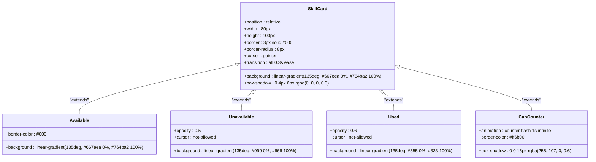
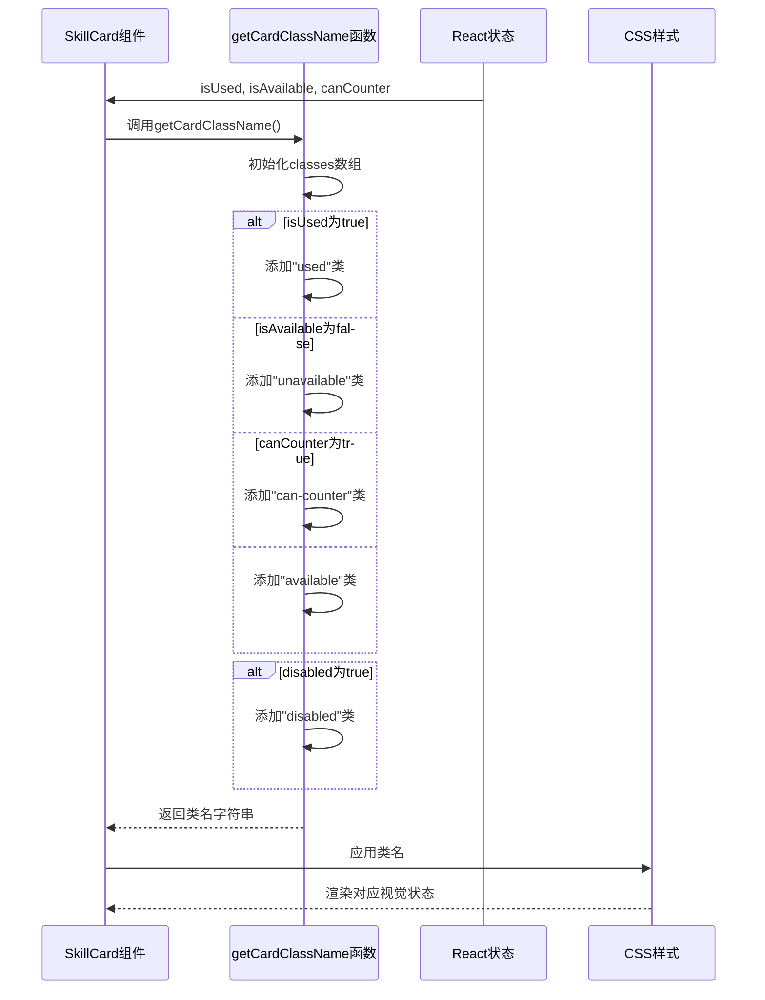
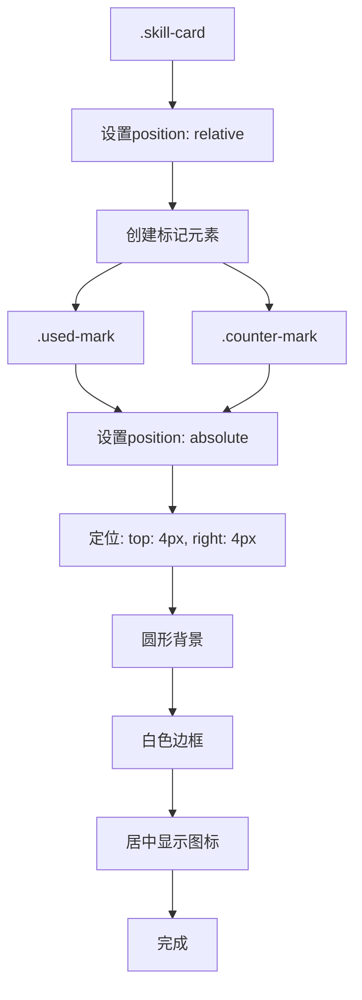
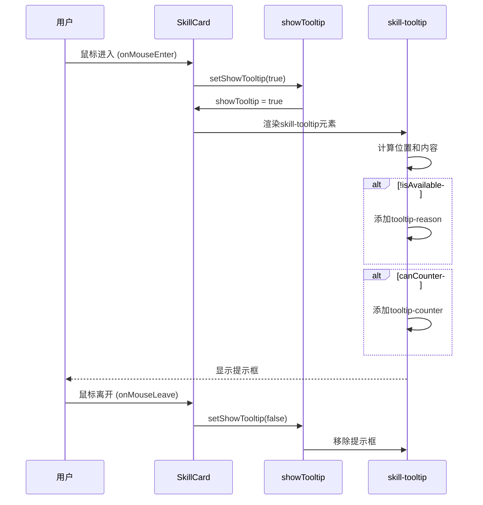

# 技能卡片样式

<cite>
**Referenced Files in This Document**   
- [SkillCard.css](file://src/components/SkillCard.css)
- [SkillCard.js](file://src/components/SkillCard.js)
- [gameConstants.js](file://src/constants/gameConstants.js)
</cite>

## 目录
1. [简介](#简介)
2. [核心组件](#核心组件)
3. [视觉状态系统](#视觉状态系统)
4. [状态类映射逻辑](#状态类映射逻辑)
5. [标记元素实现](#标记元素实现)
6. [工具提示系统](#工具提示系统)
7. [主题与动画自定义](#主题与动画自定义)

## 简介
本文档全面解析技能卡片（SkillCard）的视觉状态系统，涵盖其CSS样式定义、React组件逻辑以及与游戏常量的关联。技能卡片作为游戏交互的核心UI元素，通过不同的视觉状态向玩家传达技能的可用性、使用情况和反制可能性。文档将深入分析`.skill-card`基础样式及其四种状态类（available、unavailable、used、can-counter）的视觉表现差异，并阐明CSS类名生成函数与React状态的映射关系。

## 核心组件

本节分析技能卡片的核心实现，包括其样式定义和组件逻辑。

**Section sources**
- [SkillCard.css](file://src/components/SkillCard.css#L1-L243)
- [SkillCard.js](file://src/components/SkillCard.js#L1-L109)

## 视觉状态系统

技能卡片通过CSS类名来表现不同的视觉状态，这些状态直接影响玩家的决策。`.skill-card`基础样式定义了卡片的通用外观，包括尺寸、渐变背景、边框、圆角、阴影和悬停动画。

### 状态类视觉表现

**Diagram sources**
- [SkillCard.css](file://src/components/SkillCard.css#L1-L243)

**Section sources**
- [SkillCard.css](file://src/components/SkillCard.css#L1-L243)

#### 可用状态 (available)
当技能可以被使用时，卡片呈现主色调的紫色渐变背景，黑色边框。悬停时，背景色会轻微变亮，并伴有上浮和放大的动画效果，阴影增强，提供积极的交互反馈。

#### 不可用状态 (unavailable)
当技能因条件未满足而无法使用时，卡片变为灰色渐变背景，整体透明度降低至0.5，并将鼠标指针设为`not-allowed`，明确告知玩家当前不可操作。

#### 已使用状态 (used)
当技能已被使用后，卡片变为深灰色渐变背景，透明度为0.6，同样禁用鼠标交互。此状态与“不可用”状态视觉上相似但有区别，表明技能已消耗。

#### 可反制状态 (can-counter)
当技能可以被对手反制时，卡片进入高亮状态。通过`counter-flash`动画，边框颜色在橙色和亮橙色之间循环变化，同时阴影的大小和强度也同步脉动，形成强烈的视觉吸引，提醒玩家注意潜在的反制风险。

## 状态类映射逻辑

技能卡片的视觉状态由React组件中的`getCardClassName`函数根据当前游戏状态动态生成。该函数将组件的props（`isUsed`, `isAvailable`, `canCounter`, `disabled`）转换为对应的CSS类名。

**Diagram sources**
- [SkillCard.js](file://src/components/SkillCard.js#L24-L42)

**Section sources**
- [SkillCard.js](file://src/components/SkillCard.js#L24-L42)

### 状态判断优先级
`getCardClassName`函数内部的判断逻辑遵循严格的优先级顺序：
1.  **已使用 (isUsed)**：最高优先级，一旦技能被使用，无论其他条件如何，都显示为“已使用”状态。
2.  **不可用 (!isAvailable)**：次高优先级，当技能条件不满足时，显示为“不可用”。
3.  **可反制 (canCounter)**：当技能既未使用且可用，但存在被反制的风险时，显示为“可反制”状态。
4.  **可用 (available)**：默认状态，当以上条件均不满足时，技能为可用状态。

此外，`disabled` prop用于完全禁用卡片的交互，通常在游戏暂停或结束时使用，它会添加`disabled`类，使卡片更加灰暗且无响应。

## 标记元素实现

技能卡片使用绝对定位的子元素来显示“已使用”和“可反制”的标记。

### 绝对定位实现

**Diagram sources**
- [SkillCard.css](file://src/components/SkillCard.css#L1-L243)

**Section sources**
- [SkillCard.css](file://src/components/SkillCard.css#L1-L243)

`.skill-card`容器的`position: relative`为子元素的绝对定位提供了参考系。`.used-mark`和`.counter-mark`均设置为`position: absolute`，并通过`top: 4px`和`right: 4px`精确定位在卡片的右上角。两者都通过`border-radius: 50%`实现圆形外观，并使用`display: flex`结合`align-items: center`和`justify-content: center`来居中内部的图标（✓或!）。`.counter-mark`还应用了`pulse-mark`动画，使其周期性缩放，产生脉动效果，以增强警示性。

## 工具提示系统

当鼠标悬停在技能卡片上时，会显示一个包含详细信息的工具提示（tooltip）。

### 显示逻辑与样式适配

**Diagram sources**
- [SkillCard.js](file://src/components/SkillCard.js#L1-L109)

**Section sources**
- [SkillCard.js](file://src/components/SkillCard.js#L1-L109)

#### 三角箭头实现
工具提示的三角箭头通过CSS伪元素`::after`实现。它使用`border`技巧创建一个三角形，通过控制不同方向的边框颜色和透明度来形成指向特定方向的箭头。

#### 文字排版
提示框内部采用清晰的排版结构：
-   **标题 (tooltip-title)**：使用金色加粗字体，突出显示技能名称。
-   **类型 (tooltip-type)**：使用青色字体，标识技能类型（如“进攻型”）。
-   **描述 (tooltip-description)**：使用白色字体，展示技能的详细说明。
-   **不可用原因 (tooltip-reason)**：当技能不可用时，显示红色斜体文字，解释具体原因。
-   **反制提示 (tooltip-counter)**：当技能可被反制时，显示橙色加粗文字，并带有`blink`动画，闪烁提醒。

#### 动态内容适配
`getUnavailableReason`函数根据技能的`requireCondition`属性动态生成不可用原因。例如，如果技能要求“被静如止水控制”，则返回“需要被静如止水控制”。这确保了提示信息的准确性和上下文相关性。

#### 位置适配
提示框的位置会根据其父容器（`.skill-panel`）的类名进行调整。对于左侧技能栏，提示框显示在卡片的左侧；对于右侧技能栏，则显示在右侧，避免被遮挡。

## 主题与动画自定义

开发者可以通过修改`SkillCard.css`文件来自定义技能卡片的主题和动画效果。

### 自定义指引

**Section sources**
- [SkillCard.css](file://src/components/SkillCard.css#L1-L243)

#### 主题自定义
-   **基础颜色**：修改`.skill-card`的`background`属性可以改变卡片的主色调。
-   **状态颜色**：调整`.skill-card.available`、`.skill-card.unavailable`、`.skill-card.used`和`.skill-card.can-counter`的`background`、`border-color`等属性，可以定义不同状态下的视觉风格。
-   **标记颜色**：`.used-mark`和`.counter-mark`的`background`属性分别控制“已使用”和“可反制”标记的背景色。

#### 动画自定义
-   **悬停动画**：修改`.skill-card:hover`的`transform`和`box-shadow`值，可以调整悬停时的上浮高度、缩放比例和阴影效果。
-   **反制动画**：编辑`@keyframes counter-flash`和`@keyframes pulse-mark`可以改变边框闪烁和标记脉动的频率、颜色和强度。
-   **提示框动画**：`@keyframes blink`控制反制提示文字的闪烁效果。

通过这些自定义选项，可以轻松地将技能卡片的视觉风格与整个游戏的主题保持一致。