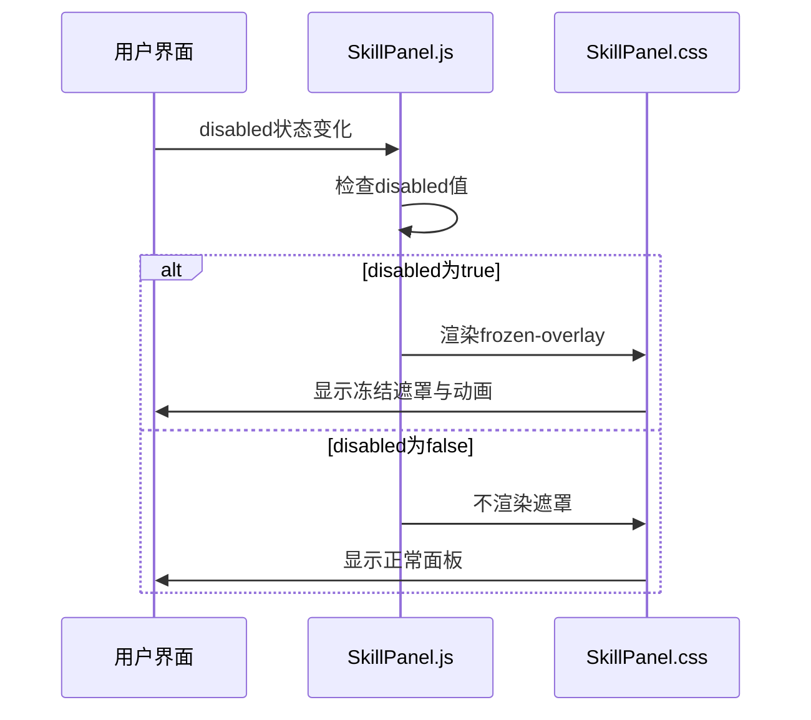

# 技能面板样式

<cite>
**Referenced Files in This Document**   
- [SkillPanel.css](file://src/components/SkillPanel.css)
- [SkillPanel.js](file://src/components/SkillPanel.js)
- [SkillCard.css](file://src/components/SkillCard.css)
- [SkillCard.js](file://src/components/SkillCard.js)
- [useGameState.js](file://src/hooks/useGameState.js)
- [gameConstants.js](file://src/constants/gameConstants.js)
</cite>

## Table of Contents
1. [技能面板布局结构](#技能面板布局结构)
2. [状态覆盖层设计与动画](#状态覆盖层设计与动画)
3. [响应式适配策略](#响应式适配策略)
4. [CSS类与React状态的协同机制](#css类与react状态的协同机制)
5. [样式定制与扩展实践](#样式定制与扩展实践)

## 技能面板布局结构

`.skill-panel`容器采用`position: relative`定位，结合`flex-direction: column`实现垂直布局。通过`.left`和`.right`两个修饰类分别添加`margin-right: 20px`和`margin-left: 20px`，实现左右双侧布局的间距控制。

面板头部`.panel-header`包含头像与标题的排版结构。`.avatar`类使用`display: flex`配合`align-items: center`和`justify-content: center`实现内容居中，通过`border-radius: 50%`创建圆形头像。根据`owner`属性动态添加`player`或`ai`类，应用不同的渐变背景色。`.panel-title`则通过`text-align: center`确保标题居中显示。

**Section sources**
- [SkillPanel.css](file://src/components/SkillPanel.css#L1-L50)
- [SkillPanel.js](file://src/components/SkillPanel.js#L17-L25)

## 状态覆盖层设计与动画

`.frozen-overlay`冻结遮罩采用`position: absolute`绝对定位，覆盖整个技能面板。其`top: 0`和`left: 0`配合`width: 100%`和`height: 100%`确保完全填充父容器。遮罩使用半透明蓝色背景`rgba(100, 181, 246, 0.3)`并配合`backdrop-filter: blur(2px)`实现毛玻璃效果。

动画效果通过`@keyframes frozen-pulse`定义，设置2秒无限循环的脉冲动画。在0%和100%关键帧使用较浅的蓝色透明度，在50%关键帧切换为较深的蓝色透明度，创造呼吸般的视觉效果。遮罩内的`.frozen-text`提示文本通过`display: flex`实现居中，并添加边框、阴影和背景增强可读性。

该遮罩与`SkillPanel.js`中的`disabled`状态联动：当`disabled`为`true`时，JSX条件渲染`{disabled && <div className="frozen-overlay">}`插入遮罩元素。`SKILL_ID.WATER_DROP`（水滴石穿）技能作为解控技能，在冻结状态下仍可使用，通过`skillId !== SKILL_ID.WATER_DROP`条件判断实现特殊逻辑。

```mermaid
classDiagram
class SkillPanel {
+owner
+skillStates
+onSkillClick
+counterSkillId
+disabled
+position
+isPlayerPanel
+avatarText
+render()
}
class SkillCard {
+skillId
+skillState
+onClick
+canCounter
+disabled
+showTooltip
+handleClick()
+getCardClassName()
+getUnavailableReason()
}
SkillPanel --> SkillCard : "包含多个"
SkillPanel --> "frozen-overlay" : "条件渲染"
```

**Diagram sources**
- [SkillPanel.css](file://src/components/SkillPanel.css#L80-L100)
- [SkillPanel.js](file://src/components/SkillPanel.js#L45-L55)

**Section sources**
- [SkillPanel.css](file://src/components/SkillPanel.css#L80-L124)
- [SkillPanel.js](file://src/components/SkillPanel.js#L45-L55)
- [useGameState.js](file://src/hooks/useGameState.js#L345-L365)
- [gameConstants.js](file://src/constants/gameConstants.js#L45-L50)

## 响应式适配策略

`.skills-container`容器使用`display: flex`和`flex-direction: column`创建垂直排列的技能卡片布局。`align-items: center`确保所有卡片水平居中，`gap: 4px`设置卡片间距，`flex: 1`使容器占据剩余空间。

响应式设计通过媒体查询`@media (max-width: 1200px)`实现。当屏幕宽度小于1200px时，调整`.skill-panel`宽度为100px，减少内边距；`.avatar`尺寸缩小至50px，字体减小；`.panel-title`字体调整为12px。这种渐进式调整确保在不同屏幕尺寸下保持良好的视觉平衡和可用性。

**Section sources**
- [SkillPanel.css](file://src/components/SkillPanel.css#L60-L78)
- [SkillPanel.css](file://src/components/SkillPanel.css#L105-L124)

## CSS类与React状态的协同机制

CSS类与React状态通过条件渲染和动态类名实现协同工作。`SkillPanel.js`中的`disabled`状态直接控制`.frozen-overlay`的渲染，体现了状态驱动UI的设计模式。当`disabled`为`true`时，冻结提示出现；为`false`时，遮罩消失。

在`SkillCard.js`中，`getCardClassName`函数根据`isUsed`、`isAvailable`和`canCounter`等状态动态生成CSS类名，实现不同视觉状态的切换。这种机制将样式逻辑与业务逻辑分离，同时保持紧密协作。`onMouseEnter`和`onMouseLeave`事件控制`showTooltip`状态，实现提示框的显示与隐藏，展示了交互状态与样式的实时同步。



**Diagram sources**
- [SkillPanel.js](file://src/components/SkillPanel.js#L45-L55)
- [SkillPanel.css](file://src/components/SkillPanel.css#L80-L100)

**Section sources**
- [SkillPanel.js](file://src/components/SkillPanel.js#L45-L55)
- [SkillCard.js](file://src/components/SkillCard.js#L30-L45)

## 样式定制与扩展实践

开发者可通过修改`SkillPanel.css`中的变量值进行样式定制。例如，调整`.frozen-overlay`的`background`值可改变遮罩颜色，修改`@keyframes frozen-pulse`的透明度值可控制动画强度。为扩展新状态样式，可新增CSS类如`.loading-overlay`，并在组件中添加相应状态判断。

建议遵循BEM命名规范，使用`block__element--modifier`模式创建新类名。对于复杂状态组合，可在JavaScript中构建动态类名字符串，或将样式逻辑封装为独立的工具函数。所有样式变更都应考虑响应式适配，确保在不同设备上的一致性体验。

**Section sources**
- [SkillPanel.css](file://src/components/SkillPanel.css)
- [SkillPanel.js](file://src/components/SkillPanel.js)