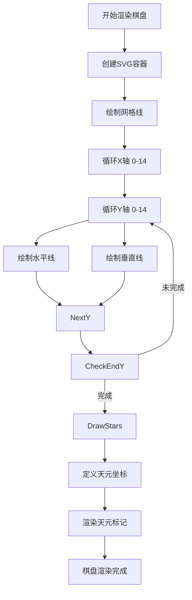
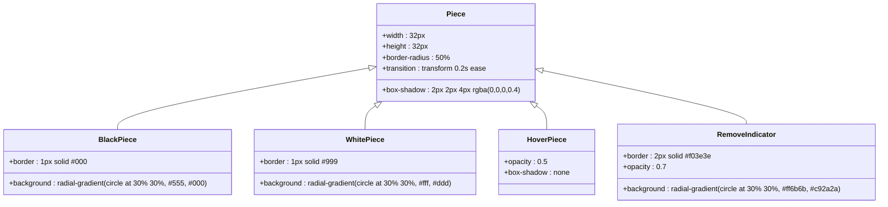
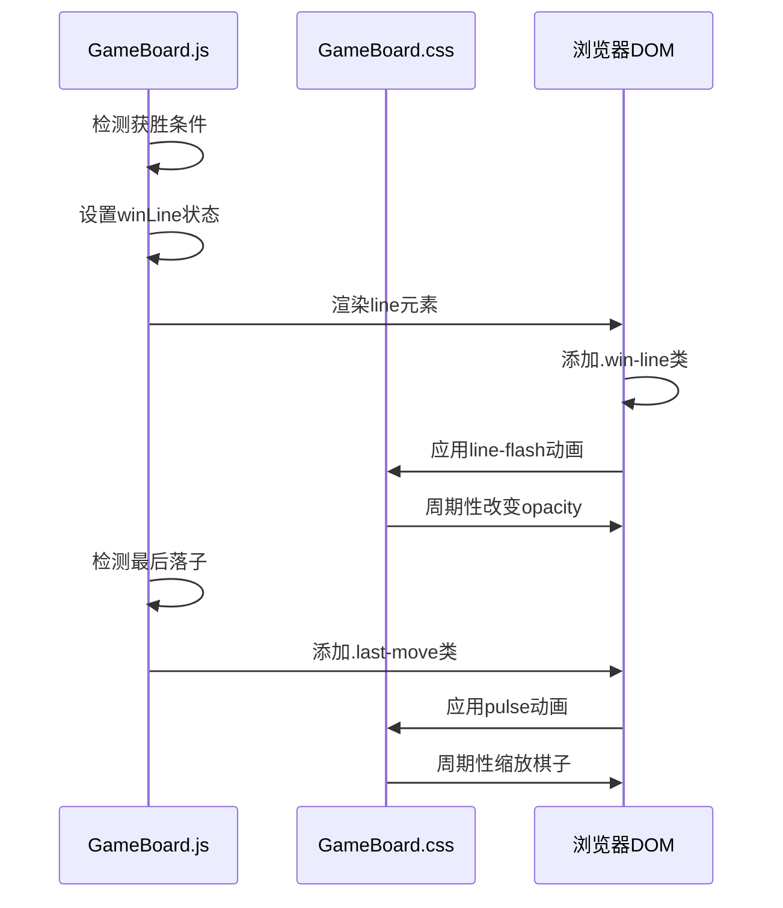

# 棋盘组件样式

<cite>
**Referenced Files in This Document**  
- [GameBoard.css](file://src/components/GameBoard.css)
- [GameBoard.js](file://src/components/GameBoard.js)
- [gameConstants.js](file://src/constants/gameConstants.js)
</cite>

## 目录
1. [简介](#简介)
2. [核心样式分析](#核心样式分析)
3. [棋盘网格实现](#棋盘网格实现)
4. [棋子渲染机制](#棋子渲染机制)
5. [高亮与动画效果](#高亮与动画效果)
6. [CSS与React状态绑定](#css与react状态绑定)
7. [响应式与布局考量](#响应式与布局考量)
8. [主题扩展建议](#主题扩展建议)

## 简介
本文档详细分析五子棋游戏中的棋盘组件样式实现，涵盖CSS与React组件的协同工作机制。重点解析棋盘网格绘制、棋子渲染逻辑、视觉反馈效果以及响应式设计策略。

## 核心样式分析

本节分析棋盘组件的核心CSS类及其功能。

**Section sources**
- [GameBoard.css](file://src/components/GameBoard.css#L1-L106)
- [GameBoard.js](file://src/components/GameBoard.js#L5-L152)

## 棋盘网格实现

`.board-grid` 类通过SVG元素实现15x15棋盘的绘制。SVG的宽度和高度由 `BOARD_SIZE` 和 `CELL_SIZE` 常量决定，确保布局的可配置性。网格线通过动态生成的 `<line>` 元素绘制，水平和垂直线在每个坐标位置均匀分布。

天元标记点通过 `<circle>` 元素实现，其位置根据预定义的坐标数组 `[[3, 3], [3, 11], [7, 7], [11, 3], [11, 11]]` 计算得出，`cx` 和 `cy` 属性基于 `CELL_SIZE` 进行定位，确保标记点精确位于交叉点中心。

**Diagram sources**
- [GameBoard.js](file://src/components/GameBoard.js#L50-L90)
- [GameBoard.css](file://src/components/GameBoard.css#L10-L15)

**Section sources**
- [GameBoard.js](file://src/components/GameBoard.js#L50-L90)
- [gameConstants.js](file://src/constants/gameConstants.js#L3-L4)

## 棋子渲染机制

棋子通过 `.piece` 类实现，采用绝对定位在 `.pieces-layer` 容器中。黑白棋子通过 `.black` 和 `.white` 类区分，使用 `radial-gradient` 创建立体光影效果。棋子大小固定为32px，通过 `border-radius: 50%` 实现圆形。

悬停预览效果（`.hover-piece`）通过降低 `opacity` 至0.5并移除阴影实现半透明效果，确保预览棋子不会干扰当前棋盘状态。移除指示器（`.remove-indicator`）使用红色渐变背景和红色边框，提供明确的视觉反馈。

**Diagram sources**
- [GameBoard.css](file://src/components/GameBoard.css#L25-L55)
- [GameBoard.js](file://src/components/GameBoard.js#L100-L130)

**Section sources**
- [GameBoard.css](file://src/components/GameBoard.css#L25-L55)
- [GameBoard.js](file://src/components/GameBoard.js#L100-L130)

## 高亮与动画效果

获胜棋子通过 `.winning` 类触发动画，使用 `winning-flash` 关键帧实现闪烁效果，通过改变 `box-shadow` 的强度和范围创造发光脉冲。最后落子通过 `.last-move` 类实现脉冲动画，使用 `pulse` 关键帧周期性缩放棋子。

获胜连线通过 `.win-line` 类实现，使用 `line-flash` 动画周期性改变透明度，创造闪烁效果。所有动画均通过CSS `animation` 属性控制，确保流畅的视觉体验。

**Diagram sources**
- [GameBoard.css](file://src/components/GameBoard.css#L65-L95)
- [GameBoard.js](file://src/components/GameBoard.js#L75-L85)

**Section sources**
- [GameBoard.css](file://src/components/GameBoard.css#L65-L95)
- [GameBoard.js](file://src/components/GameBoard.js#L75-L85)

## CSS与React状态绑定

CSS类名与React组件状态通过动态类名绑定实现。`renderPiece` 函数根据 `boardState`、`lastMove` 和 `winLine` 状态决定棋子的外观。`isWinningCell` 和 `isLastMoveCell` 辅助函数检查坐标是否在获胜线或最后落子位置，相应地添加 `winning` 或 `last-move` 类。

悬停效果通过 `hoverCell` 状态管理，`handleCellHover` 和 `handleCellLeave` 事件处理器更新状态，`renderHoverPiece` 函数根据当前悬停坐标和棋盘状态决定是否渲染预览棋子。

**Section sources**
- [GameBoard.js](file://src/components/GameBoard.js#L30-L130)

## 响应式与布局考量

棋盘布局采用固定 `CELL_SIZE`（40px）策略，确保在不同屏幕尺寸下保持一致的视觉比例。`.game-board-container` 使用相对定位，`.pieces-layer` 使用绝对定位，确保棋子层精确叠加在棋盘网格上方。

容器的 `padding: 20px` 为棋盘提供内边距，`box-shadow` 增强立体感。禁用状态通过 `.disabled` 类实现，设置 `pointer-events: none` 阻止用户交互，`opacity: 0.7` 提供视觉反馈。

**Section sources**
- [GameBoard.css](file://src/components/GameBoard.css#L1-L20)
- [gameConstants.js](file://src/constants/gameConstants.js#L4-L4)

## 主题扩展建议

可通过以下方式扩展主题：
1. 修改 `.board-grid` 的 `background-color` 和 `border` 属性更换棋盘颜色
2. 调整 `.piece` 的 `radial-gradient` 参数改变棋子材质
3. 替换 `winning-flash` 动画的颜色值自定义获胜效果
4. 修改 `CELL_SIZE` 常量调整棋盘整体尺寸
5. 通过CSS变量实现主题切换功能

**Section sources**
- [GameBoard.css](file://src/components/GameBoard.css#L1-L106)
- [gameConstants.js](file://src/constants/gameConstants.js#L3-L4)