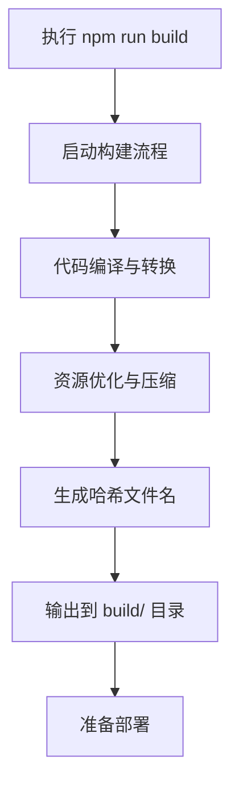
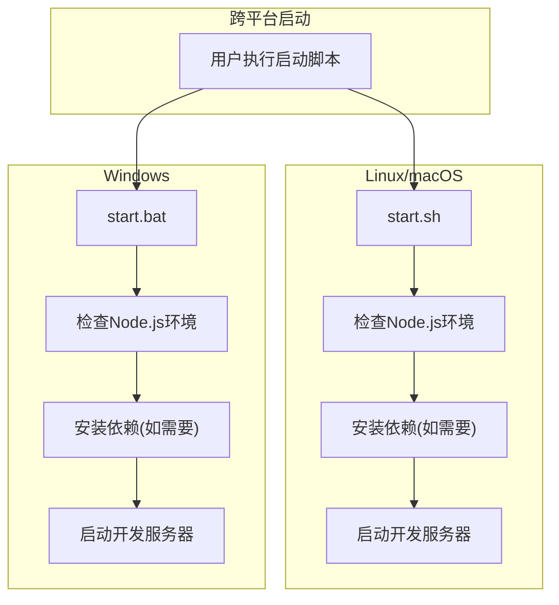

# 开发与构建流程

<cite>
**本文档中引用的文件**  
- [package.json](file://package.json)
- [start.sh](file://start.sh)
- [start.bat](file://start.bat)
- [README.md](file://README.md)
- [src/App.js](file://src/App.js)
- [src/components/GameContainer.js](file://src/components/GameContainer.js)
- [src/hooks/useGameState.js](file://src/hooks/useGameState.js)
</cite>

## 目录
1. [开发环境搭建](#开发环境搭建)
2. [代码热重载机制](#代码热重载机制)
3. [生产环境构建流程](#生产环境构建流程)
4. [启动脚本实现分析](#启动脚本实现分析)
5. [跨平台兼容性处理](#跨平台兼容性处理)
6. [代码调试建议](#代码调试建议)
7. [贡献者指南](#贡献者指南)

## 开发环境搭建

本项目基于React技术栈构建，开发环境搭建流程如下：

1. **安装Node.js与npm**：确保系统已安装Node.js（>=14.0.0）和npm（>=6.0.0）
2. **克隆项目仓库**：使用git clone命令获取项目源码
3. **安装依赖包**：在项目根目录执行`npm install`命令安装所有依赖

项目依赖管理通过`package.json`文件定义，核心依赖包括React 18、React DOM和React Scripts。开发服务器通过`react-scripts start`命令启动，自动监听3000端口。

**Section sources**
- [package.json](file://package.json#L1-L34)
- [README.md](file://README.md#L1-L210)

## 代码热重载机制

项目采用Create React App提供的开发服务器，支持热重载（Hot Reloading）功能。当开发者修改源代码文件时，开发服务器会自动检测文件变化并重新编译，浏览器将实时更新界面而无需手动刷新。

热重载机制的工作流程：
1. Webpack Dev Server监听src目录下所有文件的变更
2. 文件修改后触发增量编译
3. 编译完成后通过WebSocket通知浏览器
4. 浏览器加载更新后的模块并重新渲染组件

该机制显著提升了开发效率，开发者可即时查看代码修改效果。热重载支持JS、CSS和静态资源文件的变更检测。

**Section sources**
- [package.json](file://package.json#L1-L34)
- [src/App.js](file://src/App.js#L1-L14)

## 生产环境构建流程

生产环境构建通过`npm run build`命令执行，该命令调用`react-scripts build`进行生产级打包。构建过程包含以下关键步骤：

1. **代码优化**：自动进行Tree Shaking，移除未使用的代码
2. **压缩混淆**：JavaScript、CSS和HTML文件均被压缩和混淆
3. **资源哈希**：生成带内容哈希的文件名，实现缓存失效
4. **代码分割**：按路由和组件进行代码分割，实现懒加载
5. **环境变量替换**：将process.env变量替换为实际值

构建输出位于`build/`目录，包含静态HTML、JavaScript和CSS文件，可直接部署到任何静态文件服务器。输出文件经过优化，适合生产环境部署。

**Diagram sources**
- [package.json](file://package.json#L1-L34)

**Section sources**
- [package.json](file://package.json#L1-L34)
- [README.md](file://README.md#L1-L210)

## 启动脚本实现分析

项目提供`start.sh`（Linux/macOS）和`start.bat`（Windows）两个平台专用的启动脚本，其核心功能实现一致但语法不同。

### Bash脚本实现（start.sh）
使用Bash语法编写，主要功能包括：
- 检查Node.js和npm是否安装
- 显示版本信息
- 检查node_modules是否存在，若不存在则执行npm install
- 启动开发服务器

### 批处理脚本实现（start.bat）
使用Windows批处理语法编写，主要差异：
- 使用`@echo off`关闭命令回显
- 使用`chcp 65001`设置UTF-8编码
- 使用`where`命令检查工具是否存在
- 使用`pause`命令暂停以便查看错误信息

两个脚本均包含完善的错误处理机制，确保在依赖缺失时给出明确提示。

**Section sources**
- [start.sh](file://start.sh#L1-L63)
- [start.bat](file://start.bat#L1-L69)

## 跨平台兼容性处理

启动脚本通过以下方式实现跨平台兼容性：

1. **编码处理**：Windows脚本使用`chcp 65001`确保UTF-8编码支持，正确显示中文和Unicode符号
2. **路径分隔符**：避免硬编码路径分隔符，依赖系统默认行为
3. **命令语法**：使用各自平台的标准命令语法（Bash vs 批处理）
4. **错误处理**：统一的错误代码和用户提示，确保一致的用户体验

脚本设计遵循"一次编写，多平台运行"原则，开发者无需关心底层平台差异。两个脚本提供完全相同的功能和用户界面，仅语法实现不同。

**Diagram sources**
- [start.sh](file://start.sh#L1-L63)
- [start.bat](file://start.bat#L1-L69)

**Section sources**
- [start.sh](file://start.sh#L1-L63)
- [start.bat](file://start.bat#L1-L69)

## 代码调试建议

### React DevTools使用
1. 安装React Developer Tools浏览器扩展
2. 打开浏览器开发者工具，切换到Components标签页
3. 可查看组件树、props、state等信息
4. 支持时间旅行调试，可回溯状态变化

### 状态追踪技巧
利用项目中的日志输出机制进行状态追踪：
- `GameContainer.js`中的`console.log`语句记录关键操作
- `useGameState.js`中的reducer操作记录状态变更
- 通过浏览器控制台监控游戏状态变化

### 调试策略
1. **组件级调试**：从App组件开始，逐层向下分析组件props传递
2. **状态流分析**：跟踪useGameState返回的状态和动作函数调用
3. **事件流追踪**：分析用户交互事件的处理流程
4. **AI决策观察**：监控AI回合的决策逻辑和技能使用

**Section sources**
- [src/components/GameContainer.js](file://src/components/GameContainer.js#L1-L438)
- [src/hooks/useGameState.js](file://src/hooks/useGameState.js#L1-L542)

## 贡献者指南

为希望参与项目贡献的开发者提供以下操作路径：

1. **环境准备**：按照README.md文档搭建开发环境
2. **代码理解**：从`App.js`入口文件开始，了解整体架构
3. **功能开发**：遵循现有代码风格，在src目录下实现新功能
4. **测试验证**：确保新功能不影响现有游戏逻辑
5. **提交贡献**：通过GitHub提交Issue或Pull Request

核心代码结构：
- `src/components/`：React组件实现
- `src/hooks/`：自定义Hook，如useGameState
- `src/utils/`：工具函数，包含AI和游戏逻辑
- `src/constants/`：游戏常量定义

建议新贡献者先从修复文档或改进UI开始，逐步深入核心游戏逻辑。

**Section sources**
- [README.md](file://README.md#L1-L210)
- [src/App.js](file://src/App.js#L1-L14)
- [src/components/GameContainer.js](file://src/components/GameContainer.js#L1-L438)