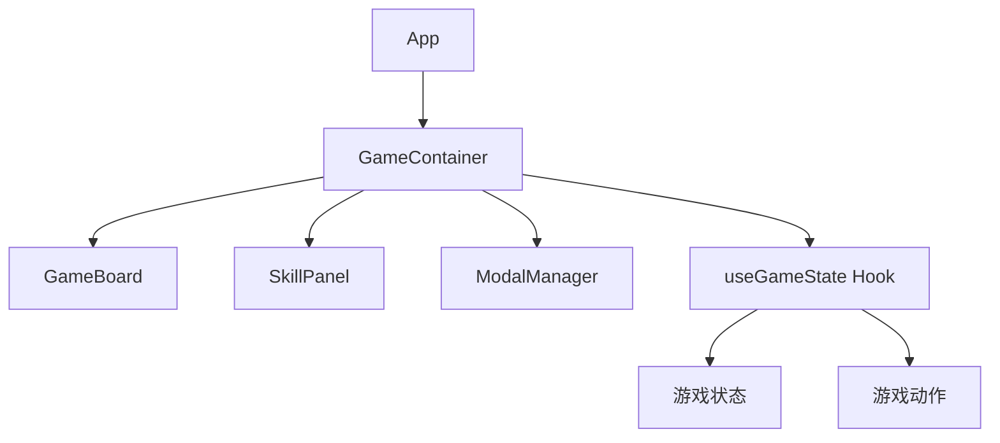

# 技术栈与依赖

<cite>
**本文档中引用的文件**  
- [package.json](file://package.json)
- [src/index.js](file://src/index.js)
- [public/index.html](file://public/index.html)
- [src/App.js](file://src/App.js)
- [src/components/GameContainer.js](file://src/components/GameContainer.js)
- [src/hooks/useGameState.js](file://src/hooks/useGameState.js)
</cite>

## 目录
1. [项目概述](#项目概述)
2. [核心前端技术栈](#核心前端技术栈)
3. [主要依赖项分析](#主要依赖项分析)
4. [构建流程与开发服务器](#构建流程与开发服务器)
5. [客户端架构与组件结构](#客户端架构与组件结构)
6. [无后端依赖说明](#无后端依赖说明)
7. [总结与维护建议](#总结与维护建议)

## 项目概述

本项目是一个基于React的单页应用（SPA），实现了一个带有独特技能系统的创新五子棋游戏。项目完全在客户端运行，不依赖任何后端服务，所有游戏逻辑、状态管理和AI决策均在浏览器中完成。

项目采用现代前端开发工作流，使用Create React App作为基础脚手架，结合React 18的新特性（如`createRoot`）构建高性能的用户界面。游戏包含复杂的交互逻辑，包括技能系统、AI对手、状态冻结、反制机制等，展示了React在复杂状态管理方面的强大能力。

**Section sources**
- [package.json](file://package.json#L1-L34)
- [public/index.html](file://public/index.html#L1-L15)

## 核心前端技术栈

### React 18.x

React 18是本项目的核心UI库，提供了声明式组件模型和高效的虚拟DOM更新机制。项目中使用了React 18引入的`createRoot` API来渲染应用，这是React 18推荐的新根节点创建方式，相比旧的`ReactDOM.render`提供了更好的并发渲染支持。

React的组件化架构使得游戏的不同部分（如棋盘、技能面板、弹窗管理器）可以被清晰地分离和复用。通过函数组件和Hooks（如`useState`、`useEffect`、`useCallback`）实现了复杂的状态逻辑和副作用管理。

### React DOM

React DOM负责将React组件渲染到实际的DOM元素中。在`src/index.js`中，通过`ReactDOM.createRoot`创建根节点，并将`<App />`组件渲染到id为`root`的DOM元素中。React DOM确保了UI与应用状态的同步，并优化了DOM操作的性能。

### React Scripts

`react-scripts`是Create React App的核心包，封装了Webpack、Babel、ESLint等工具的配置，为开发者提供了开箱即用的开发体验。它负责：

- **开发服务器**：提供热重载（HMR）功能，修改代码后自动刷新浏览器
- **构建流程**：将JSX、ES6+代码编译为浏览器兼容的JavaScript
- **CSS处理**：支持CSS模块化、自动前缀添加
- **优化**：生产环境下的代码压缩、分包、Tree Shaking

**Section sources**
- [src/index.js](file://src/index.js#L1-L12)
- [package.json](file://package.json#L7-L11)

## 主要依赖项分析

### 依赖项列表

| 依赖包 | 版本范围 | 作用 |
|--------|---------|------|
| react | ^18.2.0 | 核心UI库，提供组件系统和状态管理 |
| react-dom | ^18.2.0 | 将React组件渲染到DOM |
| react-scripts | 5.0.1 | 构建工具链，包含Webpack、Babel等 |

### 选择原因

- **React 18**：选择最新稳定版本以利用其并发渲染、自动批处理等性能优化特性，提升游戏交互的流畅性
- **React DOM**：与React配套使用，确保UI渲染的一致性和高效性
- **React Scripts 5.0.1**：这是Create React App的最新稳定版本，支持React 18的所有新特性，并提供了优化的构建配置

这些依赖项共同构成了一个现代化、高性能的前端开发环境，使开发者可以专注于游戏逻辑的实现，而不必关心复杂的构建配置。

**Section sources**
- [package.json](file://package.json#L7-L11)

## 构建流程与开发服务器

### 构建流程

项目的构建流程由`react-scripts`完全管理，主要步骤包括：

1. **JSX编译**：使用Babel将JSX语法转换为`React.createElement`调用
2. **ES6+转译**：将现代JavaScript语法转换为兼容性更好的ES5代码
3. **CSS处理**：合并、压缩CSS文件，添加浏览器前缀
4. **资源优化**：图片压缩、字体优化
5. **代码分割**：自动进行代码分包，实现懒加载
6. **生产优化**：Uglify压缩、Tree Shaking去除未使用代码

### 开发服务器机制

通过`npm start`命令启动开发服务器，`react-scripts`会：

- 启动一个本地开发服务器（默认端口3000）
- 监听文件变化，实现热重载
- 提供源码映射（source map）便于调试
- 自动打开浏览器并加载应用
- 提供开发环境下的错误提示和警告

开发服务器还集成了ESLint，可以在开发过程中实时检查代码质量，确保代码风格的一致性。

**Section sources**
- [package.json](file://package.json#L12-L19)

## 客户端架构与组件结构

### 架构概览

项目采用典型的React组件化架构，以`App`组件为根，组织各个功能组件：

**Diagram sources**
- [src/App.js](file://src/App.js#L1-L15)
- [src/components/GameContainer.js](file://src/components/GameContainer.js#L1-L439)

### 核心组件

- **GameContainer**：游戏主容器，管理游戏逻辑、AI回合、技能使用等核心功能
- **GameBoard**：棋盘组件，负责渲染棋盘网格、棋子和获胜连线
- **SkillPanel**：技能面板，显示玩家和AI的可用技能
- **ModalManager**：弹窗管理器，处理技能确认、反制、游戏结束等模态对话框
- **useGameState**：自定义Hook，使用`useReducer`管理复杂的游戏状态

### 状态管理

项目使用React Hooks进行状态管理：
- `useState`：管理组件局部状态
- `useEffect`：处理副作用（如AI回合、游戏结束检测）
- `useReducer`：在`useGameState`中管理复杂的游戏状态机
- `useCallback`：优化性能，避免不必要的函数重新创建

这种组合提供了灵活而强大的状态管理能力，适合游戏这种高交互、复杂状态的应用场景。

**Section sources**
- [src/components/GameContainer.js](file://src/components/GameContainer.js#L1-L439)
- [src/hooks/useGameState.js](file://src/hooks/useGameState.js#L1-L543)

## 无后端依赖说明

本项目完全为客户端实现，不依赖任何后端服务或API接口。所有游戏数据和逻辑均在浏览器内存中处理，具有以下特点：

- **零网络请求**：游戏运行过程中不发送任何HTTP请求
- **纯前端AI**：AI决策算法（如`findBestMove`、`decideSkillUsage`）在客户端执行
- **本地状态管理**：游戏状态通过React状态管理，无需服务器存储
- **离线可用**：一旦加载完成，可在无网络环境下正常运行

这种设计使得项目部署极其简单，只需将构建后的静态文件部署到任何静态文件服务器即可运行，非常适合小游戏、演示项目或学习用途。

**Section sources**
- [src/utils/aiUtils.js](file://src/utils/aiUtils.js#L1-L276)
- [src/hooks/useGameState.js](file://src/hooks/useGameState.js#L1-L543)

## 总结与维护建议

本项目是一个典型的现代React单页应用，展示了如何使用React 18和Create React App构建复杂的交互式游戏。技术栈选择合理，依赖项精简，构建流程自动化程度高。

对于希望扩展或维护项目的开发者，建议：

1. **遵循现有模式**：新增功能时，尽量使用现有的组件模式和状态管理方式
2. **保持依赖精简**：除非必要，避免引入新的大型依赖
3. **利用Hooks**：优先使用自定义Hook封装可复用的逻辑
4. **测试**：可以考虑添加单元测试和集成测试，确保游戏逻辑的正确性
5. **性能优化**：对于复杂计算（如AI决策），可以考虑使用Web Workers避免阻塞UI线程

项目结构清晰，代码组织良好，为后续的扩展和维护提供了坚实的基础。

**Section sources**
- [package.json](file://package.json#L1-L34)
- [src/index.js](file://src/index.js#L1-L12)