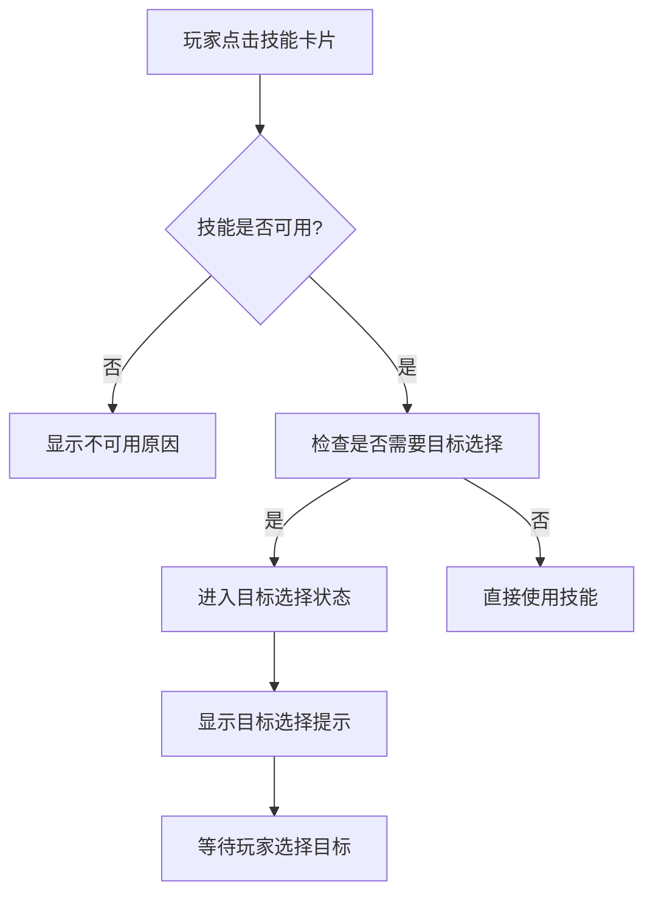
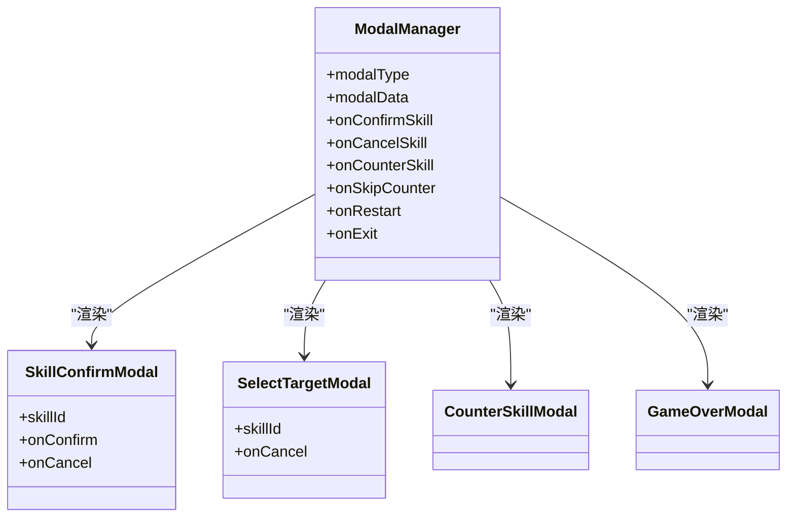
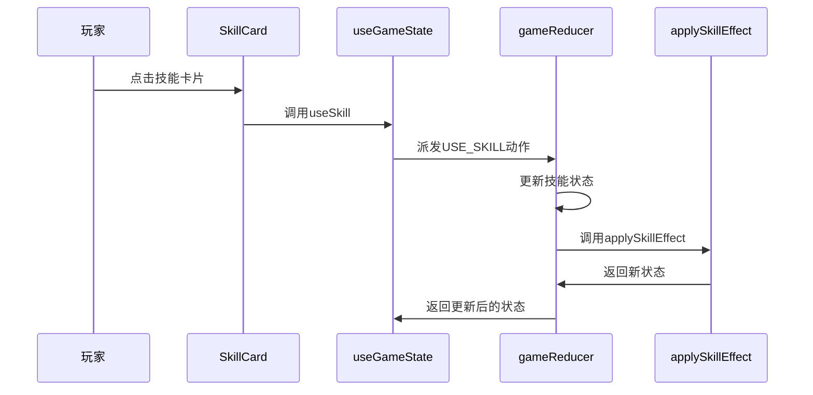
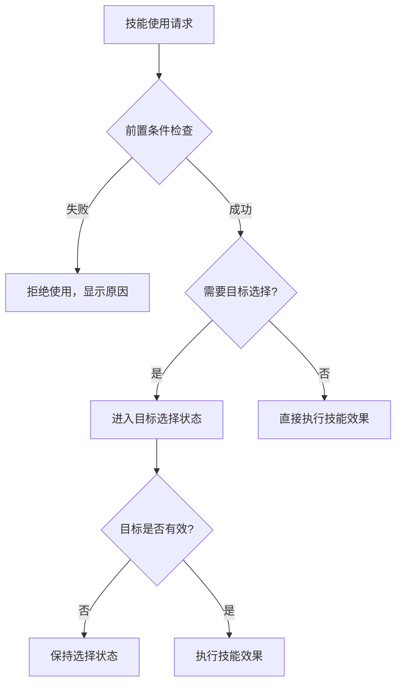
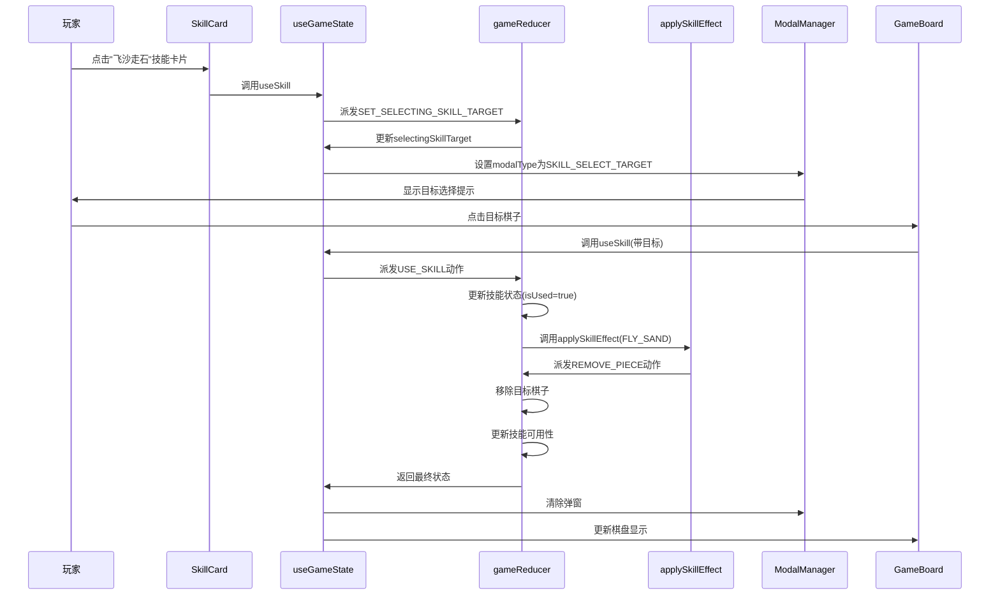

# 技能使用流程

<cite>
**Referenced Files in This Document**   
- [useGameState.js](file://src/hooks/useGameState.js)
- [ModalManager.js](file://src/components/ModalManager.js)
- [SkillCard.js](file://src/components/SkillCard.js)
- [gameConstants.js](file://src/constants/gameConstants.js)
- [GameBoard.js](file://src/components/GameBoard.js)
- [SkillPanel.js](file://src/components/SkillPanel.js)
</cite>

## 目录
1. [技能使用流程概述](#技能使用流程概述)
2. [核心组件与状态管理](#核心组件与状态管理)
3. [技能触发与目标选择流程](#技能触发与目标选择流程)
4. [技能执行与效果处理](#技能执行与效果处理)
5. [约束机制与异常处理](#约束机制与异常处理)
6. [完整流程时序图](#完整流程时序图)

## 技能使用流程概述

本文档深入解析技能从触发到执行的完整流程链路，以`useGameState`中的`useSkill`和`setSelectingSkillTarget`动作为核心，详细描述玩家点击技能卡片（SkillCard）后如何进入目标选择状态，特别是"飞沙走石"技能需选择目标棋子的交互流程。

文档涵盖`ModalManager`在技能确认和目标选择中的弹窗机制（`MODAL_TYPE.SKILL_SELECT_TARGET`），结合`ACTIONS.USE_SKILL`动作的派发与`gameReducer`中`applySkillEffect`的处理逻辑，展示状态更新与效果执行的全过程。同时，详细说明技能冷却、回合限制、前置条件检查等约束机制的实现方式，并提供正常流程与异常处理（如无效目标）的代码示例。

**Section sources**
- [useGameState.js](file://src/hooks/useGameState.js#L1-L542)
- [gameConstants.js](file://src/constants/gameConstants.js#L1-L181)

## 核心组件与状态管理

### useGameState Hook
`useGameState`是游戏状态管理的核心Hook，通过`useReducer`管理游戏的全局状态。它暴露了`useSkill`和`setSelectingSkillTarget`等关键方法，用于处理技能相关的用户交互和状态变更。

该Hook维护了包括棋盘状态、当前玩家、游戏阶段、技能状态等在内的完整游戏状态，并通过`gameReducer`处理各种动作，确保状态的一致性和可预测性。

### 技能状态管理
技能状态通过`playerSkillStates`和`aiSkillStates`两个对象分别管理玩家和AI的技能状态。每个技能状态包含以下关键属性：
- `isUsed`: 技能是否已被使用
- `isAvailable`: 技能是否可用
- `usedAtTurn`: 技能使用的回合数
- `canCounter`: 是否可以反制

技能的可用性通过`updateSkillAvailability`函数动态更新，该函数会根据技能的前置条件（如`requireCondition`）和当前游戏状态来决定技能是否可用。

**Section sources**
- [useGameState.js](file://src/hooks/useGameState.js#L1-L542)
- [gameConstants.js](file://src/constants/gameConstants.js#L1-L181)

## 技能触发与目标选择流程

### 技能卡片交互
当玩家点击技能卡片时，`SkillCard`组件会触发`onClick`回调。该组件首先检查技能状态（是否已使用、是否可用），只有在满足条件时才会触发技能使用流程。

**Diagram sources**
- [SkillCard.js](file://src/components/SkillCard.js#L1-L108)
- [useGameState.js](file://src/hooks/useGameState.js#L1-L542)

### 目标选择状态管理
对于需要选择目标的技能（如"飞沙走石"），系统通过`setSelectingSkillTarget`动作进入目标选择状态。该状态会更新`selectingSkillTarget`字段，指示当前正在选择技能目标。

`GameBoard`组件会根据此状态改变鼠标悬停效果，显示移除指示器（remove-indicator），提示玩家可以点击棋盘上的棋子作为目标。

### 弹窗机制
`ModalManager`负责管理所有游戏弹窗，包括技能确认和目标选择。当需要确认技能使用时，会显示`SKILL_CONFIRM`类型的弹窗；当需要选择目标时，会显示`SKILL_SELECT_TARGET`类型的弹窗。

**Diagram sources**
- [ModalManager.js](file://src/components/ModalManager.js#L1-L210)
- [gameConstants.js](file://src/constants/gameConstants.js#L1-L181)

**Section sources**
- [ModalManager.js](file://src/components/ModalManager.js#L1-L210)
- [SkillCard.js](file://src/components/SkillCard.js#L1-L108)
- [GameBoard.js](file://src/components/GameBoard.js#L1-L155)

## 技能执行与效果处理

### 动作派发流程
技能使用流程始于`useSkill`方法的调用，该方法会派发`ACTIONS.USE_SKILL`动作。这个动作包含技能ID、所有者和目标（如果需要）等信息。

**Diagram sources**
- [useGameState.js](file://src/hooks/useGameState.js#L1-L542)
- [gameConstants.js](file://src/constants/gameConstants.js#L1-L181)

### 效果执行逻辑
`applySkillEffect`函数负责执行各种技能的具体效果。不同的技能ID会触发不同的效果逻辑：

- **飞沙走石 (FLY_SAND)**: 移除指定位置的棋子
- **拾金不昧 (PICK_GOLD)**: 恢复被移除的棋子
- **静如止水 (STILL_WATER)**: 冻结对手玩家
- **力拔山兮 (MOUNTAIN_POWER)**: 摔坏棋盘，直接获胜

执行技能效果时，会通过`gameReducer`派发相应的子动作（如`REMOVE_PIECE`、`UPDATE_FROZEN_STATUS`等），确保状态变更的一致性和可追溯性。

**Section sources**
- [useGameState.js](file://src/hooks/useGameState.js#L1-L542)
- [gameConstants.js](file://src/constants/gameConstants.js#L1-L181)

## 约束机制与异常处理

### 技能约束机制
系统实现了多种技能使用约束机制，确保游戏的平衡性和策略性：

1. **使用次数限制**: 每个技能有固定的`usageCount`，通常为1次
2. **前置条件检查**: 某些技能需要特定条件才能使用（如"拾金不昧"需要有被移除的棋子）
3. **冷却机制**: 技能使用后标记为`isUsed`，无法再次使用
4. **回合限制**: 部分技能效果会影响多个回合（如冻结效果持续2回合）

### 异常处理
系统对各种异常情况进行了妥善处理：

- **无效目标**: 当玩家选择无效目标时，系统会忽略该操作，保持在目标选择状态
- **技能不可用**: 如果技能因各种原因不可用，技能卡片会显示为灰色，并提示具体原因
- **状态不一致**: 通过`useReducer`的不可变性保证，确保状态变更的可预测性

**Diagram sources**
- [useGameState.js](file://src/hooks/useGameState.js#L1-L542)
- [SkillCard.js](file://src/components/SkillCard.js#L1-L108)

**Section sources**
- [useGameState.js](file://src/hooks/useGameState.js#L1-L542)
- [SkillCard.js](file://src/components/SkillCard.js#L1-L108)

## 完整流程时序图

**Diagram sources**
- [useGameState.js](file://src/hooks/useGameState.js#L1-L542)
- [ModalManager.js](file://src/components/ModalManager.js#L1-L210)
- [SkillCard.js](file://src/components/SkillCard.js#L1-L108)
- [GameBoard.js](file://src/components/GameBoard.js#L1-L155)

**Section sources**
- [useGameState.js](file://src/hooks/useGameState.js#L1-L542)
- [ModalManager.js](file://src/components/ModalManager.js#L1-L210)
- [SkillCard.js](file://src/components/SkillCard.js#L1-L108)
- [GameBoard.js](file://src/components/GameBoard.js#L1-L155)