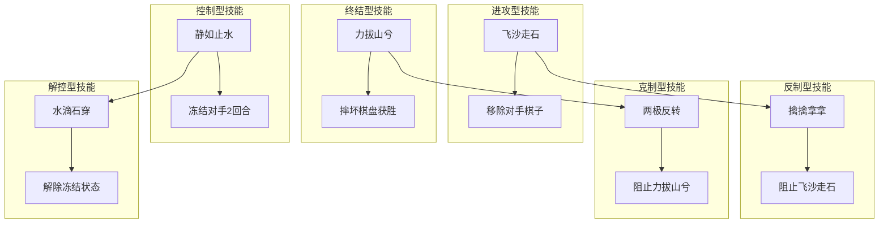
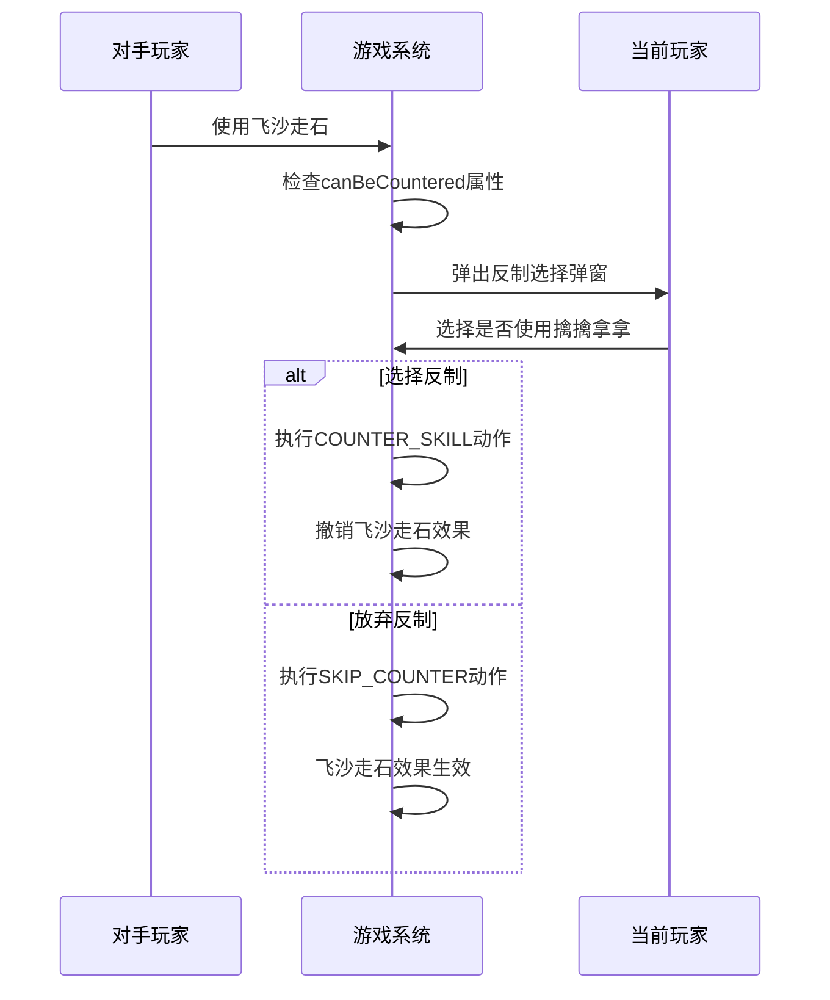
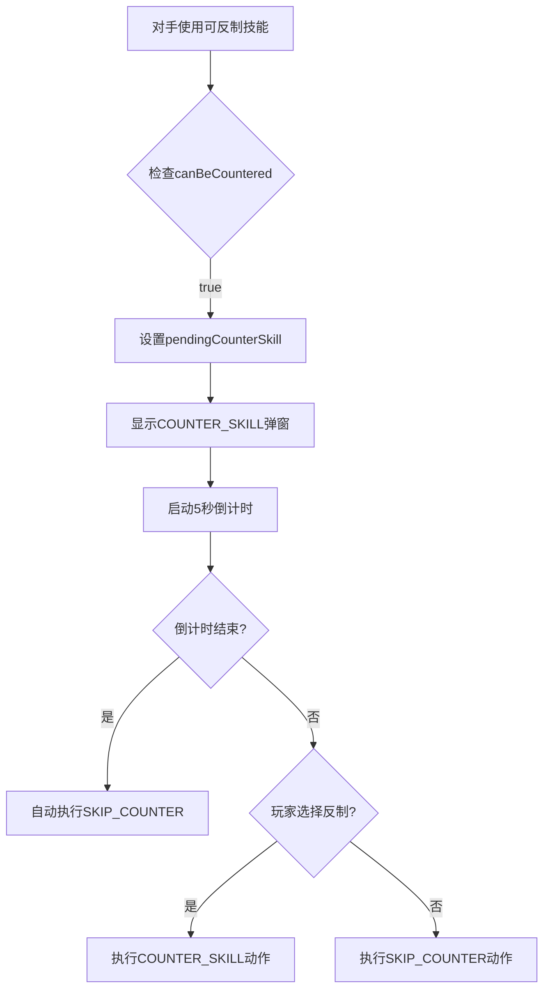
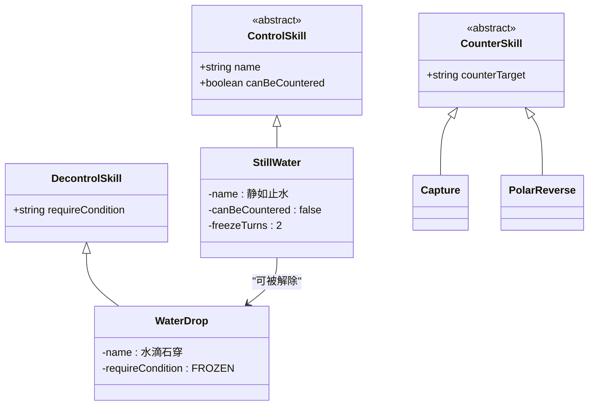
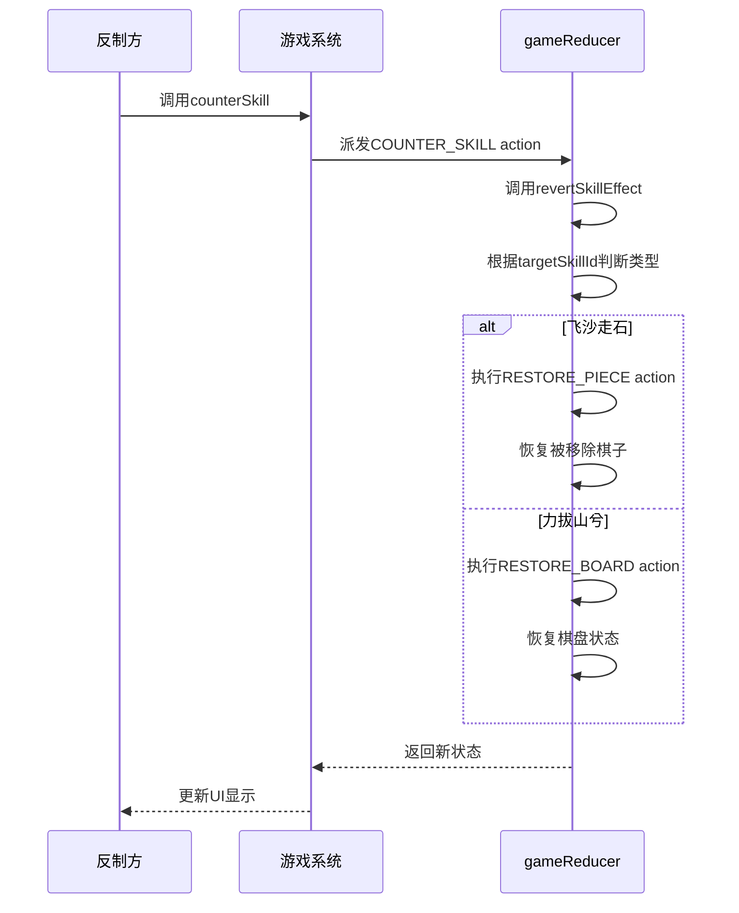
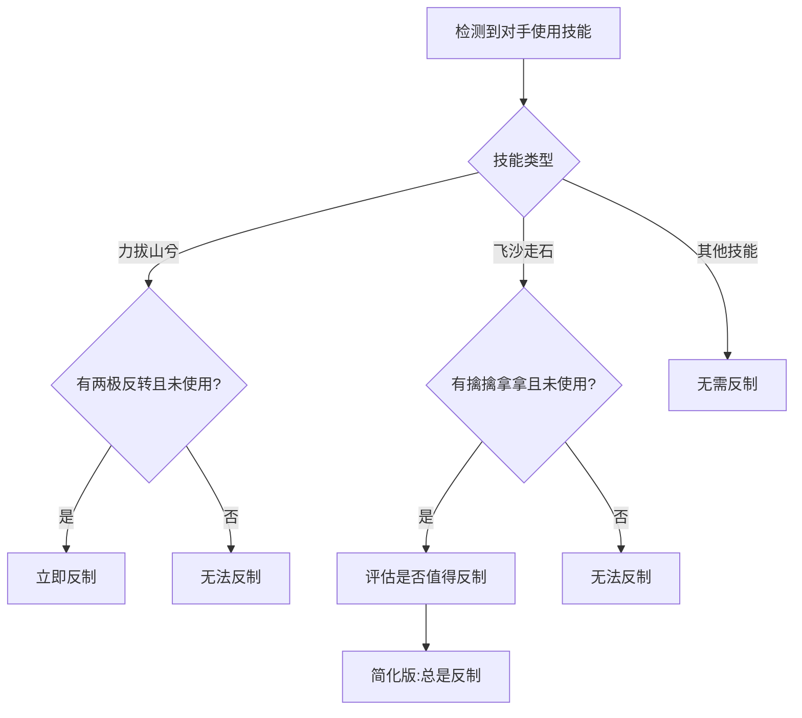

# 技能反制机制

<cite>
**Referenced Files in This Document**  
- [SKILL_RELATIONSHIPS.md](file://SKILL_RELATIONSHIPS.md)
- [src/hooks/useGameState.js](file://src/hooks/useGameState.js)
- [src/utils/aiUtils.js](file://src/utils/aiUtils.js)
- [src/constants/gameConstants.js](file://src/constants/gameConstants.js)
</cite>

## 目录
1. [技能反制关系图示](#技能反制关系图示)
2. [立即反制机制](#立即反制机制)
3. [反制弹窗与倒计时](#反制弹窗与倒计时)
4. [静如止水的特殊设计](#静如止水的特殊设计)
5. [反制成功后的效果撤销](#反制成功后的效果撤销)
6. [AI反制决策逻辑](#ai反制决策逻辑)

## 技能反制关系图示

根据SKILL_RELATIONSHIPS.md文件中的反制链条图示，技能之间存在明确的克制关系。系统中的技能被分为进攻型、防御型、反制型、控制型、解控型、终结型、克制型和复活型八类，形成了完整的技能生态。

**Diagram sources**  
- [SKILL_RELATIONSHIPS.md](file://SKILL_RELATIONSHIPS.md#L1-L236)

**Section sources**  
- [SKILL_RELATIONSHIPS.md](file://SKILL_RELATIONSHIPS.md#L1-L236)

## 立即反制机制

系统实现了两种立即反制关系：飞沙走石与擒擒拿拿、力拔山兮与两极反转。当对手使用可被反制的技能时，系统会立即触发反制流程。

在gameConstants.js中，技能配置明确指定了反制关系：
- 飞沙走石（SKILL_01）可被擒擒拿拿（SKILL_03）反制
- 力拔山兮（SKILL_06）可被两极反转（SKILL_07）反制

**Diagram sources**  
- [src/constants/gameConstants.js](file://src/constants/gameConstants.js#L70-L100)
- [src/hooks/useGameState.js](file://src/hooks/useGameState.js#L134-L386)

**Section sources**  
- [src/constants/gameConstants.js](file://src/constants/gameConstants.js#L70-L100)
- [src/hooks/useGameState.js](file://src/hooks/useGameState.js#L134-L386)

## 反制弹窗与倒计时

反制弹窗（MODAL_TYPE.COUNTER_SKILL）的触发时机由useGameState中的状态管理逻辑控制。当对手使用可反制技能时，系统会设置pendingCounterSkill状态，从而触发反制弹窗的显示。

在useGameState.js中，通过counterSkill动作处理反制逻辑，该动作会派发COUNTER_SKILL类型的action。反制倒计时机制由COUNTER_SKILL_TIMEOUT常量控制，其值为5秒，定义在gameConstants.js中。

**Diagram sources**  
- [src/hooks/useGameState.js](file://src/hooks/useGameState.js#L493-L541)
- [src/constants/gameConstants.js](file://src/constants/gameConstants.js#L175-L181)

**Section sources**  
- [src/hooks/useGameState.js](file://src/hooks/useGameState.js#L493-L541)
- [src/constants/gameConstants.js](file://src/constants/gameConstants.js#L175-L181)

## 静如止水的特殊设计

静如止水技能被设计为不能被立即反制的关键决策，这在gameConstants.js中有明确体现：`canBeCountered: false`。这一设计避免了双方互相冻结的无限循环问题。

与水滴石穿的对比分析：
- 静如止水是控制型技能，不能被立即反制
- 水滴石穿是解控型技能，是主动技能而非反制技能
- 水滴石穿只能在被冻结时由被冻结方主动使用

**Diagram sources**  
- [src/constants/gameConstants.js](file://src/constants/gameConstants.js#L90-L95)
- [src/hooks/useGameState.js](file://src/hooks/useGameState.js#L389-L451)

**Section sources**  
- [src/constants/gameConstants.js](file://src/constants/gameConstants.js#L90-L95)
- [src/hooks/useGameState.js](file://src/hooks/useGameState.js#L389-L451)

## 反制成功后的效果撤销

反制成功后，系统通过revertSkillEffect函数撤销原技能效果。该函数在gameReducer中实现，根据不同技能类型执行相应的撤销操作。

对于飞沙走石，反制成功后会恢复被移除的棋子；对于力拔山兮，反制成功后会恢复棋盘。这一机制确保了游戏状态的一致性和公平性。

**Diagram sources**  
- [src/hooks/useGameState.js](file://src/hooks/useGameState.js#L454-L490)
- [src/hooks/useGameState.js](file://src/hooks/useGameState.js#L134-L386)

**Section sources**  
- [src/hooks/useGameState.js](file://src/hooks/useGameState.js#L454-L490)

## AI反制决策逻辑

AI的反制决策逻辑在aiUtils.js中实现，主要通过decideCounterSkill函数进行判断。AI会优先反制力拔山兮，因为这是直接获胜的技能；对于飞沙走石，则会根据情况决定是否反制。

AI决策考虑因素包括：对手技能类型、自身可用技能、游戏局势等。这一设计使得AI在关键时刻能够做出合理的反制选择，提升游戏的挑战性和策略性。

**Diagram sources**  
- [src/utils/aiUtils.js](file://src/utils/aiUtils.js#L256-L274)
- [src/utils/aiUtils.js](file://src/utils/aiUtils.js#L115-L173)

**Section sources**  
- [src/utils/aiUtils.js](file://src/utils/aiUtils.js#L256-L274)