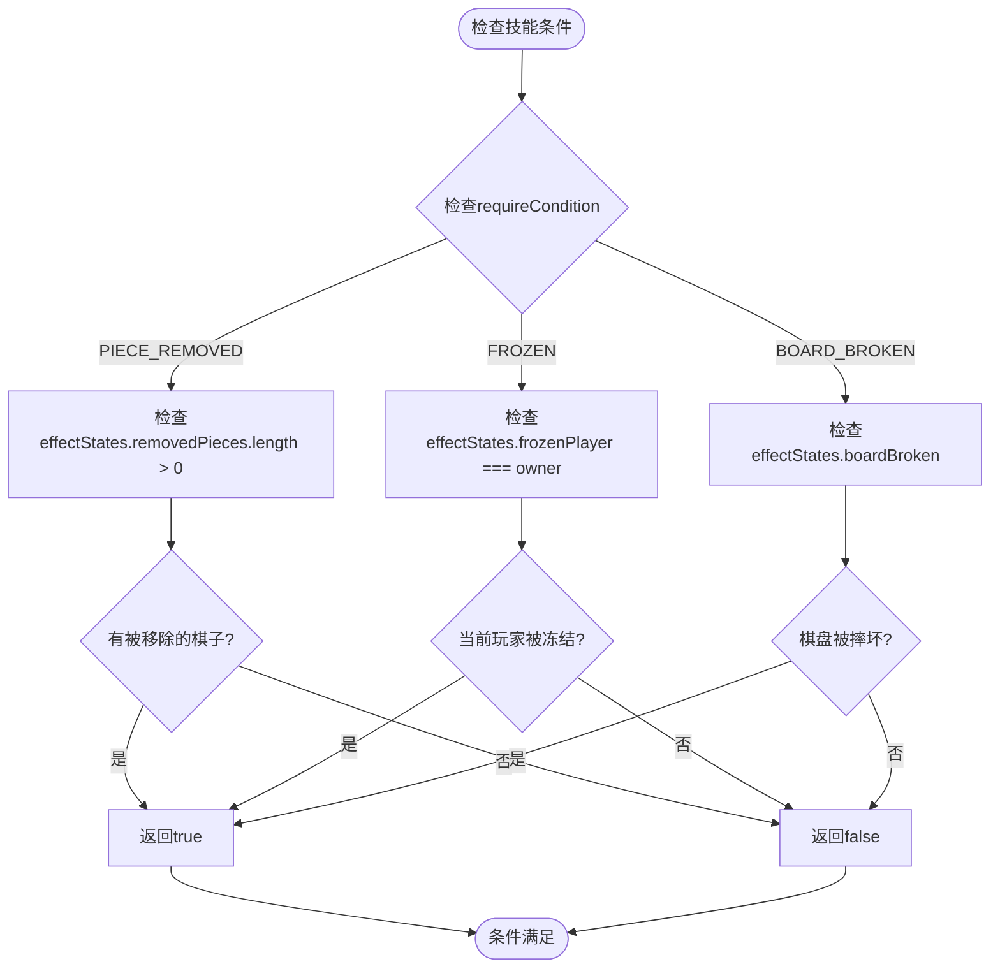
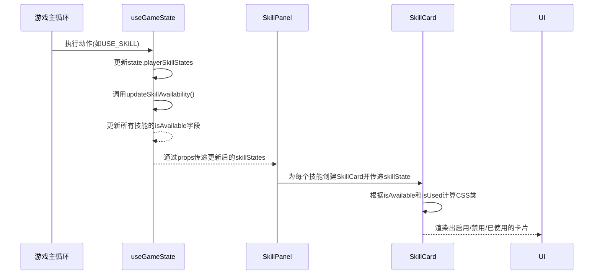

# 技能可用性与冷却机制

<cite>
**Referenced Files in This Document**   
- [useGameState.js](file://src/hooks/useGameState.js)
- [gameConstants.js](file://src/constants/gameConstants.js)
- [SkillCard.js](file://src/components/SkillCard.js)
- [SkillPanel.js](file://src/components/SkillPanel.js)
</cite>

## 目录
1. [技能可用性三重判断标准](#技能可用性三重判断标准)
2. [特殊技能条件检测逻辑](#特殊技能条件检测逻辑)
3. [UI状态同步机制](#ui状态同步机制)
4. [技能使用后永久失效设计](#技能使用后永久失效设计)
5. [与传统冷却系统的区别](#与传统冷却系统的区别)

## 技能可用性三重判断标准

技能是否可用由 `updateSkillAvailability` 函数在游戏状态更新时进行判断，遵循三重判断标准：

1.  **是否已使用 (isUsed)**：技能一旦被使用，其 `isUsed` 标志位会被设置为 `true`，此后该技能将永久不可用。
2.  **前置条件是否满足 (requireCondition)**：对于有特殊前置条件的技能（如“拾金不昧”），其可用性取决于 `checkSkillCondition` 函数的返回结果。
3.  **当前回合状态**：技能的可用性会根据游戏的实时状态（如棋盘状态、被移除的棋子等）动态更新。

该逻辑在 `useGameState.js` 中实现，确保了在每次游戏状态变化（如落子、使用技能、切换玩家）后，所有技能的可用性都能得到及时、准确的评估。

**Section sources**
- [useGameState.js](file://src/hooks/useGameState.js#L38-L70)

## 特殊技能条件检测逻辑

`checkSkillCondition` 函数负责检测特定技能的前置条件，其实现逻辑如下：

**Diagram sources**
- [useGameState.js](file://src/hooks/useGameState.js#L72-L95)

**Section sources**
- [useGameState.js](file://src/hooks/useGameState.js#L72-L95)
- [gameConstants.js](file://src/constants/gameConstants.js#L57-L127)

### 拾金不昧（需有被移除棋子）
该技能的 `requireCondition` 为 `PIECE_REMOVED`。`checkSkillCondition` 会检查全局状态 `effectStates.removedPieces` 数组的长度。只有当该数组不为空（即存在被“飞沙走石”等技能移除的棋子）时，此技能才可用。

### 水滴石穿（需被冻结）
该技能的 `requireCondition` 为 `FROZEN`。`checkSkillCondition` 会检查 `effectStates.frozenPlayer` 是否等于当前技能拥有者（`owner`）。只有当技能拥有者正处于被“静如止水”技能冻结的状态时，此技能才可用。

### 东山再起（需棋盘被摔坏）
该技能的 `requireCondition` 为 `BOARD_BROKEN`。`checkSkillCondition` 会直接检查 `effectStates.boardBroken` 的布尔值。只有当棋盘已被“力拔山兮”技能摔坏时，此技能才可用。

## UI状态同步机制

技能卡片在用户界面上的启用/禁用状态是通过 `playerSkillStates` 和 `aiSkillStates` 中的 `isAvailable` 字段来同步的。

1.  **状态来源**：`useGameState` Hook 管理着 `playerSkillStates` 和 `aiSkillStates` 这两个对象，它们包含了所有技能的完整状态，其中 `isAvailable` 字段直接反映了技能的可用性。
2.  **组件传递**：`SkillPanel` 组件接收 `skillStates` 作为属性，并将其传递给每个 `SkillCard`。
3.  **UI渲染**：`SkillCard` 组件根据接收到的 `skillState.isAvailable` 和 `skillState.isUsed` 值，通过 `getCardClassName` 函数动态生成 CSS 类名（如 `available`, `unavailable`, `used`），从而改变卡片的视觉样式（颜色、图标、提示信息）。

**Diagram sources**
- [useGameState.js](file://src/hooks/useGameState.js#L38-L70)
- [SkillPanel.js](file://src/components/SkillPanel.js#L1-L62)
- [SkillCard.js](file://src/components/SkillCard.js#L1-L109)

**Section sources**
- [useGameState.js](file://src/hooks/useGameState.js#L38-L70)
- [SkillPanel.js](file://src/components/SkillPanel.js#L1-L62)
- [SkillCard.js](file://src/components/SkillCard.js#L1-L109)

## 技能使用后永久失效设计

本系统中，所有技能的 `usageCount` 均被设置为 `1`。这意味着：

*   **一次性使用**：任何技能在被成功使用一次后，其 `isUsed` 字段会被永久标记为 `true`。
*   **永久失效**：一旦 `isUsed` 为 `true`，`updateSkillAvailability` 函数会立即将该技能的 `isAvailable` 设置为 `false`，并且此状态不可逆转。
*   **全局状态**：此设计通过 `playerSkillStates` 和 `aiSkillStates` 对象中的 `isUsed` 字段来实现，确保了状态的持久性和一致性。

这种设计鼓励玩家在关键时刻做出战略性选择，因为每个技能都只有一次使用机会。

**Section sources**
- [gameConstants.js](file://src/constants/gameConstants.js#L57-L127)
- [useGameState.js](file://src/hooks/useGameState.js#L48-L51)

## 与传统冷却系统的区别

本系统的技能机制与传统的“冷却时间”（Cooldown）系统有本质区别：

| 特性 | 本系统 (永久失效) | 传统冷却系统 |
| :--- | :--- | :--- |
| **重置机制** | **不可重置**：技能使用后永久失效，无法再次使用。 | **自动重置**：技能使用后进入冷却，经过一段时间后自动恢复可用。 |
| **使用次数** | **一次性**：每个技能在整个游戏中只能使用一次。 | **可重复使用**：技能可以被多次使用，只要冷却时间结束。 |
| **策略重点** | **时机选择**：核心策略在于选择最合适的时机使用唯一的技能。 | **资源管理**：策略在于管理技能使用频率，避免在关键时刻技能处于冷却中。 |
| **技术实现** | 使用 `isUsed` 布尔标志和 `usageCount=1` 来实现一次性使用。 | 通常使用倒计时计数器（如 `cooldownTimer`）来跟踪剩余冷却时间。 |

**Section sources**
- [gameConstants.js](file://src/constants/gameConstants.js#L57-L127)
- [useGameState.js](file://src/hooks/useGameState.js#L38-L70)