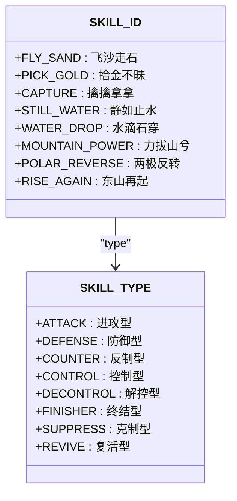
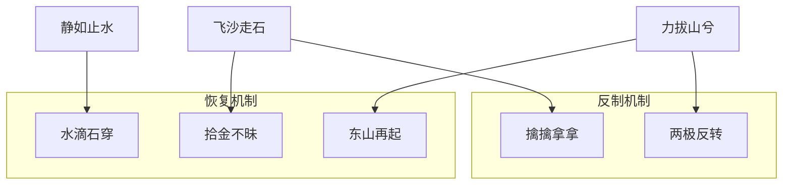
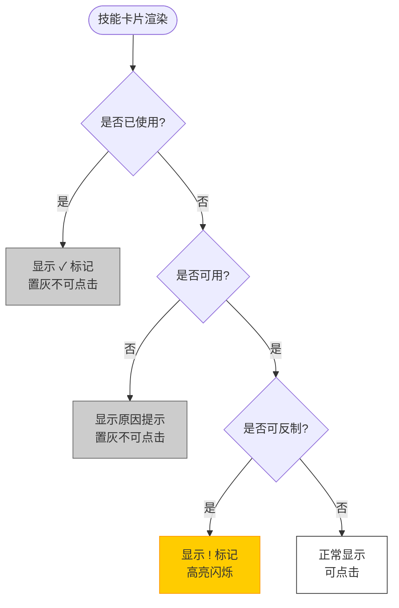

# 技能类型与分类

<cite>
**Referenced Files in This Document**  
- [gameConstants.js](file://src/constants/gameConstants.js)
- [SkillCard.js](file://src/components/SkillCard.js)
- [useGameState.js](file://src/hooks/useGameState.js)
- [SKILL_RELATIONSHIPS.md](file://SKILL_RELATIONSHIPS.md)
</cite>

## 目录
1. [技能类型概述](#技能类型概述)
2. [八种技能类型详解](#八种技能类型详解)
3. [技能分类逻辑](#技能分类逻辑)
4. [技能反制关系链](#技能反制关系链)
5. [UI状态显示逻辑](#ui状态显示逻辑)
6. [设计意图与战略定位](#设计意图与战略定位)

## 技能类型概述

本系统定义了八种核心技能类型，分别对应不同的战略功能与游戏机制。这些技能通过`SKILL_ID`常量进行唯一标识，并通过`SKILL_TYPE`枚举值进行分类管理。技能系统的设计旨在构建多层次的博弈策略，涵盖进攻、防御、控制、反制、终结与恢复等维度。

**Section sources**
- [gameConstants.js](file://src/constants/gameConstants.js#L33-L54)

## 八种技能类型详解

### 飞沙走石（移除棋子）
- **技能ID**：`SKILL_01`
- **效果**：从对手棋盘上移除一颗已落下的棋子
- **使用限制**：每局仅可使用一次
- **可被反制**：是，由“擒擒拿拿”技能立即反制
- **可被恢复**：是，由“拾金不昧”技能恢复被移除的棋子

### 拾金不昧（恢复棋子）
- **技能ID**：`SKILL_02`
- **效果**：恢复被“飞沙走石”移除的棋子
- **触发条件**：存在已被移除的棋子
- **使用时机**：任意己方回合
- **可被反制**：否

### 擒擒拿拿（反制飞沙走石）
- **技能ID**：`SKILL_03`
- **效果**：在对手使用“飞沙走石”后立即弹窗反制，阻止其生效
- **触发时机**：对手确认使用“飞沙走石”后的反制窗口期
- **可被反制**：否

### 静如止水（冻结对手）
- **技能ID**：`SKILL_04`
- **效果**：使对手连续两个回合无法行动（冻结2回合）
- **可被反制**：否（重要设计变更）
- **可被解除**：是，由“水滴石穿”技能主动解除

### 水滴石穿（解除冻结）
- **技能ID**：`SKILL_05`
- **效果**：解除自身“静如止水”的冻结状态
- **触发条件**：自身处于被冻结状态
- **使用时机**：即使被冻结，仍可在己方回合主动使用
- **非反制技能**：不能在对手使用“静如止水”时立即反制

### 力拔山兮（直接获胜）
- **技能ID**：`SKILL_06`
- **效果**：摔坏棋盘，立即获得胜利
- **可被反制**：是，由“两极反转”技能立即反制
- **可被恢复**：是，由“东山再起”技能恢复棋盘

### 两极反转（反制力拔山兮）
- **技能ID**：`SKILL_07`
- **效果**：在对手使用“力拔山兮”后立即弹窗反制，阻止其获胜
- **触发时机**：对手确认使用“力拔山兮”后的反制窗口期
- **可被反制**：否

### 东山再起（恢复棋盘）
- **技能ID**：`SKILL_08`
- **效果**：恢复被“力拔山兮”摔坏的棋盘，使游戏继续
- **触发条件**：棋盘已被摔坏
- **使用时机**：游戏结束后弹窗提示使用
- **可被反制**：否

**Section sources**
- [SKILL_RELATIONSHIPS.md](file://SKILL_RELATIONSHIPS.md#L1-L236)
- [gameConstants.js](file://src/constants/gameConstants.js#L56-L134)

## 技能分类逻辑

技能系统通过`SKILL_TYPE`枚举值进行分类，共分为八类，每类对应特定的战略角色与行为模式。

**Diagram sources**
- [gameConstants.js](file://src/constants/gameConstants.js#L45-L54)
- [gameConstants.js](file://src/constants/gameConstants.js#L33-L42)

### 分类依据说明

| 分类类型 | 对应技能 | 分类逻辑 |
|--------|--------|--------|
| 进攻型 | 飞沙走石 | 主动削弱对手棋盘优势 |
| 防御型 | 拾金不昧 | 恢复己方被破坏的棋局 |
| 反制型 | 擒擒拿拿 | 在对手使用技能后立即反制 |
| 控制型 | 静如止水 | 限制对手行动能力 |
| 解控型 | 水滴石穿 | 解除自身负面状态 |
| 终结型 | 力拔山兮 | 直接结束游戏并获胜 |
| 克制型 | 两极反转 | 针对终结型技能的专门反制 |
| 复活型 | 东山再起 | 恢复被终结的棋局 |

**Section sources**
- [gameConstants.js](file://src/constants/gameConstants.js#L45-L54)

## 技能反制关系链

技能系统构建了三条核心反制关系链，形成闭环博弈机制。

**Diagram sources**
- [SKILL_RELATIONSHIPS.md](file://SKILL_RELATIONSHIPS.md#L25-L80)

### 立即反制机制
当对手使用以下技能时，系统将弹出反制窗口：

| 主动技能 | 反制技能 | 触发时机 |
|--------|--------|--------|
| 飞沙走石 | 擒擒拿拿 | 对手确认使用后立即弹窗 |
| 力拔山兮 | 两极反转 | 对手确认使用后立即弹窗 |

> **注意**：“静如止水”不可被立即反制，只能通过“水滴石穿”主动解除。

### 主动解除/恢复机制
以下技能需玩家主动使用，不会触发反制弹窗：

| 技能 | 前置条件 | 使用时机 |
|------|---------|---------|
| 拾金不昧 | 有被移除的棋子 | 任意己方回合 |
| 水滴石穿 | 自己被冻结 | 被冻结时的己方回合 |
| 东山再起 | 棋盘被摔坏 | 游戏结束后弹窗 |

**Section sources**
- [SKILL_RELATIONSHIPS.md](file://SKILL_RELATIONSHIPS.md#L82-L110)

## UI状态显示逻辑

技能卡片的UI状态由`SkillCard.js`组件控制，其显示样式根据技能状态动态调整。

**Diagram sources**
- [SkillCard.js](file://src/components/SkillCard.js#L1-L108)

### 状态判断条件

| 状态 | 判断条件 | 显示样式 |
|------|---------|---------|
| 已使用 | `isUsed = true` | 置灰 + ✓ 标记 |
| 不可用 | `isAvailable = false` | 置灰 + 提示原因 |
| 可反制 | `canCounter = true` | 高亮闪烁 + ! 标记 |
| 可用 | `!isUsed && isAvailable` | 正常高亮 |

**Section sources**
- [SkillCard.js](file://src/components/SkillCard.js#L1-L108)
- [useGameState.js](file://src/hooks/useGameState.js#L1-L542)

## 设计意图与战略定位

技能系统的设计意图在于构建多层次、动态平衡的博弈策略体系。通过进攻-防御、控制-解控、终结-复活的三重对立关系，鼓励玩家根据局势灵活调整战术。

### 战略定位分析

- **飞沙走石系列**：适用于中盘阶段打破僵局，但需防范“擒擒拿拿”的反制。
- **静如止水系列**：高风险高回报的控制策略，但对手可通过“水滴石穿”逆转局势。
- **力拔山兮系列**：终局决胜手段，但存在被“两极反转”翻盘的风险。

> **重要修复说明**：早期版本中“静如止水”可被立即反制，导致可能出现双方互相冻结的异常情况。现已修复为“不可被反制，只能被解除”，确保游戏逻辑的合理性与玩家体验的流畅性。

**Section sources**
- [SKILL_RELATIONSHIPS.md](file://SKILL_RELATIONSHIPS.md#L112-L236)
- [useGameState.js](file://src/hooks/useGameState.js#L1-L542)