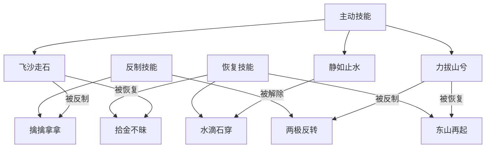
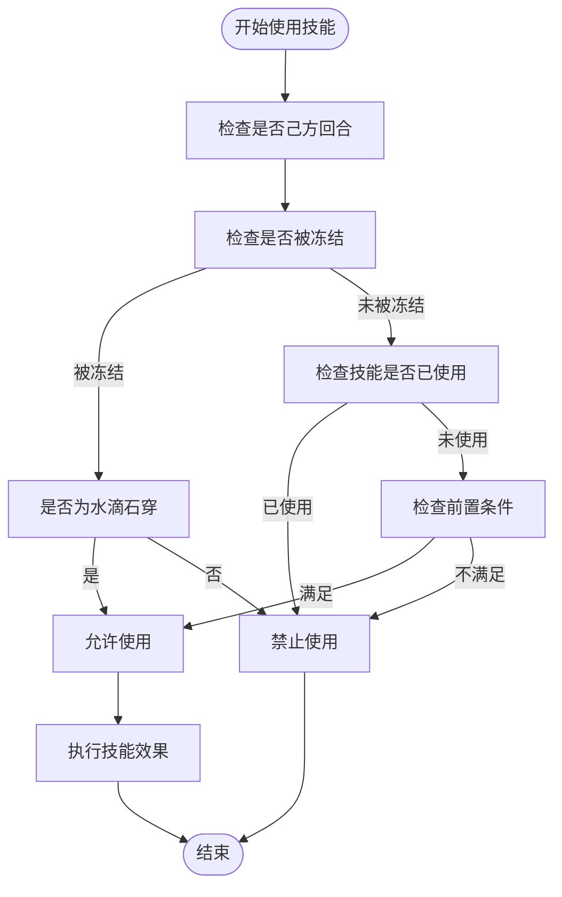
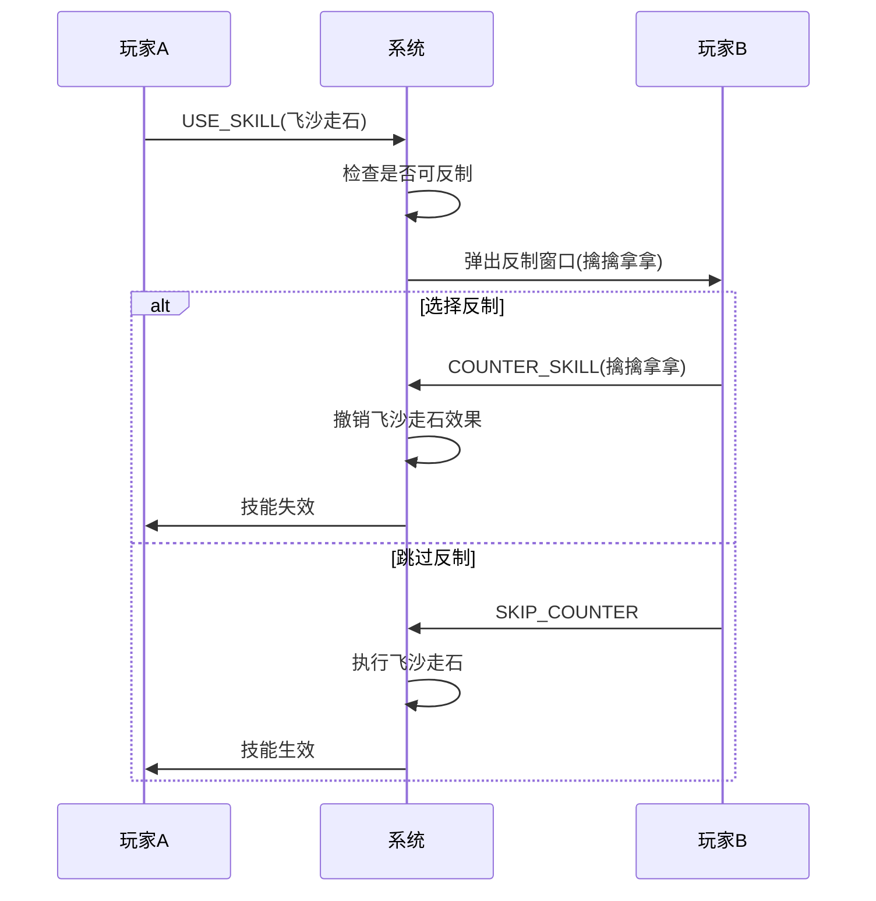
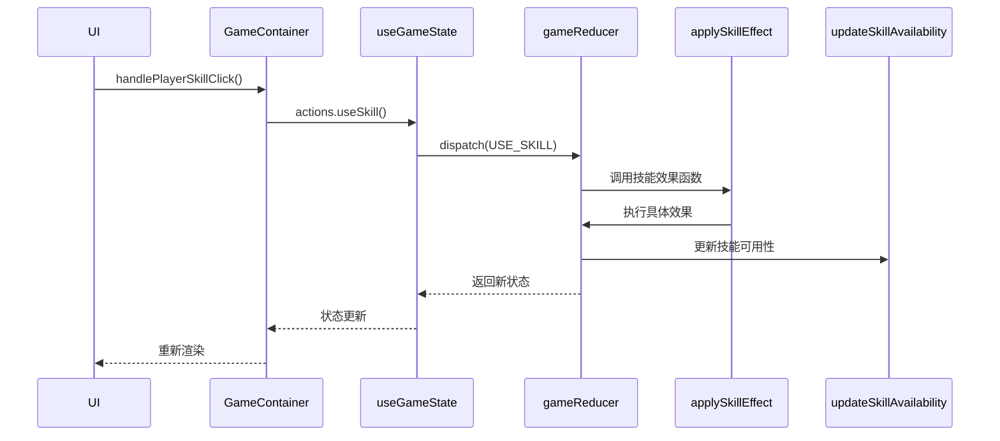
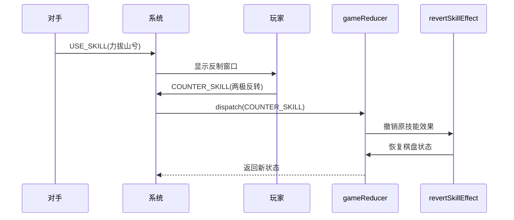
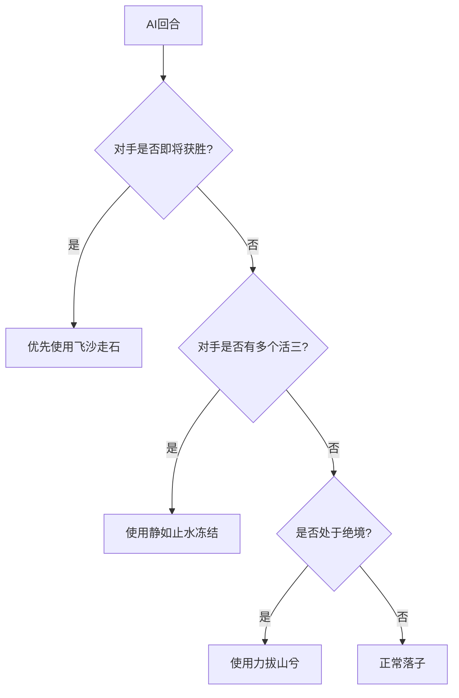
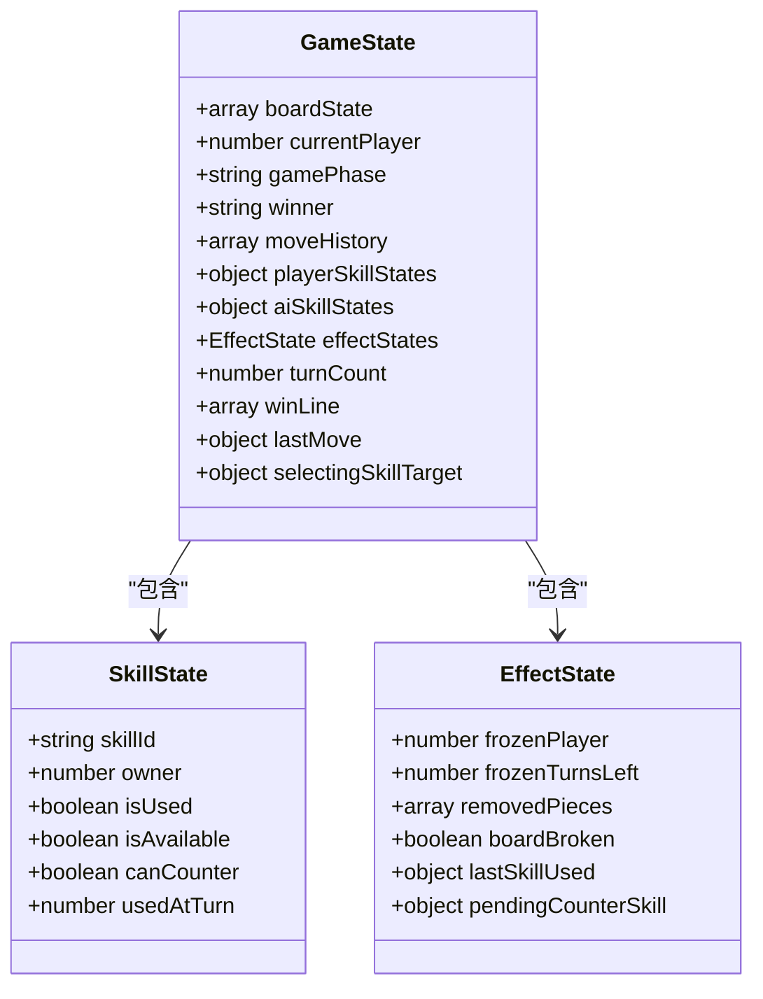
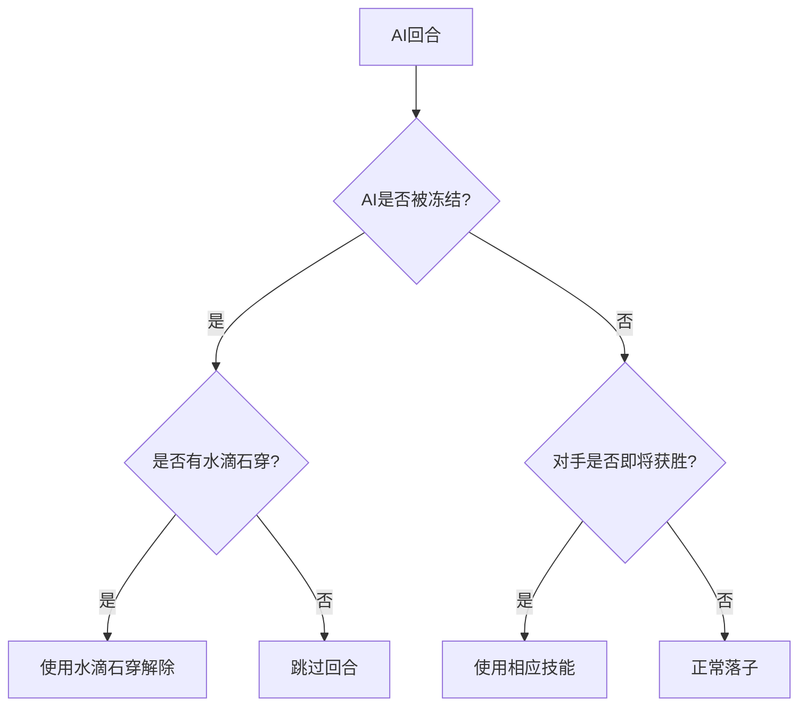
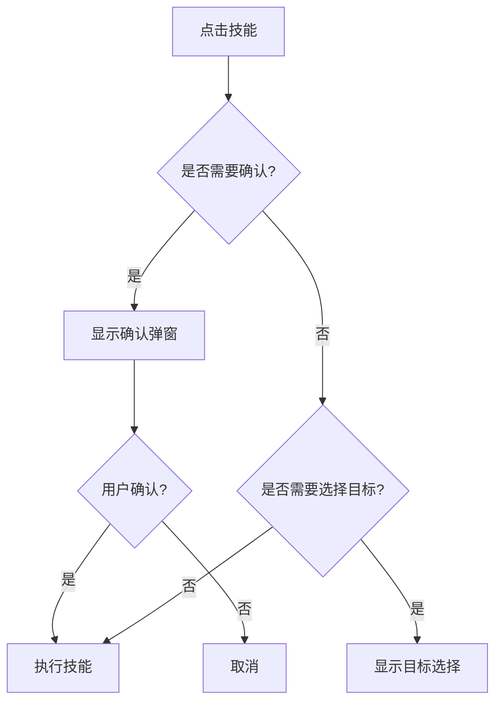

# 技能系统

<cite>
**本文档引用文件**  
- [SKILL_RELATIONSHIPS.md](file://SKILL_RELATIONSHIPS.md)
- [useGameState.js](file://src/hooks/useGameState.js)
- [gameConstants.js](file://src/constants/gameConstants.js)
- [SkillCard.js](file://src/components/SkillCard.js)
- [GameContainer.js](file://src/components/GameContainer.js)
- [aiUtils.js](file://src/utils/aiUtils.js)
</cite>

## 目录
1. [技能分类与功能逻辑](#技能分类与功能逻辑)  
2. [技能使用流程与冷却机制](#技能使用流程与冷却机制)  
3. [技能反制规则详解](#技能反制规则详解)  
4. [技能执行链路分析](#技能执行链路分析)  
5. [技能组合策略示例](#技能组合策略示例)  
6. [状态管理与可用性判断](#状态管理与可用性判断)  
7. [AI技能决策逻辑](#ai技能决策逻辑)  
8. [用户界面交互设计](#用户界面交互设计)  
9. [总结](#总结)

## 技能分类与功能逻辑

根据 `SKILL_RELATIONSHIPS.md` 文件定义，本系统共包含八种技能，分为三类：主动技能、反制技能和恢复技能。

### 主动技能

#### 飞沙走石 (SKILL_01)
- **效果**：移除对手棋盘上一颗棋子
- **触发条件**：己方回合，选择对手棋子作为目标
- **可被反制**：是 → 擒擒拿拿
- **可被恢复**：是 → 拾金不昧

#### 静如止水 (SKILL_04)
- **效果**：使对手本回合+下回合无法行动（冻结2回合）
- **注意**：不能被立即反制（`canBeCountered: false`）
- **可被解除**：是 → 水滴石穿（被冻结者主动使用）

#### 力拔山兮 (SKILL_06)
- **效果**：摔坏棋盘，直接获胜
- **可被反制**：是 → 两极反转
- **可被恢复**：是 → 东山再起

### 反制技能

#### 擒擒拿拿 (SKILL_03)
- **效果**：阻止【飞沙走石】生效
- **触发时机**：对手使用飞沙走石后弹窗选择
- **可被反制**：否

#### 两极反转 (SKILL_07)
- **效果**：阻止【力拔山兮】生效
- **触发时机**：对手使用力拔山兮后弹窗选择
- **可被反制**：否

### 恢复技能

#### 拾金不昧 (SKILL_02)
- **效果**：恢复被【飞沙走石】移除的棋子
- **触发条件**：有被移除的棋子
- **可被反制**：否

#### 水滴石穿 (SKILL_05)
- **效果**：解除【静如止水】的冻结效果
- **触发条件**：自己被冻结时
- **使用时机**：自己的回合（即使被冻结）
- **不是反制技能**：不能在对手使用静如止水时立即反制

#### 东山再起 (SKILL_08)
- **效果**：恢复被【力拔山兮】摔坏的棋盘
- **触发条件**：棋盘被摔坏
- **可被反制**：否



**Diagram sources**  
- [SKILL_RELATIONSHIPS.md](file://SKILL_RELATIONSHIPS.md)

**Section sources**  
- [SKILL_RELATIONSHIPS.md](file://SKILL_RELATIONSHIPS.md#L1-L236)

## 技能使用流程与冷却机制

### 使用流程

1. **选择技能**：在己方回合点击技能卡片
2. **确认使用**：弹出确认窗口
3. **执行效果**：调用 `useSkill` 动作
4. **更新状态**：技能标记为已使用，进入冷却

### 冷却机制

- 每个技能每局游戏只能使用一次
- 使用后技能卡片置灰，显示"已使用"
- 技能状态通过 `isUsed` 字段记录
- 游戏重置时所有技能恢复可用

### 触发条件与可用性

| 技能 | 前置条件 | 可用性判断 |
|------|---------|-----------|
| 拾金不昧 | 有被移除的棋子 | `effectStates.removedPieces.length > 0` |
| 水滴石穿 | 自己被冻结 | `effectStates.frozenPlayer === owner` |
| 东山再起 | 棋盘被摔坏 | `effectStates.boardBroken === true` |



**Diagram sources**  
- [useGameState.js](file://src/hooks/useGameState.js#L38-L90)
- [gameConstants.js](file://src/constants/gameConstants.js#L1-L181)

**Section sources**  
- [useGameState.js](file://src/hooks/useGameState.js#L38-L90)
- [gameConstants.js](file://src/constants/gameConstants.js#L1-L181)

## 技能反制规则详解

### 立即反制机制

当对手使用可反制技能时，系统会弹窗询问是否反制：

| 主动技能 | 反制技能 | 反制时机 |
|---------|---------|---------|
| 飞沙走石 | 擒擒拿拿 | 对手确认使用后立即弹窗 |
| 力拔山兮 | 两极反转 | 对手确认使用后立即弹窗 |

**注意**：静如止水不能被立即反制（`canBeCountered: false`）

### 反制关系定义

根据 `SKILL_RELATIONSHIPS.md` 和 `gameConstants.js`：

```javascript
[SKILL_ID.FLY_SAND]: {
  canBeCountered: true,
  counterSkills: [SKILL_ID.CAPTURE],
},

[SKILL_ID.MOUNTAIN_POWER]: {
  canBeCountered: true,
  counterSkills: [SKILL_ID.POLAR_REVERSE],
},

[SKILL_ID.STILL_WATER]: {
  canBeCountered: false, // 不能被立即反制
}
```

### 反制执行流程

1. 对手发起 `USE_SKILL` 请求
2. 系统检测该技能是否可被反制
3. 若可反制且对方拥有反制技能，则弹出反制窗口
4. 玩家选择反制或跳过
5. 若选择反制，则执行 `COUNTER_SKILL` 动作



**Diagram sources**  
- [SKILL_RELATIONSHIPS.md](file://SKILL_RELATIONSHIPS.md#L1-L236)
- [useGameState.js](file://src/hooks/useGameState.js#L454-L490)

**Section sources**  
- [SKILL_RELATIONSHIPS.md](file://SKILL_RELATIONSHIPS.md#L1-L236)
- [useGameState.js](file://src/hooks/useGameState.js#L454-L490)

## 技能执行链路分析

### 核心动作处理

在 `useGameState.js` 中定义了两个关键动作：

```javascript
const useSkill = useCallback((skillId, owner, target = null) => {
  dispatch({ type: ACTIONS.USE_SKILL, payload: { skillId, owner, target } });
}, []);

const counterSkill = useCallback((counterSkillId, owner, targetSkillId) => {
  dispatch({ type: ACTIONS.COUNTER_SKILL, payload: { counterSkillId, owner, targetSkillId } });
}, []);
```

### 执行链路

#### 使用技能链路



#### 反制技能链路



**Diagram sources**  
- [useGameState.js](file://src/hooks/useGameState.js#L493-L541)
- [GameContainer.js](file://src/components/GameContainer.js#L348-L352)

**Section sources**  
- [useGameState.js](file://src/hooks/useGameState.js#L493-L541)
- [GameContainer.js](file://src/components/GameContainer.js#L348-L352)

## 技能组合策略示例

### 进攻压制组合

**场景**：对手即将形成五连

1. 使用【飞沙走石】移除关键棋子
2. 若对手使用【拾金不昧】恢复，则已达到拖延目的
3. 继续正常落子争取胜利

### 控制反制组合

**场景**：AI频繁使用【静如止水】

1. 保持至少一个【水滴石穿】备用
2. 被冻结时立即使用【水滴石穿】解除控制
3. 获得额外行动机会进行反击

### 终结博弈组合

**场景**：局势不利时的翻盘机会

1. 使用【力拔山兮】尝试直接获胜
2. 若对手有【两极反转】，则棋盘恢复
3. 立即使用【东山再起】恢复棋盘（若已使用则无法恢复）
4. 利用心理优势打乱对手节奏

### AI决策策略

根据 `aiUtils.js` 中的 `decideSkillUsage` 函数：

```javascript
// 对手即将获胜时的决策优先级
1. 飞沙走石 → 移除关键棋子
2. 静如止水 → 冻结对手（若未被冻结）
3. 力拔山兮 → 绝境翻盘
```



**Diagram sources**  
- [aiUtils.js](file://src/utils/aiUtils.js#L115-L173)
- [GameContainer.js](file://src/components/GameContainer.js#L348-L352)

**Section sources**  
- [aiUtils.js](file://src/utils/aiUtils.js#L115-L173)
- [GameContainer.js](file://src/components/GameContainer.js#L348-L352)

## 状态管理与可用性判断

### 技能状态结构

每个技能状态包含以下字段：

- `skillId`: 技能ID
- `owner`: 所有者
- `isUsed`: 是否已使用
- `isAvailable`: 是否可用
- `canCounter`: 是否可反制
- `usedAtTurn`: 使用回合数

### 可用性更新逻辑

`updateSkillAvailability` 函数负责更新所有技能的可用状态：

```javascript
const updateSkillAvailability = (state) => {
  // 遍历所有技能
  Object.keys(SKILLS).forEach((skillId) => {
    // 已使用的技能不可用
    if (newPlayerSkillStates[skillId].isUsed) {
      newPlayerSkillStates[skillId].isAvailable = false;
    } 
    // 有条件限制的技能检查条件
    else if (skill.requireCondition) {
      newPlayerSkillStates[skillId].isAvailable = checkSkillCondition(skill, state, PLAYER.BLACK);
    } 
    // 其他技能可用
    else {
      newPlayerSkillStates[skillId].isAvailable = true;
    }
  });
  return newState;
};
```

### 条件检查实现

`checkSkillCondition` 函数根据不同条件类型进行判断：

```javascript
const checkSkillCondition = (skill, state, owner) => {
  switch (skill.requireCondition) {
    case 'PIECE_REMOVED':
      return state.effectStates.removedPieces.length > 0;
    case 'FROZEN':
      return state.effectStates.frozenPlayer === owner;
    case 'BOARD_BROKEN':
      return state.effectStates.boardBroken;
    default:
      return true;
  }
};
```



**Diagram sources**  
- [useGameState.js](file://src/hooks/useGameState.js#L73-L90)
- [gameConstants.js](file://src/constants/gameConstants.js#L1-L181)

**Section sources**  
- [useGameState.js](file://src/hooks/useGameState.js#L73-L90)
- [gameConstants.js](file://src/constants/gameConstants.js#L1-L181)

## AI技能决策逻辑

### 技能使用决策

`decideSkillUsage` 函数根据当前局势做出决策：

1. **优先级1**：对手即将获胜 → 使用【飞沙走石】或【静如止水】
2. **优先级2**：对手有多个活三 → 使用【静如止水】冻结
3. **优先级3**：绝境 → 使用【力拔山兮】翻盘

### 反制决策

`decideCounterSkill` 函数决定是否反制：

```javascript
// 力拔山兮必须反制
if (opponentSkillId === SKILL_ID.MOUNTAIN_POWER) {
  return SKILL_ID.POLAR_REVERSE;
}

// 飞沙走石根据情况反制
if (opponentSkillId === SKILL_ID.FLY_SAND) {
  return SKILL_ID.CAPTURE; // 简化版：总是反制
}
```

### 冻结状态处理

AI被冻结时的特殊逻辑：

```javascript
if (state.effectStates.frozenPlayer === PLAYER.WHITE) {
  if (可以使用水滴石穿) {
    使用水滴石穿解除冻结;
  } else {
    跳过回合;
  }
}
```



**Diagram sources**  
- [aiUtils.js](file://src/utils/aiUtils.js#L256-L274)
- [GameContainer.js](file://src/components/GameContainer.js#L348-L352)

**Section sources**  
- [aiUtils.js](file://src/utils/aiUtils.js#L256-L274)
- [GameContainer.js](file://src/components/GameContainer.js#L348-L352)

## 用户界面交互设计

### 技能卡片状态

`SkillCard.js` 根据状态显示不同样式：

- **已使用**：置灰 + ✓ 标记
- **不可用**：置灰 + 提示原因
- **可反制**：显示 ! 标记
- **可用**：彩色高亮

### 不可用原因提示

```javascript
const getUnavailableReason = () => {
  if (isUsed) return '已使用';
  if (!isAvailable) {
    if (requireCondition === 'PIECE_REMOVED') {
      return '需要对手使用飞沙走石';
    }
    if (requireCondition === 'FROZEN') {
      return '需要被静如止水控制';
    }
    if (requireCondition === 'BOARD_BROKEN') {
      return '需要棋盘被摔坏';
    }
  }
};
```

### 技能面板设计

`SkillPanel.js` 实现双侧技能面板：

- 左侧：AI技能（只读）
- 右侧：玩家技能（可点击）
- 被冻结时显示冻结遮罩层

### 弹窗交互流程

1. **技能确认弹窗**：确认是否使用技能
2. **反制弹窗**：选择是否反制对手技能
3. **目标选择弹窗**：为【飞沙走石】选择目标棋子
4. **游戏结束弹窗**：显示胜负结果



**Diagram sources**  
- [SkillCard.js](file://src/components/SkillCard.js#L1-L108)
- [SkillPanel.js](file://src/components/SkillPanel.js#L1-L61)

**Section sources**  
- [SkillCard.js](file://src/components/SkillCard.js#L1-L108)
- [SkillPanel.js](file://src/components/SkillPanel.js#L1-L61)

## 总结

本文档全面阐述了技能系统的八种技能类型及其相互作用机制。系统通过 `useGameState` Hook 统一管理技能状态和效果执行，采用 `USE_SKILL` 和 `COUNTER_SKILL` 两种核心动作构建技能执行链路。

关键设计要点包括：
- **技能分类清晰**：主动、反制、恢复三类技能形成完整闭环
- **反制机制合理**：飞沙走石与力拔山兮可被立即反制，静如止水采用主动解除机制
- **状态管理完善**：通过 `effectStates` 记录特殊状态，确保技能条件判断准确
- **AI决策智能**：根据局势优先级做出技能使用和反制决策
- **用户体验友好**：界面清晰展示技能状态和可用性提示

该技能系统实现了丰富的策略深度，玩家需要根据局势灵活运用技能组合，同时考虑对手可能的反制，大大提升了游戏的策略性和趣味性。