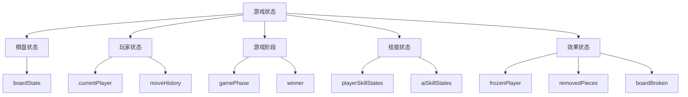
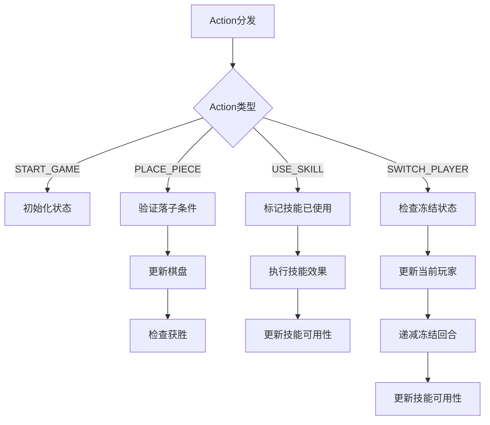
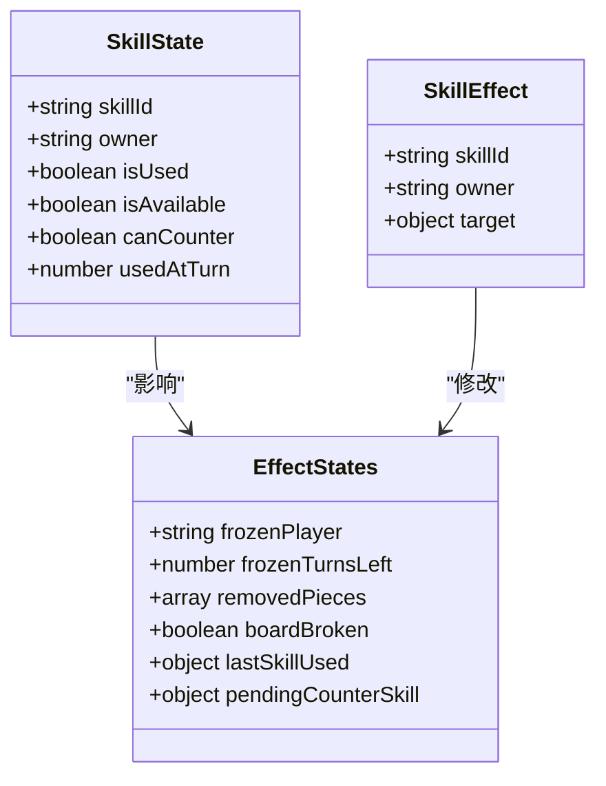

# 游戏状态管理

<cite>
**Referenced Files in This Document**   
- [useGameState.js](file://src/hooks/useGameState.js)
- [gameConstants.js](file://src/constants/gameConstants.js)
- [gameUtils.js](file://src/utils/gameUtils.js)
- [GameContainer.js](file://src/components/GameContainer.js)
</cite>

## 目录
1. [简介](#简介)
2. [核心组件](#核心组件)
3. [状态结构设计](#状态结构设计)
4. [动作与Reducer逻辑](#动作与reducer逻辑)
5. [技能系统实现](#技能系统实现)
6. [组件交互契约](#组件交互契约)

## 简介
`useGameState`自定义Hook是本五子棋游戏的核心逻辑中枢，采用React的`useReducer`钩子实现状态管理。该Hook封装了游戏的所有状态和业务逻辑，包括棋盘状态、玩家回合、技能系统、游戏规则判断等。通过精心设计的Action-Reducer模式，确保了状态流转的可预测性和一致性，为上层组件提供了清晰的状态管理和操作接口。

## 核心组件

`useGameState` Hook作为游戏的核心状态管理器，负责维护整个应用的状态并提供操作方法。它通过`useReducer`管理复杂的状态逻辑，将状态更新逻辑集中在一个reducer函数中，使得状态变化更加可预测和易于调试。

**Section sources**
- [useGameState.js](file://src/hooks/useGameState.js#L493-L541)

## 状态结构设计

### 初始状态设计
`initialState`对象定义了游戏的完整状态结构，包含多个维度的状态信息：

- **boardState**: 15x15的二维数组，表示棋盘上每个位置的棋子状态
- **currentPlayer**: 当前回合的玩家（黑方或白方）
- **gamePhase**: 游戏阶段（准备、进行中、结束等）
- **winner**: 游戏获胜者结果
- **moveHistory**: 记录所有走棋的历史
- **playerSkillStates/aiSkillStates**: 分别存储玩家和AI的技能状态
- **effectStates**: 存储各种游戏效果状态，如冻结、被移除的棋子等
- **turnCount**: 当前回合数计数器

这种分层的状态设计使得不同功能模块的状态分离清晰，便于管理和维护。



**Diagram sources**
- [useGameState.js](file://src/hooks/useGameState.js#L45-L100)

**Section sources**
- [useGameState.js](file://src/hooks/useGameState.js#L45-L100)

## 动作与Reducer逻辑

### 支持的ACTION类型
`useGameState`通过定义一系列Action类型来驱动状态变化，每个Action都有明确的语义和用途：

- `START_GAME`: 开始新游戏，初始化状态
- `PLACE_PIECE`: 在指定位置落子
- `USE_SKILL`: 使用技能
- `COUNTER_SKILL`: 反制对手技能
- `SWITCH_PLAYER`: 切换当前玩家
- `SET_WINNER`: 设置游戏获胜者
- `UPDATE_FROZEN_STATUS`: 更新冻结状态
- `REMOVE_PIECE`: 移除棋子
- `BREAK_BOARD`: 摔坏棋盘

### Reducer处理逻辑
Reducer函数根据不同的Action类型执行相应的状态更新逻辑。关键处理逻辑包括：

1. **落子处理**: 验证位置是否为空且玩家未被冻结，然后更新棋盘状态并检查是否获胜
2. **技能使用**: 标记技能已使用，并调用`applySkillEffect`执行具体技能效果
3. **玩家切换**: 处理冻结状态的递减和解除，确保游戏流程正确
4. **状态一致性**: 在每次状态更新后，调用`updateSkillAvailability`确保技能可用性与当前游戏状态一致



**Diagram sources**
- [useGameState.js](file://src/hooks/useGameState.js#L102-L491)

**Section sources**
- [useGameState.js](file://src/hooks/useGameState.js#L102-L491)

## 技能系统实现

### 技能状态管理
技能系统通过`createInitialSkillStates`函数初始化，为每个技能创建详细的状态对象，包含：

- `isUsed`: 技能是否已被使用
- `isAvailable`: 技能当前是否可用
- `canCounter`: 是否可以被反制
- `usedAtTurn`: 使用时的回合数

### 技能条件检查
`checkSkillCondition`函数根据技能的`requireCondition`属性检查技能可用性：

- `PIECE_REMOVED`: 拾金不昧需要有被移除的棋子
- `FROZEN`: 水滴石穿需要使用者被冻结
- `BOARD_BROKEN`: 东山再起需要棋盘被摔坏

### 技能效果执行
`applySkillEffect`函数根据技能ID执行相应的游戏效果：

- **飞沙走石**: 移除指定位置的棋子
- **静如止水**: 冻结对手2个回合
- **力拔山兮**: 摔坏棋盘直接获胜
- **水滴石穿**: 解除冻结状态

反制技能通过`revertSkillEffect`函数撤销原技能效果，形成技能对抗机制。



**Diagram sources**
- [useGameState.js](file://src/hooks/useGameState.js#L15-L491)
- [gameConstants.js](file://src/constants/gameConstants.js#L1-L181)

**Section sources**
- [useGameState.js](file://src/hooks/useGameState.js#L15-L491)
- [gameConstants.js](file://src/constants/gameConstants.js#L1-L181)

## 组件交互契约

### Hook导出接口
`useGameState` Hook返回一个包含`state`和`actions`的对象，为组件层提供清晰的交互契约：

```javascript
return {
  state,
  actions: {
    startGame,
    placePiece,
    useSkill,
    counterSkill,
    skipCounter,
    switchPlayer,
    resetGame,
    setSelectingSkillTarget,
  },
};
```

### 函数调用规范
各操作函数的参数传递规范如下：

- `useSkill(skillId, owner, target = null)`: 使用技能，target参数用于需要指定目标的技能
- `counterSkill(counterSkillId, owner, targetSkillId)`: 反制技能，指定反制技能ID和目标技能ID
- `placePiece(x, y, player)`: 在指定坐标落子
- `setSelectingSkillTarget(skillData)`: 设置技能目标选择状态

### 状态一致性保证
通过以下机制确保状态一致性：

1. **单一状态源**: 所有状态集中管理，避免状态分散
2. **不可变更新**: 使用扩展运算符创建新对象，避免直接修改状态
3. **副作用处理**: 在reducer中通过调用其他action处理复杂逻辑
4. **可用性同步**: 每次状态更新后自动调用`updateSkillAvailability`同步技能可用性

**Section sources**
- [useGameState.js](file://src/hooks/useGameState.js#L493-L541)
- [GameContainer.js](file://src/components/GameContainer.js#L17-L17)