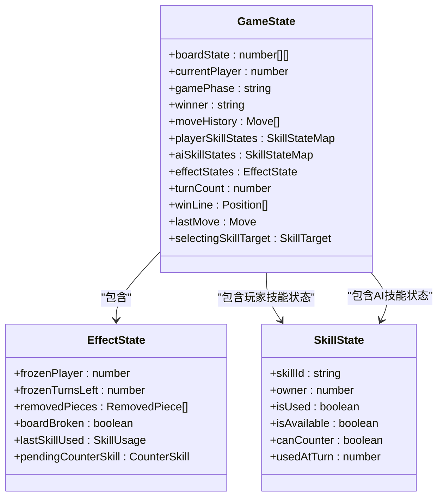
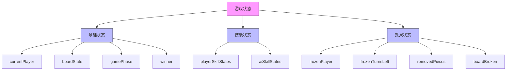
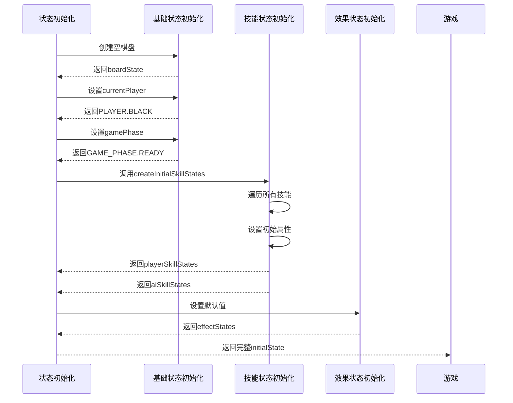
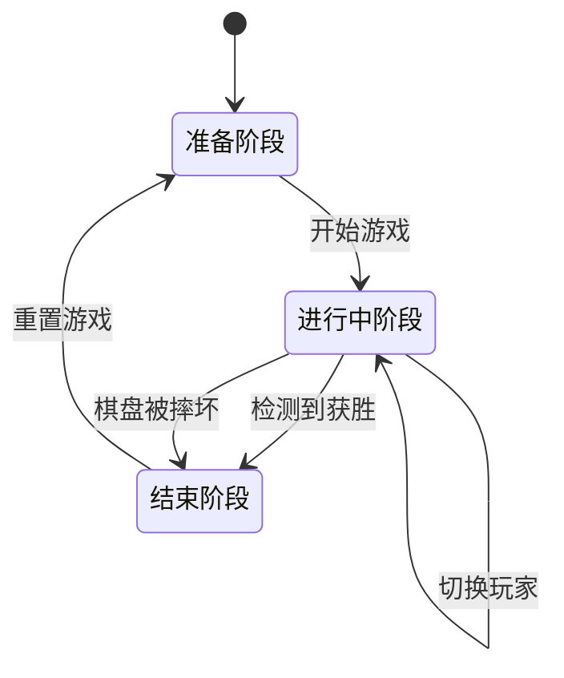
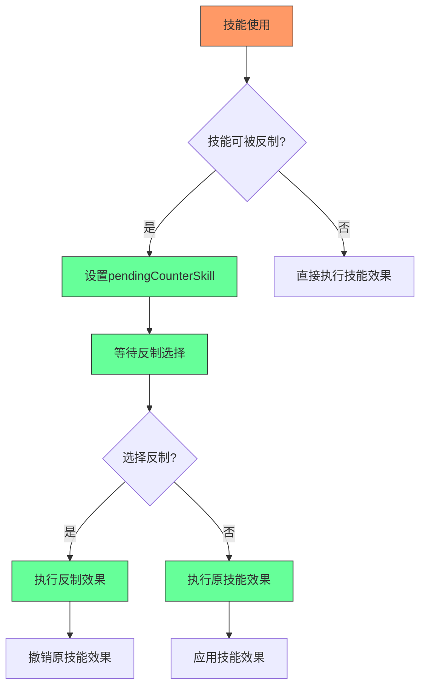

# 游戏状态结构

<cite>
**本文档引用文件**   
- [useGameState.js](file://src/hooks/useGameState.js)
- [gameConstants.js](file://src/constants/gameConstants.js)
- [gameUtils.js](file://src/utils/gameUtils.js)
</cite>

## 目录
1. [游戏状态结构设计](#游戏状态结构设计)
2. [核心状态字段详解](#核心状态字段详解)
3. [状态初始化逻辑](#状态初始化逻辑)
4. [游戏阶段状态演变](#游戏阶段状态演变)
5. [高级机制支持](#高级机制支持)
6. [实际状态快照示例](#实际状态快照示例)

## 游戏状态结构设计

游戏状态结构采用模块化设计，将不同功能的状态分离管理，确保状态的清晰性和可维护性。整体结构分为基础状态、技能状态和效果状态三大模块，通过useReducer进行集中管理。



**Diagram sources**
- [useGameState.js](file://src/hooks/useGameState.js#L93-L113)

**Section sources**
- [useGameState.js](file://src/hooks/useGameState.js#L93-L113)

## 核心状态字段详解

### 基础状态字段

**currentPlayer**：表示当前回合的玩家，数据类型为PLAYER枚举值（PLAYER.BLACK或PLAYER.WHITE）。该字段决定了当前是玩家还是AI进行操作，是游戏流程控制的核心。

**boardState**：表示15x15棋盘的落子情况，数据类型为二维数组，每个元素的值对应PLAYER.NONE（空）、PLAYER.BLACK（黑子）或PLAYER.WHITE（白子）。通过createEmptyBoard()函数初始化，确保每次游戏开始时棋盘都是清空状态。

**gamePhase**：表示游戏当前所处的阶段，数据类型为GAME_PHASE枚举值（READY、PLAYING、PAUSED、ENDED）。该字段控制游戏的整体流程，决定当前可以执行哪些操作。

**winner**：表示游戏的获胜结果，数据类型为GAME_RESULT枚举值。当游戏结束时，该字段会记录是玩家获胜、AI获胜还是平局等结果。

### 技能状态字段

**playerSkillStates**和**aiSkillStates**：分别表示玩家和AI的技能状态，数据类型为对象映射，键为技能ID，值为技能状态对象。每个技能状态包含isUsed（是否已使用）、isAvailable（是否可用）等属性，用于跟踪技能的冷却与可用状态。

**selectedSkillTarget**：在代码中对应selectingSkillTarget字段，表示当前正在选择技能目标的状态。当玩家使用需要选择目标的技能（如飞沙走石）时，该字段会记录技能相关信息，引导用户进行目标选择。

### 效果状态字段

**effectStates**：包含所有特殊效果的状态，如frozenPlayer（被冻结的玩家）、frozenTurnsLeft（剩余冻结回合数）、removedPieces（被移除的棋子列表）等。这些状态用于实现技能的特殊效果，如冻结、棋子移除等。



**Diagram sources**
- [useGameState.js](file://src/hooks/useGameState.js#L93-L113)
- [gameConstants.js](file://src/constants/gameConstants.js#L15-L30)

**Section sources**
- [useGameState.js](file://src/hooks/useGameState.js#L93-L113)

## 状态初始化逻辑

游戏状态的初始化通过initialState常量实现，该常量定义了游戏开始时的所有默认状态。初始化过程分为三个主要部分：基础状态初始化、技能状态初始化和效果状态初始化。

基础状态初始化包括创建空棋盘、设置当前玩家为黑方（PLAYER.BLACK）、游戏阶段为准备状态（GAME_PHASE.READY）等。棋盘通过createEmptyBoard()函数创建，该函数返回一个15x15的二维数组，所有元素初始化为PLAYER.NONE。

技能状态初始化通过createInitialSkillStates()函数实现。该函数接收玩家类型作为参数，为该玩家创建所有技能的初始状态。每个技能的初始状态包括技能ID、拥有者、是否已使用（初始为false）、是否可用（根据技能条件决定）等属性。

效果状态初始化设置了所有特殊效果的默认值，如frozenPlayer为null（无人被冻结）、frozenTurnsLeft为0（无剩余冻结回合）、removedPieces为空数组（无被移除棋子）等。



**Diagram sources**
- [useGameState.js](file://src/hooks/useGameState.js#L11-L113)

**Section sources**
- [useGameState.js](file://src/hooks/useGameState.js#L11-L113)

## 游戏阶段状态演变

游戏状态随着游戏进程在不同阶段间演变，每个阶段都有特定的状态特征和行为规则。

### 准备阶段

在准备阶段（GAME_PHASE.READY），游戏尚未开始，棋盘为空，currentPlayer为PLAYER.BLACK，turnCount为0。此阶段玩家可以查看技能但不能进行任何操作，直到点击开始游戏按钮。

### 进行中阶段

当游戏开始后，状态进入进行中阶段（GAME_PHASE.PLAYING）。此时gamePhase变为PLAYING，玩家可以开始落子和使用技能。每回合结束后，通过SWITCH_PLAYER action切换currentPlayer，并检查是否需要更新冻结状态。

在进行中阶段，boardState随着玩家和AI的落子不断变化，moveHistory记录所有移动历史，turnCount逐回合递增。当某个玩家形成五子连线时，checkWin函数会检测到获胜情况，并触发SET_WINNER action。

### 结束阶段

当游戏结束时，状态进入结束阶段（GAME_PHASE.ENDED）。此时gamePhase变为ENDED，winner字段被设置为相应的获胜结果，winLine记录获胜的五子连线位置。如果使用了力拔山兮技能，boardBroken会变为true，表示棋盘被摔坏。



**Diagram sources**
- [useGameState.js](file://src/hooks/useGameState.js#L150-L350)
- [gameConstants.js](file://src/constants/gameConstants.js#L45-L55)

**Section sources**
- [useGameState.js](file://src/hooks/useGameState.js#L150-L350)

## 高级机制支持

游戏状态结构精心设计以支持技能反制、冻结等高级机制，确保这些复杂功能能够正确实现。

### 技能反制机制

技能反制通过pendingCounterSkill字段实现。当一个可被反制的技能（如飞沙走石、力拔山兮）被使用时，effectStates中的pendingCounterSkill会被设置为相应的反制技能信息。此时游戏会暂停，等待对手在规定时间内选择是否反制。

如果对手选择反制，会触发COUNTER_SKILL action，执行revertSkillEffect函数撤销原技能的效果。如果对手选择不反制或超时，pendingCounterSkill会被清除，原技能效果生效。

### 冻结机制

冻结机制通过frozenPlayer和frozenTurnsLeft两个字段实现。当使用静如止水技能时，UPDATE_FROZEN_STATUS action会设置frozenPlayer为目标玩家，frozenTurnsLeft为2。

在SWITCH_PLAYER action中，系统会检查下一个玩家是否被冻结。如果是，且frozenTurnsLeft大于0，则减少frozenTurnsLeft的值。当frozenTurnsLeft减至0时，frozenPlayer被重置为null，冻结状态解除。

特别地，被冻结的玩家仍然可以使用水滴石穿技能来主动解除冻结状态，这通过在技能使用检查中特别处理水滴石穿技能实现。

### 棋子移除与恢复

飞沙走石技能通过REMOVE_PIECE action实现棋子移除，被移除的棋子信息会被记录在removedPieces数组中。拾金不昧技能则通过RESTORE_PIECE action恢复最近被移除的棋子，从removedPieces数组中移除相应记录。



**Diagram sources**
- [useGameState.js](file://src/hooks/useGameState.js#L200-L250)
- [useGameState.js](file://src/hooks/useGameState.js#L300-L350)

**Section sources**
- [useGameState.js](file://src/hooks/useGameState.js#L200-L350)

## 实际状态快照示例

以下是一个游戏进行中的实际状态快照示例，展示了各状态字段的具体值：

```javascript
{
  boardState: [
    [0,0,0,0,0,0,0,0,0,0,0,0,0,0,0],
    [0,0,0,0,0,0,0,0,0,0,0,0,0,0,0],
    [0,0,0,0,0,0,0,0,0,0,0,0,0,0,0],
    [0,0,0,0,0,0,0,0,0,0,0,0,0,0,0],
    [0,0,0,0,0,0,0,0,0,0,0,0,0,0,0],
    [0,0,0,0,0,1,0,0,0,0,0,0,0,0,0],
    [0,0,0,0,0,0,1,0,0,0,0,0,0,0,0],
    [0,0,0,0,0,0,0,1,0,0,0,0,0,0,0],
    [0,0,0,0,0,0,0,0,1,0,0,0,0,0,0],
    [0,0,0,0,0,0,0,0,0,1,0,0,0,0,0],
    [0,0,0,0,0,0,0,0,0,0,0,0,0,0,0],
    [0,0,0,0,0,0,0,0,0,0,0,0,0,0,0],
    [0,0,0,0,0,0,0,0,0,0,0,0,0,0,0],
    [0,0,0,0,0,0,0,0,0,0,0,0,0,0,0],
    [0,0,0,0,0,0,0,0,0,0,0,0,0,0,0]
  ],
  currentPlayer: 2,
  gamePhase: "PLAYING",
  winner: null,
  moveHistory: [
    {x:5,y:5,player:1,turn:0},
    {x:6,y:6,player:2,turn:1},
    {x:7,y:7,player:1,turn:2},
    {x:8,y:8,player:2,turn:3},
    {x:9,y:9,player:1,turn:4}
  ],
  playerSkillStates: {
    "SKILL_01": {skillId:"SKILL_01",owner:1,isUsed:false,isAvailable:true,canCounter:false,usedAtTurn:null},
    "SKILL_02": {skillId:"SKILL_02",owner:1,isUsed:false,isAvailable:false,canCounter:false,usedAtTurn:null},
    // 其他技能状态...
  },
  aiSkillStates: {
    "SKILL_04": {skillId:"SKILL_04",owner:2,isUsed:false,isAvailable:true,canCounter:false,usedAtTurn:null},
    // 其他技能状态...
  },
  effectStates: {
    frozenPlayer: null,
    frozenTurnsLeft: 0,
    removedPieces: [],
    boardBroken: false,
    lastSkillUsed: null,
    pendingCounterSkill: null
  },
  turnCount: 5,
  winLine: null,
  lastMove: {x:9,y:9,player:1},
  selectingSkillTarget: null
}
```

此状态快照显示了一个正在进行的游戏，玩家（黑子）和AI（白子）已经交替落子5回合，形成了斜线上的交替落子模式。当前轮到AI（currentPlayer: 2）行动，所有技能都处于初始状态，无人被冻结，棋盘完好无损。

**Section sources**
- [useGameState.js](file://src/hooks/useGameState.js#L93-L113)
- [gameConstants.js](file://src/constants/gameConstants.js#L15-L30)