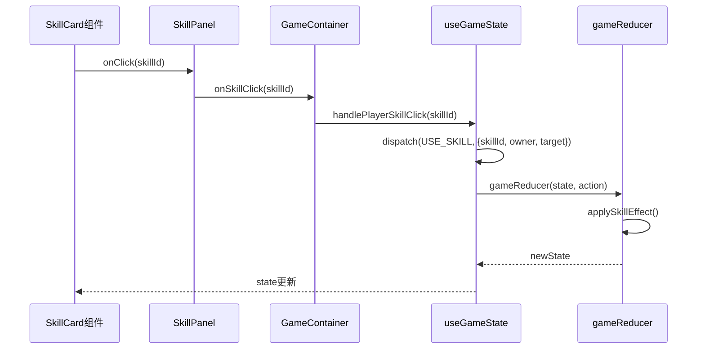
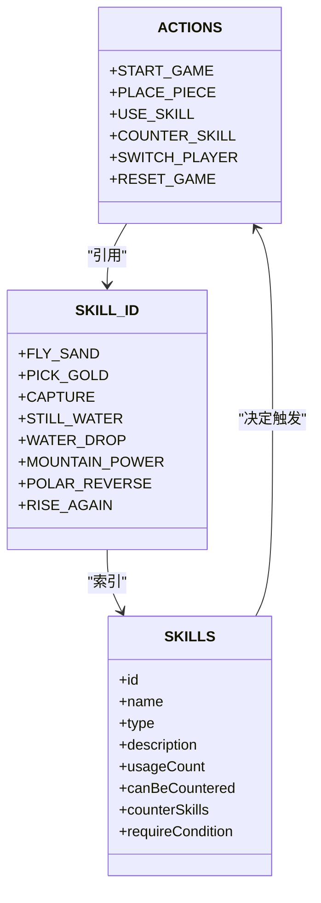
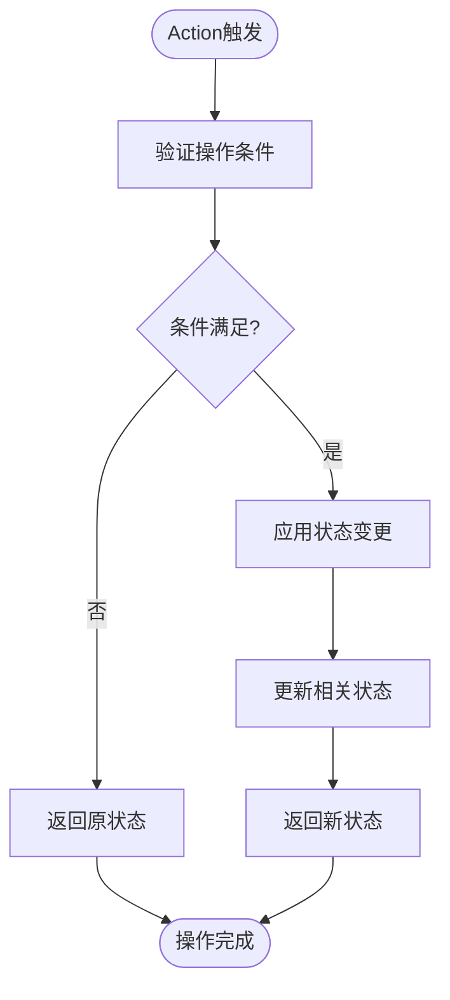
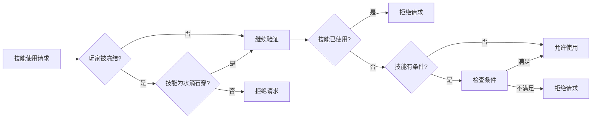

# 状态操作与Action系统

<cite>
**Referenced Files in This Document**   
- [useGameState.js](file://src/hooks/useGameState.js)
- [gameConstants.js](file://src/constants/gameConstants.js)
- [SkillCard.js](file://src/components/SkillCard.js)
- [SkillPanel.js](file://src/components/SkillPanel.js)
- [GameContainer.js](file://src/components/GameContainer.js)
- [GameBoard.js](file://src/components/GameBoard.js)
</cite>

## 目录
1. [简介](#简介)
2. [核心Action类型详解](#核心action类型详解)
3. [Action触发与处理流程](#action触发与处理流程)
4. [Action设计原则](#action设计原则)
5. [常见误用与规避](#常见误用与规避)
6. [结论](#结论)

## 简介
本文档全面文档化`useGameState`中定义的所有ACTION类型，包括`START_GAME`、`PLACE_PIECE`、`USE_SKILL`、`COUNTER_SKILL`、`SWITCH_PLAYER`、`RESET_GAME`等。针对每个Action，说明其触发条件、payload结构、在reducer中的处理流程及其对游戏状态的影响。结合具体代码路径，展示从UI组件调用`useSkill`到`dispatch`执行的完整链条。

**Section sources**
- [useGameState.js](file://src/hooks/useGameState.js#L1-L50)

## 核心Action类型详解

### START_GAME
**触发条件**：游戏初始化时，由`GameContainer`组件的`useEffect`钩子在组件挂载时触发。

**Payload结构**：无payload。

**处理流程**：
1. 将游戏阶段`gamePhase`设置为`PLAYING`
2. 重置棋盘状态为初始空棋盘
3. 设置当前玩家为黑方（玩家）

**对游戏状态的影响**：
- 游戏进入`PLAYING`阶段
- 棋盘状态重置
- 当前玩家设为黑方

**Section sources**
- [useGameState.js](file://src/hooks/useGameState.js#L134-L142)

### PLACE_PIECE
**触发条件**：玩家或AI在棋盘上落子时触发。

**Payload结构**：
- `x`: 棋子x坐标
- `y`: 棋子y坐标
- `player`: 落子玩家标识（PLAYER.BLACK或PLAYER.WHITE）

**处理流程**：
1. 验证落子位置是否为空且玩家未被冻结
2. 在棋盘上放置棋子
3. 检查是否形成五连获胜
4. 更新移动历史和回合计数

**对游戏状态的影响**：
- 棋盘状态更新
- 移动历史增加新记录
- 可能触发游戏结束状态

**Section sources**
- [useGameState.js](file://src/hooks/useGameState.js#L144-L175)

### USE_SKILL
**触发条件**：玩家或AI使用技能时触发。

**Payload结构**：
- `skillId`: 技能标识符
- `owner`: 技能使用者（PLAYER.BLACK或PLAYER.WHITE）
- `target`: 技能目标（可选，如飞沙走石的目标坐标）

**处理流程**：
1. 标记技能为已使用
2. 记录最后使用的技能
3. 执行技能效果（通过`applySkillEffect`函数）
4. 更新技能可用性

**对游戏状态的影响**：
- 技能状态更新（标记为已使用）
- 游戏效果状态改变（如冻结、移除棋子等）
- 技能可用性重新计算

**Section sources**
- [useGameState.js](file://src/hooks/useGameState.js#L177-L206)

### COUNTER_SKILL
**触发条件**：反制对手技能时触发。

**Payload结构**：
- `counterSkillId`: 反制技能ID
- `owner`: 反制者标识
- `targetSkillId`: 被反制的技能ID

**处理流程**：
1. 标记反制技能为已使用
2. 撤销目标技能的效果（通过`revertSkillEffect`函数）
3. 清除待处理的反制技能状态
4. 更新技能可用性

**对游戏状态的影响**：
- 反制技能标记为已使用
- 被反制技能的效果被撤销
- 游戏状态恢复到技能使用前

**Section sources**
- [useGameState.js](file://src/hooks/useGameState.js#L208-L235)

### SWITCH_PLAYER
**触发条件**：玩家或AI完成操作后切换回合时触发。

**Payload结构**：无payload。

**处理流程**：
1. 切换当前玩家
2. 检查新玩家是否被冻结，更新冻结状态
3. 更新技能可用性

**对游戏状态的影响**：
- 当前玩家切换
- 冻结回合数递减，可能解除冻结
- 技能可用性重新计算

**Section sources**
- [useGameState.js](file://src/hooks/useGameState.js#L237-L273)

### RESET_GAME
**触发条件**：游戏结束后重新开始时触发。

**Payload结构**：无payload。

**处理流程**：
1. 重置为初始状态
2. 将游戏阶段设置为`PLAYING`

**对游戏状态的影响**：
- 所有游戏状态重置
- 游戏重新进入`PLAYING`阶段

**Section sources**
- [useGameState.js](file://src/hooks/useGameState.js#L377-L382)

## Action触发与处理流程

### 从UI到dispatch的完整链条

**Diagram sources**
- [SkillCard.js](file://src/components/SkillCard.js#L1-L109)
- [SkillPanel.js](file://src/components/SkillPanel.js#L1-L62)
- [GameContainer.js](file://src/components/GameContainer.js#L1-L439)
- [useGameState.js](file://src/hooks/useGameState.js#L1-L543)

### Action类型与技能关系

**Diagram sources**
- [useGameState.js](file://src/hooks/useGameState.js#L116-L131)
- [gameConstants.js](file://src/constants/gameConstants.js#L1-L182)

## Action设计原则

### 可预测性
Action系统通过以下方式确保状态变化的可预测性：
1. **单一数据源**：所有状态存储在`useReducer`的state中
2. **纯函数reducer**：`gameReducer`是纯函数，相同输入产生相同输出
3. **不可变性**：通过扩展运算符创建新状态对象，避免直接修改

### 可追溯性
系统通过以下机制实现操作的可追溯性：
1. **动作日志**：每个Action类型都有明确的语义
2. **状态快照**：`moveHistory`记录所有移动
3. **调试日志**：关键操作添加`console.log`输出

**Diagram sources**
- [useGameState.js](file://src/hooks/useGameState.js#L134-L386)

## 常见误用与规避

### 常见误用场景

1. **在冻结状态下尝试使用技能**
   - 错误：被冻结的玩家尝试使用非解控技能
   - 规避：在`handlePlayerSkillClick`中检查冻结状态

2. **重复使用已用技能**
   - 错误：尝试使用已标记为`isUsed`的技能
   - 规避：在`SkillCard`组件中禁用已使用技能

3. **无效的技能目标选择**
   - 错误：为飞沙走石选择空位置或己方棋子
   - 规避：在`handleSkillTarget`中验证目标

### 规避策略

**Diagram sources**
- [GameContainer.js](file://src/components/GameContainer.js#L1-L439)
- [SkillCard.js](file://src/components/SkillCard.js#L1-L109)

## 结论
本文档详细分析了`useGameState`中的Action系统，展示了从UI交互到状态变更的完整流程。Action系统通过明确的类型定义、结构化的payload和可预测的reducer处理，确保了游戏状态管理的可靠性和可维护性。通过遵循本文档中的设计原则和规避常见误用，可以有效维护游戏逻辑的正确性。