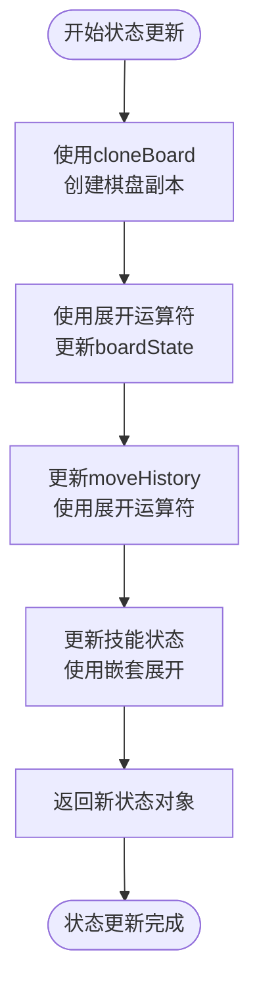
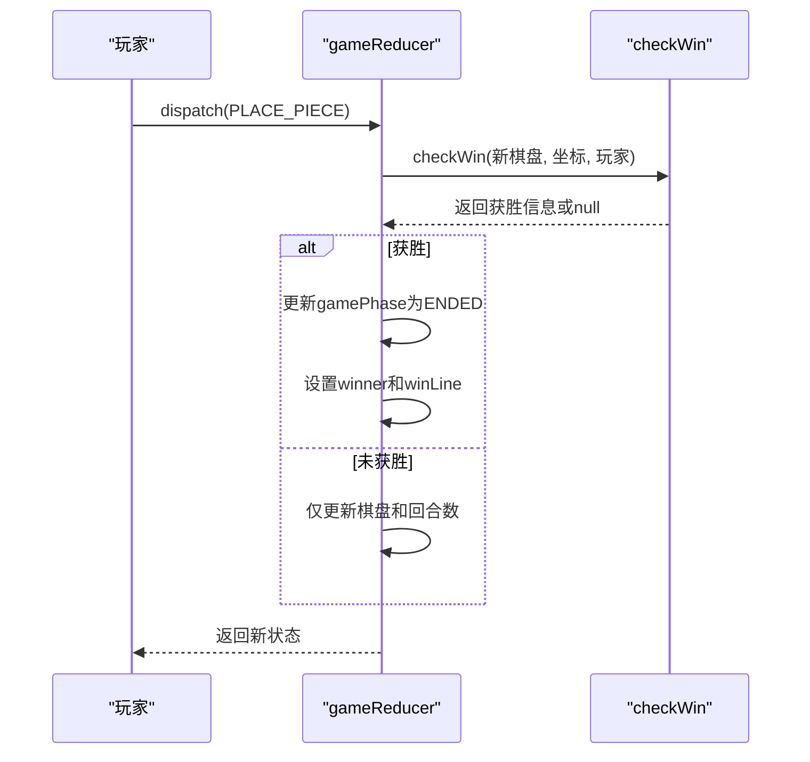
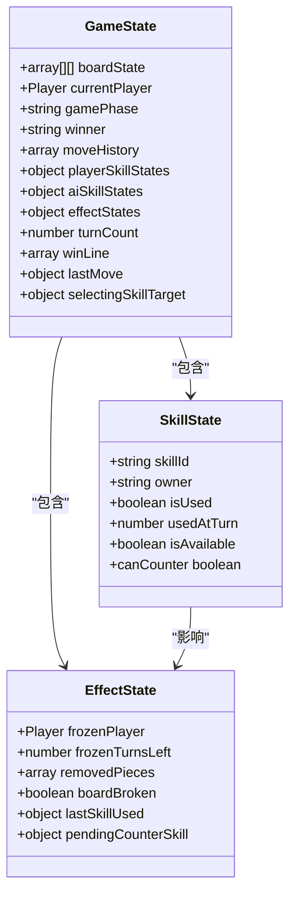
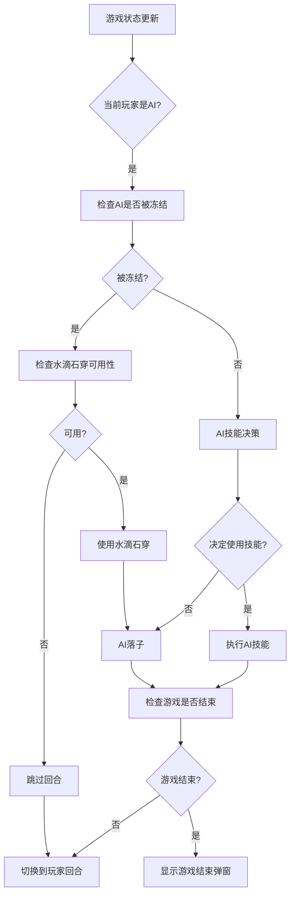
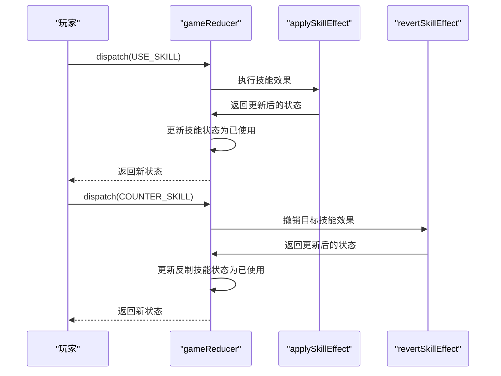
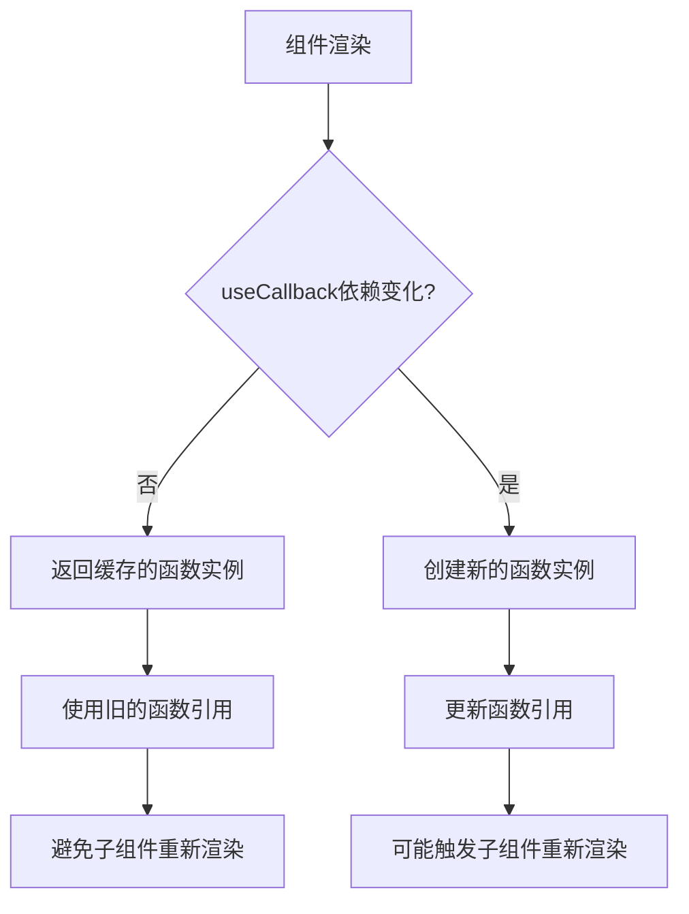

# 状态更新与流转机制

<cite>
**Referenced Files in This Document**   
- [useGameState.js](file://src/hooks/useGameState.js)
- [GameContainer.js](file://src/components/GameContainer.js)
- [gameUtils.js](file://src/utils/gameUtils.js)
- [gameConstants.js](file://src/constants/gameConstants.js)
</cite>

## 目录
1. [简介](#简介)
2. [核心状态管理](#核心状态管理)
3. [状态不可变性实现](#状态不可变性实现)
4. [关键状态流转节点](#关键状态流转节点)
5. [游戏规则与UI协调](#游戏规则与ui协调)
6. [性能优化建议](#性能优化建议)

## 简介
本文档深入分析基于useReducer的游戏状态更新机制，重点描述gameReducer函数如何根据不同的Action类型更新状态。文档将解释状态不可变性的实现方式，说明状态流转的关键节点，并阐述该机制如何协调游戏规则、技能效果与UI响应，确保状态一致性。

## 核心状态管理

游戏状态管理采用React的useReducer Hook实现，通过定义清晰的Action类型和对应的处理逻辑，确保状态更新的可预测性和可维护性。核心状态管理逻辑位于`useGameState` Hook中，通过`gameReducer`函数处理各种游戏事件。

**Section sources**
- [useGameState.js](file://src/hooks/useGameState.js#L493-L541)

## 状态不可变性实现

### 结构化克隆与展开运算符

为确保状态不可变性，系统采用结构化克隆与展开运算符来创建新的状态对象。在`gameReducer`中，每次状态更新都通过展开运算符(`...`)创建新对象，避免直接修改原状态。

**Diagram sources**
- [useGameState.js](file://src/hooks/useGameState.js#L134-L386)
- [gameUtils.js](file://src/utils/gameUtils.js#L108-L110)

### 棋盘状态维护

棋盘状态的不可变性通过`cloneBoard`工具函数实现，该函数使用数组的map方法和展开运算符创建深拷贝，确保每次落子都基于全新的棋盘状态。

**Section sources**
- [gameUtils.js](file://src/utils/gameUtils.js#L108-L110)
- [useGameState.js](file://src/hooks/useGameState.js#L134-L386)

## 关键状态流转节点

### 落子后胜负判断

当玩家或AI落子后，系统立即执行胜负判断。`gameReducer`在处理`PLACE_PIECE` Action时，调用`checkWin`函数检测是否形成五子连线，若检测到获胜情况，则更新游戏阶段和获胜者信息。

**Diagram sources**
- [useGameState.js](file://src/hooks/useGameState.js#L134-L386)
- [gameUtils.js](file://src/utils/gameUtils.js#L42-L85)

### 技能使用后冷却计时

技能使用后，系统记录使用时的回合数，并通过`updateSkillAvailability`函数在后续回合中检查技能冷却状态。技能状态对象包含`isUsed`、`usedAtTurn`和`isAvailable`字段，共同管理技能的可用性。

**Diagram sources**
- [useGameState.js](file://src/hooks/useGameState.js#L134-L386)
- [gameConstants.js](file://src/constants/gameConstants.js#L80-L181)

### AI回合自动切换

AI回合的自动切换通过`GameContainer`组件中的useEffect Hook实现。当游戏处于进行中状态且当前玩家为AI时，系统自动触发AI回合处理逻辑，包括技能决策、落子和玩家切换。

**Diagram sources**
- [GameContainer.js](file://src/components/GameContainer.js#L100-L250)
- [useGameState.js](file://src/hooks/useGameState.js#L493-L541)

## 游戏规则与UI协调

### 技能效果应用与反制

游戏通过`applySkillEffect`和`revertSkillEffect`函数实现技能效果的应用与反制。当使用技能时，`applySkillEffect`根据技能ID执行相应的状态变更；当技能被反制时，`revertSkillEffect`撤销原技能的效果。

**Diagram sources**
- [useGameState.js](file://src/hooks/useGameState.js#L389-L451)
- [useGameState.js](file://src/hooks/useGameState.js#L454-L490)

### 状态一致性保障

系统通过集中式状态管理确保状态一致性。所有状态变更都通过`dispatch`函数触发，`gameReducer`作为单一状态更新入口，确保状态变更的可预测性和可追溯性。UI组件通过`useGameState` Hook订阅状态变化，实现视图的自动更新。

**Section sources**
- [useGameState.js](file://src/hooks/useGameState.js#L493-L541)
- [GameContainer.js](file://src/components/GameContainer.js#L10-L50)

## 性能优化建议

### useCallback缓存dispatch封装函数

为优化性能，`useGameState` Hook使用`useCallback`缓存所有dispatch封装函数。这避免了每次组件重新渲染时创建新的函数实例，减少不必要的子组件重新渲染。

**Diagram sources**
- [useGameState.js](file://src/hooks/useGameState.js#L493-L541)

### 技能可用性优化

`updateSkillAvailability`函数在每次相关状态变化时被调用，确保技能可用性状态的实时更新。该函数通过检查技能条件和使用状态，动态更新技能的可用性，为UI提供准确的技能状态信息。

**Section sources**
- [useGameState.js](file://src/hooks/useGameState.js#L38-L70)
- [useGameState.js](file://src/hooks/useGameState.js#L134-L386)