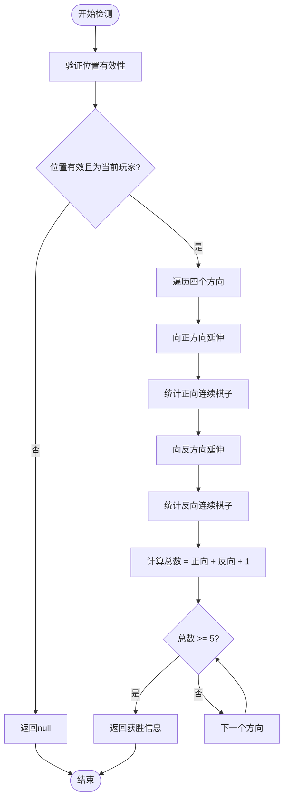
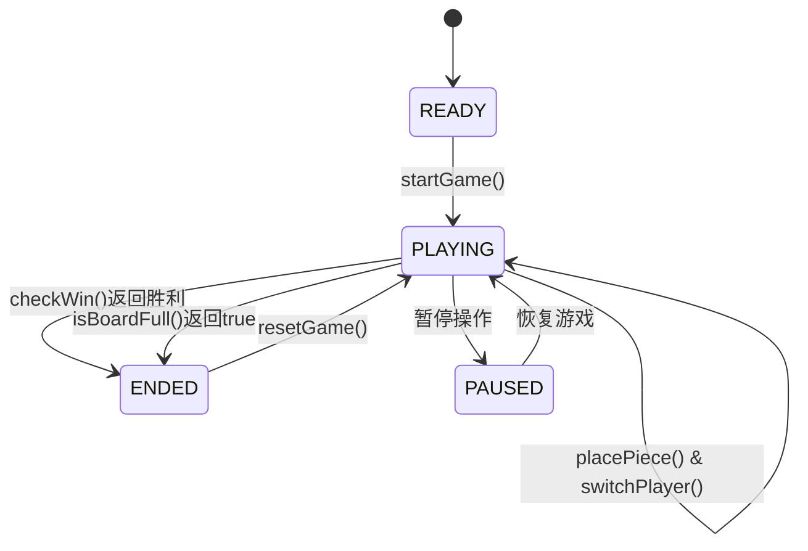

# 游戏规则与逻辑

<cite>
**Referenced Files in This Document**   
- [gameUtils.js](file://src/utils/gameUtils.js)
- [useGameState.js](file://src/hooks/useGameState.js)
- [gameConstants.js](file://src/constants/gameConstants.js)
</cite>

## 目录
1. [游戏基础规则](#游戏基础规则)
2. [胜利判定算法](#胜利判定算法)
3. [游戏状态管理](#游戏状态管理)
4. [特殊状态处理](#特殊状态处理)
5. [算法效率分析](#算法效率分析)

## 游戏基础规则

本游戏采用15×15标准棋盘布局，遵循五子棋基本规则。游戏双方分别为黑子（玩家）和白子（AI），通过交替落子进行对弈。棋盘坐标系统采用二维数组表示，范围为0-14，符合`BOARD_SIZE = 15`的常量定义。

游戏开始时，棋盘处于空状态，由黑子方先行。落子必须满足两个条件：位置在棋盘范围内且目标位置为空。这些规则通过`isValidPosition`和`isEmptyPosition`函数实现验证，确保所有操作的合法性。

**Section sources**
- [gameConstants.js](file://src/constants/gameConstants.js#L4-L6)
- [gameUtils.js](file://src/utils/gameUtils.js#L10-L38)

## 胜利判定算法

胜利判定的核心实现位于`checkWin`函数中，该函数在每次落子后被调用以检测是否形成五子连珠。算法采用以落子点为中心，向四个方向（横向、纵向、主对角线、副对角线）双向延伸的策略。

对于每个方向，算法首先向正方向延伸，统计连续同色棋子数量，然后向反方向延伸，累加总数。当任意方向的连续棋子数达到`WIN_COUNT = 5`时，判定为获胜，并返回获胜方向和具体位置坐标。这种实现避免了重复检测，提高了效率。

**Diagram sources**
- [gameUtils.js](file://src/utils/gameUtils.js#L42-L85)
- [gameConstants.js](file://src/constants/gameConstants.js#L6)

**Section sources**
- [gameUtils.js](file://src/utils/gameUtils.js#L42-L85)
- [gameConstants.js](file://src/constants/gameConstants.js#L6)

## 游戏状态管理

游戏状态通过`useGameState` Hook进行集中管理，采用Redux模式的reducer机制实现状态流转。初始状态包含空棋盘、当前玩家（黑子先行）、游戏阶段（准备中）等信息。

状态流转通过dispatch不同action实现：
- `START_GAME`：开始游戏，初始化棋盘
- `PLACE_PIECE`：放置棋子，更新棋盘并检测胜负
- `SWITCH_PLAYER`：切换玩家，处理冻结状态
- `RESET_GAME`：重置游戏到初始状态

每次落子后，系统自动检查胜负并更新游戏阶段。若检测到五子连珠，游戏阶段变为"ENDED"，并记录胜者信息。这种状态管理模式确保了游戏逻辑的清晰和可维护性。

**Diagram sources**
- [useGameState.js](file://src/hooks/useGameState.js#L493-L541)

**Section sources**
- [useGameState.js](file://src/hooks/useGameState.js#L493-L541)
- [gameUtils.js](file://src/utils/gameUtils.js#L42-L85)

## 特殊状态处理

系统实现了多种特殊状态的处理机制，包括非法操作拦截、平局判断和技能效果管理。

非法操作通过前置验证拦截：在`PLACE_PIECE` action中，首先检查目标位置是否为空且在棋盘范围内，若不满足条件则直接返回原状态，阻止非法落子。同时，被冻结的玩家无法执行落子操作。

平局判断通过`isBoardFull`函数实现，遍历整个棋盘检查是否存在空位。当棋盘填满且无五子连珠时，游戏以平局结束。

技能系统引入了更复杂的状态管理，如"静如止水"技能会冻结对手2回合，通过`frozenPlayer`和`frozenTurnsLeft`状态变量跟踪。这些特殊状态在`SWITCH_PLAYER`时被检查和更新，确保规则正确执行。

**Section sources**
- [useGameState.js](file://src/hooks/useGameState.js#L150-L170)
- [gameUtils.js](file://src/utils/gameUtils.js#L100-L118)

## 算法效率分析

`checkWin`函数的算法时间复杂度为O(1)，因为检测范围固定为四个方向，每个方向最多检查4个延伸位置（5子连珠减去中心点），与棋盘大小无关。空间复杂度也为O(1)，仅使用常量级额外空间存储临时变量。

该实现具有以下优势：
1. **高效性**：无需遍历整个棋盘，只检测与最新落子相关的潜在连线
2. **正确性**：通过双向延伸确保所有可能的五子连线都被检测
3. **完整性**：覆盖横、竖、斜四个方向的所有可能获胜情况
4. **实用性**：返回详细的获胜位置信息，可用于胜利动画展示

与遍历整个棋盘的O(n²)算法相比，此实现将每次落子后的检测开销降至最低，适合实时对弈场景。

**Section sources**
- [gameUtils.js](file://src/utils/gameUtils.js#L42-L85)
- [gameConstants.js](file://src/constants/gameConstants.js#L6)