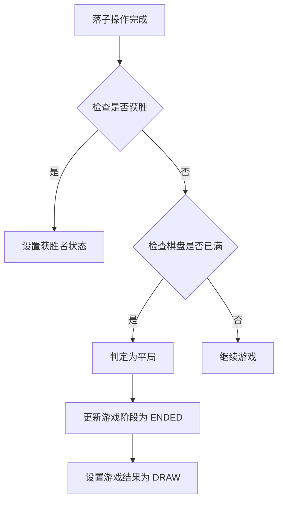
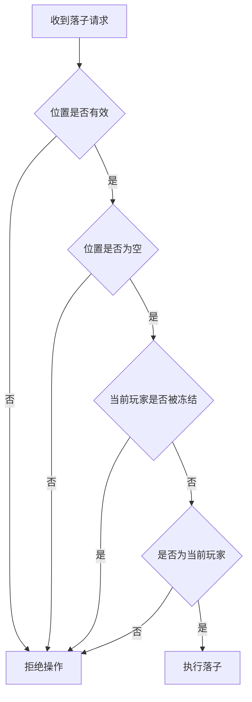
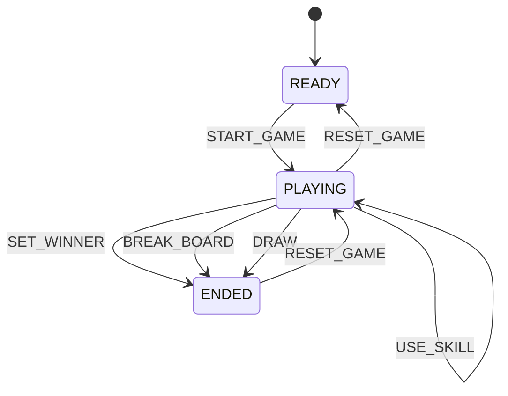
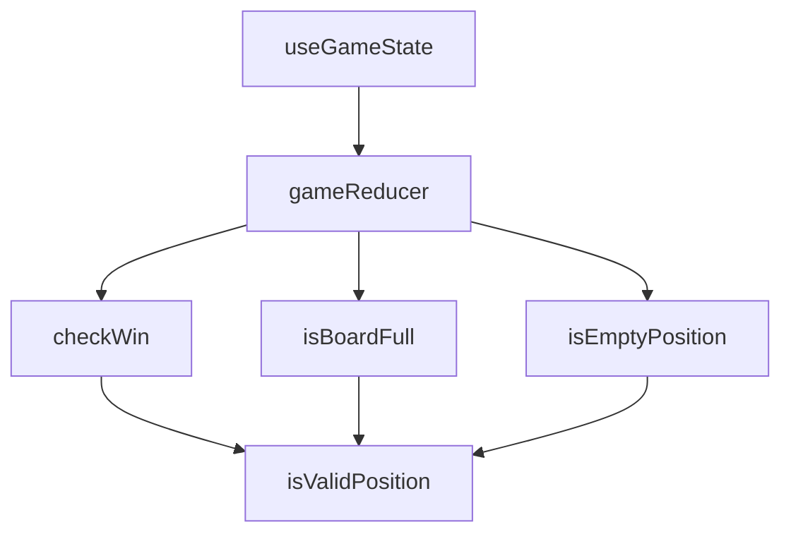

# 特殊状态处理

<cite>
**Referenced Files in This Document**   
- [useGameState.js](file://src/hooks/useGameState.js)
- [gameUtils.js](file://src/utils/gameUtils.js)
- [gameConstants.js](file://src/constants/gameConstants.js)
</cite>

## 目录
1. [特殊状态处理机制概述](#特殊状态处理机制概述)
2. [平局判断实现逻辑](#平局判断实现逻辑)
3. [非法操作拦截策略](#非法操作拦截策略)
4. [游戏状态管理机制](#游戏状态管理机制)
5. [工具函数辅助判断](#工具函数辅助判断)
6. [异常流程调试建议](#异常流程调试建议)
7. [常见问题解决方案](#常见问题解决方案)

## 特殊状态处理机制概述

本系统通过 `useGameState` 状态管理 Hook 和 `gameUtils` 工具函数库协同工作，实现对游戏特殊状态的全面处理。系统采用 Redux 风格的 `useReducer` 模式，通过 `dispatch action` 机制确保状态的安全过渡。游戏状态由 `gameStatus` 字段（在代码中体现为 `gamePhase` 和 `winner` 字段）统一管理，涵盖游戏开始、进行中、结束、重置等全生命周期场景。

核心机制包括：
- **平局判断**：当棋盘已满且无胜者时判定为平局
- **非法操作拦截**：防止重复落子、非当前玩家操作等违规行为
- **状态安全过渡**：通过 action 分发机制确保状态变更的原子性和一致性

**Section sources**
- [useGameState.js](file://src/hooks/useGameState.js#L493-L541)
- [gameUtils.js](file://src/utils/gameUtils.js#L0-L258)
- [gameConstants.js](file://src/constants/gameConstants.js#L0-L181)

## 平局判断实现逻辑

平局状态的判定基于两个核心条件：棋盘已满且无任何玩家获胜。系统通过 `gameUtils.js` 中的 `isBoardFull` 函数检测棋盘填充状态，并结合 `checkWin` 函数的返回结果进行综合判断。

**Diagram sources**
- [gameUtils.js](file://src/utils/gameUtils.js#L92-L101)
- [useGameState.js](file://src/hooks/useGameState.js#L493-L541)

**Section sources**
- [gameUtils.js](file://src/utils/gameUtils.js#L92-L101)
- [useGameState.js](file://src/hooks/useGameState.js#L493-L541)

## 非法操作拦截策略

系统通过多层次的验证机制拦截非法操作，确保游戏规则的严格执行。拦截策略主要在 `useGameState` 的 `gameReducer` 中实现，针对不同类型的非法操作采取相应的处理方式。

### 重复落子拦截
当玩家尝试在已有棋子的位置落子时，系统通过 `isEmptyPosition` 工具函数进行验证，若位置非空则直接返回原状态，拒绝该操作。

### 非当前玩家操作拦截
系统通过检查 `currentPlayer` 字段与操作发起者是否匹配来防止非当前玩家操作。此外，特殊状态如"冻结"也会阻止玩家行动。

**Diagram sources**
- [useGameState.js](file://src/hooks/useGameState.js#L493-L541)
- [gameUtils.js](file://src/utils/gameUtils.js#L60-L63)

**Section sources**
- [useGameState.js](file://src/hooks/useGameState.js#L493-L541)
- [gameUtils.js](file://src/utils/gameUtils.js#L60-L63)

## 游戏状态管理机制

系统采用 `useGameState` Hook 作为单一状态源，通过 `gameStatus` 相关字段管理游戏的完整生命周期。状态管理基于 `useReducer` 模式，通过 `dispatch action` 实现状态的安全过渡。

### 状态字段说明
- `gamePhase`：表示游戏阶段（READY、PLAYING、ENDED）
- `winner`：存储游戏结果，包括平局（DRAW）状态
- `currentPlayer`：跟踪当前操作玩家

### Action 分发模式
系统定义了清晰的 action 类型，如 `PLACE_PIECE`、`RESET_GAME` 等，每个 action 都会触发 reducer 中的相应处理逻辑，确保状态变更的可预测性和可追溯性。

**Diagram sources**
- [useGameState.js](file://src/hooks/useGameState.js#L493-L541)
- [gameConstants.js](file://src/constants/gameConstants.js#L25-L38)

**Section sources**
- [useGameState.js](file://src/hooks/useGameState.js#L493-L541)
- [gameConstants.js](file://src/constants/gameConstants.js#L25-L38)

## 工具函数辅助判断

`gameUtils.js` 提供了一系列工具函数，为特殊状态的判断提供基础支持。这些函数被 `useGameState` 中的 reducer 广泛调用，确保判断逻辑的复用性和一致性。

### 核心工具函数
- `isBoardFull`：检测棋盘是否已满
- `checkWin`：判断是否有玩家获胜
- `isEmptyPosition`：验证指定位置是否可落子
- `cloneBoard`：创建棋盘的深拷贝，用于状态更新

### 函数调用关系

**Diagram sources**
- [gameUtils.js](file://src/utils/gameUtils.js#L0-L258)
- [useGameState.js](file://src/hooks/useGameState.js#L493-L541)

**Section sources**
- [gameUtils.js](file://src/utils/gameUtils.js#L0-L258)

## 异常流程调试建议

### 状态不同步问题
当出现客户端与服务端（或不同组件间）状态不一致时，建议：
1. 检查 `dispatch` 调用是否正确执行
2. 验证 action payload 数据的完整性
3. 确认 reducer 中状态更新的不可变性原则

### 判定延迟问题
若特殊状态判定出现延迟，应：
1. 检查 `checkWin` 和 `isBoardFull` 函数的调用时机
2. 确保在每次有效操作后立即进行状态判断
3. 验证异步操作的执行顺序

**Section sources**
- [useGameState.js](file://src/hooks/useGameState.js#L493-L541)
- [gameUtils.js](file://src/utils/gameUtils.js#L0-L258)

## 常见问题解决方案

### 平局未正确判定
**问题**：棋盘已满但游戏未结束  
**解决方案**：确认 `isBoardFull` 函数正确遍历整个棋盘，并检查 `gamePhase` 是否在条件满足时更新为 `ENDED`。

### 非法操作未被拦截
**问题**：允许重复落子或非当前玩家操作  
**解决方案**：验证 `isEmptyPosition` 和 `currentPlayer` 检查逻辑是否在 `PLACE_PIECE` action 处理中正确执行。

### 状态重置异常
**问题**：`resetGame` 操作后状态不完整  
**解决方案**：检查 `RESET_GAME` action 是否正确应用 `initialState`，并确保所有相关状态字段都被重置。

**Section sources**
- [useGameState.js](file://src/hooks/useGameState.js#L493-L541)
- [gameUtils.js](file://src/utils/gameUtils.js#L0-L258)