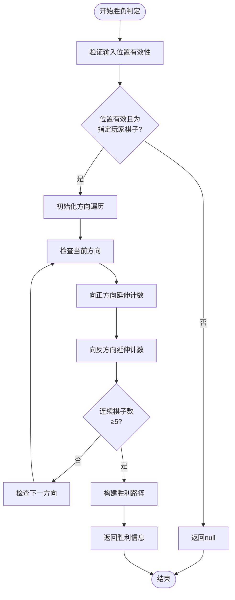
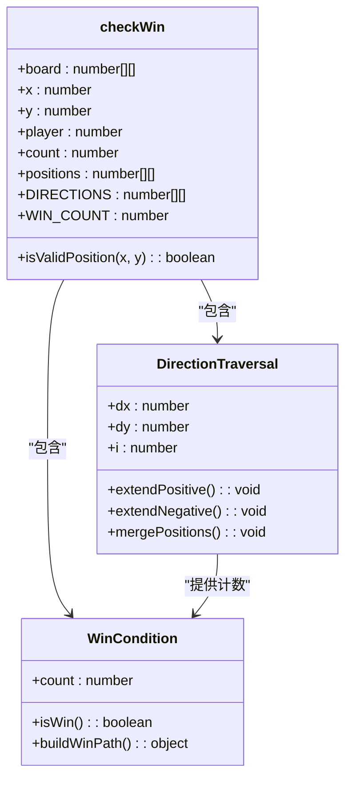
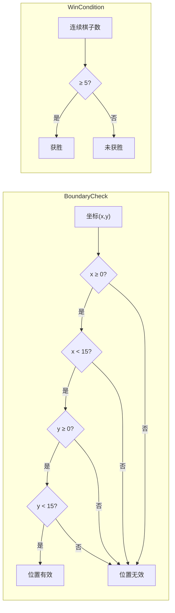
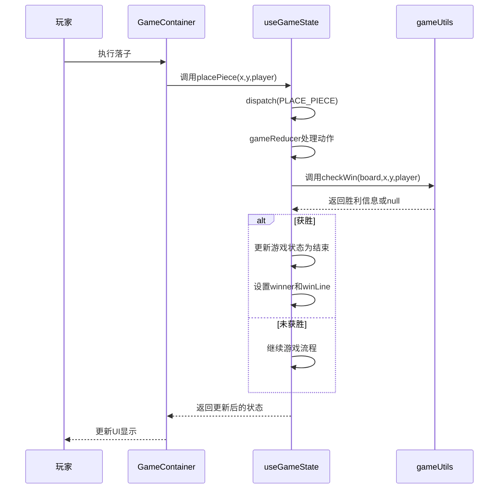

# 胜负判定逻辑

<cite>
**Referenced Files in This Document**   
- [gameUtils.js](file://src/utils/gameUtils.js)
- [useGameState.js](file://src/hooks/useGameState.js)
- [gameConstants.js](file://src/constants/gameConstants.js)
</cite>

## 目录
1. [胜负判定算法概述](#胜负判定算法概述)
2. [checkWin函数实现机制](#checkwin函数实现机制)
3. [方向遍历与双向延伸](#方向遍历与双向延伸)
4. [边界校验与胜利条件](#边界校验与胜利条件)
5. [胜利路径构建](#胜利路径构建)
6. [游戏状态中的调用流程](#游戏状态中的调用流程)
7. [常量配置与参数应用](#常量配置与参数应用)

## 胜负判定算法概述

五子连珠游戏的核心胜负判定算法通过分析棋盘上连续同色棋子的数量来确定游戏结果。该算法在每次玩家或AI落子后立即执行，确保游戏状态的实时更新。胜负判定系统由`gameUtils.js`中的`checkWin`函数实现，该函数接收棋盘状态、落子位置和玩家类型作为参数，返回是否形成五子连线的判定结果。

**Section sources**
- [gameUtils.js](file://src/utils/gameUtils.js#L42-L85)
- [gameConstants.js](file://src/constants/gameConstants.js#L1-L182)

## checkWin函数实现机制

`checkWin`函数是胜负判定的核心实现，采用高效的遍历算法检测四个方向上的连续棋子。函数首先验证输入位置的有效性，确保落子坐标在棋盘范围内且确实为指定玩家的棋子。随后，函数遍历预定义的四个方向向量，对每个方向执行双向延伸计数。

算法采用增量计数策略，从落子点开始，分别向正反两个方向延伸，统计连续的同色棋子数量。当任意方向上的连续棋子数达到或超过胜利条件时，函数立即返回胜利信息，包含获胜方向和具体的胜利路径坐标。

**Diagram sources**
- [gameUtils.js](file://src/utils/gameUtils.js#L42-L85)

**Section sources**
- [gameUtils.js](file://src/utils/gameUtils.js#L42-L85)

## 方向遍历与双向延伸

胜负判定算法通过`DIRECTIONS`常量定义的四个方向向量进行系统性遍历。这四个方向分别代表横向（[0,1]）、纵向（[1,0]）、主对角线（[1,1]）和副对角线（[1,-1]）。每个方向向量由dx和dy组成，表示在棋盘坐标系中的移动增量。

对于每个方向，算法执行双向延伸计数：
1. **正方向延伸**：从落子点开始，按照方向向量递增坐标，逐个检查棋盘位置
2. **反方向延伸**：从落子点开始，按照方向向量的反向递减坐标，逐个检查棋盘位置

这种双向延伸策略确保了能够准确统计以落子点为中心的连续棋子总数，无论连续序列是从哪个方向延伸而来。算法使用while循环实现延伸过程，每次迭代都进行边界校验和棋子类型匹配。

**Diagram sources**
- [gameUtils.js](file://src/utils/gameUtils.js#L42-L85)
- [gameConstants.js](file://src/constants/gameConstants.js#L175-L182)

**Section sources**
- [gameUtils.js](file://src/utils/gameUtils.js#L42-L85)
- [gameConstants.js](file://src/constants/gameConstants.js#L175-L182)

## 边界校验与胜利条件

算法中的`isValidPosition`函数负责边界校验，确保所有坐标访问都在15×15棋盘的有效范围内。该函数检查x和y坐标是否均大于等于0且小于`BOARD_SIZE`（15），防止数组越界访问。

胜利条件由`WIN_COUNT`常量定义，当前设置为5，表示需要连续5个同色棋子才能获胜。算法在每个方向的双向延伸完成后，将初始的1（落子点自身）与两个方向的计数相加，得到总连续棋子数。当总数大于或等于`WIN_COUNT`时，判定为获胜。

边界校验在每次坐标访问前执行，确保算法的安全性。这种预防性检查避免了无效内存访问，提高了代码的健壮性。同时，棋子类型的匹配检查确保只统计指定玩家的连续棋子。

**Diagram sources**
- [gameUtils.js](file://src/utils/gameUtils.js#L24-L33)
- [gameConstants.js](file://src/constants/gameConstants.js#L4)

**Section sources**
- [gameUtils.js](file://src/utils/gameUtils.js#L24-L33)
- [gameConstants.js](file://src/constants/gameConstants.js#L4)

## 胜利路径构建

当检测到五子连线时，算法不仅返回胜负结果，还构建详细的胜利路径信息。胜利路径的构建过程包括：
1. 将反方向延伸得到的坐标添加到`positions`数组的开头（使用`unshift`）
2. 将正方向延伸得到的坐标添加到`positions`数组的末尾
3. 在适当位置插入落子点坐标作为中心点
4. 截取恰好5个连续坐标的子数组作为最终的胜利路径

这种构建方式确保了胜利路径的坐标按连续顺序排列，便于在UI层进行可视化展示。返回的胜利信息对象包含`direction`属性（获胜方向向量）和`positions`属性（胜利路径坐标数组），为游戏界面的胜利动画提供了精确的数据支持。

**Section sources**
- [gameUtils.js](file://src/utils/gameUtils.js#L42-L85)

## 游戏状态中的调用流程

`useGameState` Hook负责管理游戏的整体状态，并在适当的时机调用`checkWin`函数。每次落子操作通过`placePiece`动作触发，该动作在`gameReducer`中处理。落子后，系统立即调用`checkWin`进行胜负判定。

调用流程如下：
1. 玩家或AI执行落子操作
2. `gameReducer`的`PLACE_PIECE`分支处理落子
3. 创建新的棋盘状态并放置棋子
4. 调用`checkWin`函数进行胜负判定
5. 根据判定结果更新游戏状态

如果检测到胜利，游戏状态将更新为结束状态，记录获胜者信息和胜利路径，以便UI组件进行相应的展示。这种即时判定机制确保了游戏逻辑的实时性和准确性。

**Diagram sources**
- [useGameState.js](file://src/hooks/useGameState.js#L200-L235)
- [gameUtils.js](file://src/utils/gameUtils.js#L42-L85)

**Section sources**
- [useGameState.js](file://src/hooks/useGameState.js#L200-L235)

## 常量配置与参数应用

胜负判定算法依赖于`gameConstants.js`中定义的多个常量，这些常量提供了算法运行所需的配置参数。`BOARD_SIZE`定义了棋盘的大小（15×15），`WIN_COUNT`定义了获胜所需的连续棋子数（5），`DIRECTIONS`定义了四个检测方向的向量。

这些常量的集中管理使得算法具有良好的可配置性和可维护性。通过修改这些常量值，可以轻松调整游戏规则，如改变棋盘大小或胜利条件。常量的使用也避免了魔法数字的出现，提高了代码的可读性和可维护性。

**Section sources**
- [gameConstants.js](file://src/constants/gameConstants.js#L2-L182)