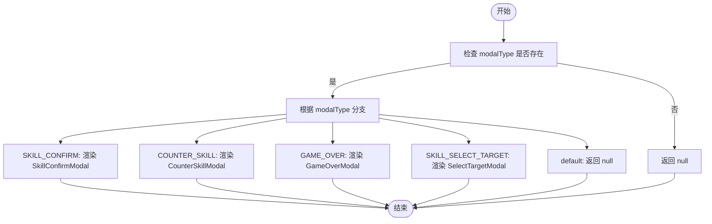
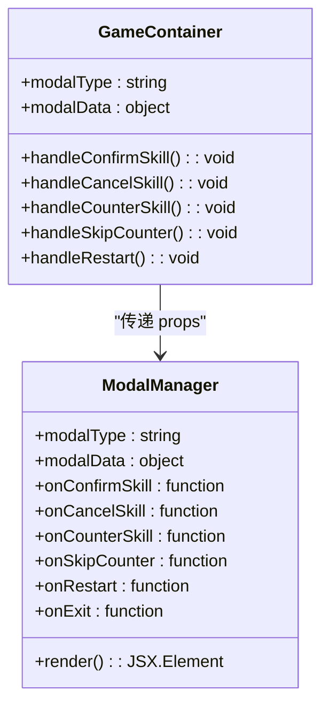

# 弹窗管理器组件

<cite>
**Referenced Files in This Document**   
- [ModalManager.js](file://src/components/ModalManager.js)
- [gameConstants.js](file://src/constants/gameConstants.js)
- [useGameState.js](file://src/hooks/useGameState.js)
- [GameContainer.js](file://src/components/GameContainer.js)
</cite>

## 目录
1. [简介](#简介)
2. [核心组件](#核心组件)
3. [弹窗类型路由机制](#弹窗类型路由机制)
4. [数据传递与上下文注入](#数据传递与上下文注入)
5. [回调函数契约设计](#回调函数契约设计)
6. [轻量级展示逻辑](#轻量级展示逻辑)
7. [扩展与优化建议](#扩展与优化建议)

## 简介
弹窗管理器组件（ModalManager）是游戏交互系统的核心枢纽，负责根据游戏状态动态渲染不同类型的弹窗。该组件通过`modalType`状态精确控制弹窗的显示与类型分发，确保玩家在技能确认、反制选择、游戏结束等关键节点获得清晰的视觉反馈。组件设计遵循单一职责原则，专注于展示逻辑的调度，不参与任何状态管理，从而保持了代码的高内聚与低耦合。

## 核心组件

ModalManager组件通过`switch`语句实现弹窗类型的路由分发，支持四种核心弹窗类型：技能确认、反制选择、游戏结束和目标选择。组件首先检查`modalType`是否为空，若为空则安全返回`null`，避免渲染不必要的UI。对于每种弹窗类型，组件通过`modalData`接收上下文数据，并将预定义的回调函数注入到具体的弹窗子组件中，实现交互逻辑的闭环。

**Section sources**
- [ModalManager.js](file://src/components/ModalManager.js#L155-L207)

## 弹窗类型路由机制

ModalManager通过`switch`语句实现弹窗类型的精确路由。`modalType`的值来源于`MODAL_TYPE`常量，确保类型定义的统一性与可维护性。当`modalType`匹配特定类型时，组件渲染对应的弹窗子组件；若无匹配，则返回`null`，保证了系统的健壮性。

**Diagram sources**
- [ModalManager.js](file://src/components/ModalManager.js#L155-L207)
- [gameConstants.js](file://src/constants/gameConstants.js#L130-L136)

**Section sources**
- [ModalManager.js](file://src/components/ModalManager.js#L155-L207)
- [gameConstants.js](file://src/constants/gameConstants.js#L130-L136)

## 数据传递与上下文注入

ModalManager通过`modalData`对象实现上下文信息的传递。`modalData`是一个灵活的数据结构，根据弹窗类型携带不同的上下文信息：
- **技能确认弹窗**：传递`skillId`，用于显示技能名称与描述。
- **反制选择弹窗**：传递`opponentSkillId`和`counterSkillId`，用于展示对手技能与可反制技能。
- **游戏结束弹窗**：传递`winner`，用于确定胜利者并显示相应结果。
- **目标选择弹窗**：传递`skillId`，用于提示玩家选择目标。

这种设计确保了弹窗组件能够获取必要的上下文信息，同时保持了ModalManager的通用性。

**Section sources**
- [ModalManager.js](file://src/components/ModalManager.js#L155-L207)

## 回调函数契约设计

ModalManager通过一组预定义的回调函数与父组件进行通信，这些回调函数构成了清晰的契约：
- `onConfirmSkill`：确认使用技能的回调。
- `onCancelSkill`：取消技能的回调。
- `onCounterSkill`：执行反制技能的回调。
- `onSkipCounter`：跳过反制的回调。
- `onRestart`：重新开始游戏的回调。
- `onExit`：退出游戏的回调。

这些回调函数由父组件（如GameContainer）提供，确保了交互逻辑的正确执行。例如，当玩家在`SkillConfirmModal`中点击“确认”时，`onConfirmSkill`被触发，进而执行技能逻辑。

**Section sources**
- [ModalManager.js](file://src/components/ModalManager.js#L155-L207)
- [GameContainer.js](file://src/components/GameContainer.js#L300-L350)

## 轻量级展示逻辑

ModalManager组件严格遵循展示逻辑与状态管理分离的原则。组件本身不维护任何状态，仅作为状态的消费者。所有状态（如`modalType`、`modalData`）和行为（回调函数）均由父组件通过props注入。这种设计使得ModalManager成为一个纯粹的函数式组件，易于测试、复用和维护。

**Diagram sources**
- [ModalManager.js](file://src/components/ModalManager.js#L155-L207)
- [GameContainer.js](file://src/components/GameContainer.js#L20-L50)

**Section sources**
- [ModalManager.js](file://src/components/ModalManager.js#L155-L207)
- [GameContainer.js](file://src/components/GameContainer.js#L20-L50)

## 扩展与优化建议

### 弹窗堆叠处理
当前设计未处理弹窗堆叠的情况。建议引入弹窗栈（Modal Stack）机制，允许同时管理多个弹窗，例如在游戏结束弹窗中显示成就解锁提示。

### 无障碍访问改进
为提升无障碍访问性，建议为所有弹窗添加`aria-label`和`role`属性，并确保键盘导航的完整性。例如，为`modal-overlay`添加`role="dialog"`和`aria-modal="true"`。

### 国际化支持
为支持多语言，建议将弹窗中的文本（如“确认”、“取消”）提取到语言包中，并通过`i18n`库进行动态加载。这将使游戏更容易适应不同地区的玩家。

**Section sources**
- [ModalManager.js](file://src/components/ModalManager.js#L1-L210)
- [GameContainer.js](file://src/components/GameContainer.js#L1-L439)