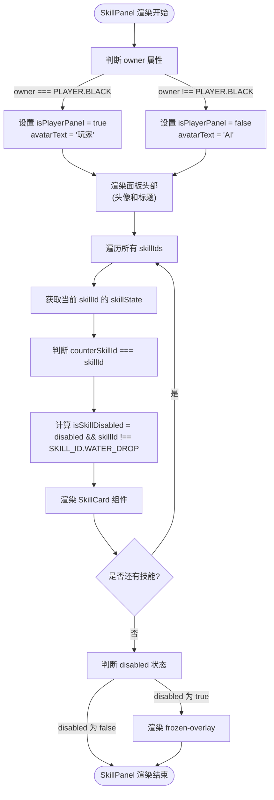

# 技能面板组件

<cite>
**Referenced Files in This Document**   
- [SkillPanel.js](file://src/components/SkillPanel.js)
- [gameConstants.js](file://src/constants/gameConstants.js)
- [SkillCard.js](file://src/components/SkillCard.js)
- [SkillPanel.css](file://src/components/SkillPanel.css)
- [SkillCard.css](file://src/components/SkillCard.css)
- [GameContainer.js](file://src/components/GameContainer.js)
- [useGameState.js](file://src/hooks/useGameState.js)
</cite>

## 目录
1. [简介](#简介)
2. [核心设计与实现](#核心设计与实现)
3. [状态与交互逻辑](#状态与交互逻辑)
4. [样式与布局](#样式与布局)
5. [组件复用与扩展](#组件复用与扩展)
6. [结论](#结论)

## 简介
`SkillPanel` 组件是游戏中的核心UI元素，作为技能展示的容器，为玩家和AI提供统一的技能管理界面。该组件通过`owner`属性区分面板归属，动态渲染对应的头像和标题。它遍历`SKILL_ID`枚举，为每个技能创建`SkillCard`子组件，并通过`disabled`、`counterSkillId`和`position`等属性精确控制其状态、高亮和布局。本文档将深入解析其设计模式、状态处理逻辑和样式实现。

## 核心设计与实现

`SkillPanel`组件的设计体现了高度的通用性和可配置性。其核心功能是作为技能的容器，根据传入的`owner`（所有者）属性来区分是玩家面板还是AI面板，并相应地渲染不同的视觉元素。

组件通过`Object.values(SKILL_ID)`获取所有技能ID，然后使用`map`函数遍历这些ID，为每一个技能创建一个`SkillCard`组件实例。这种设计使得添加新技能变得非常简单，只需在`SKILL_ID`枚举中定义新的ID，`SkillPanel`便会自动将其渲染出来，无需修改其内部逻辑。



**Section sources**
- [SkillPanel.js](file://src/components/SkillPanel.js#L6-L58)

## 状态与交互逻辑

### 禁用与冻结状态处理
`SkillPanel`的`disabled`属性是实现“冻结”状态的关键。当`disabled`为`true`时，面板进入冻结状态，此时会渲染一个半透明的`.frozen-overlay`遮罩层，视觉上提示用户该面板当前不可操作。

```mermaid
classDiagram
class SkillPanel {
+owner : PLAYER
+skillStates : object
+onSkillClick : function
+counterSkillId : string
+disabled : boolean
+position : 'left'|'right'
-isPlayerPanel : boolean
-avatarText : string
-isSkillDisabled(skillId) : boolean
}
class SkillCard {
+skillId : string
+skillState : object
+onClick : function
+canCounter : boolean
+disabled : boolean
}
SkillPanel --> SkillCard : "渲染多个"
SkillPanel --> "SKILL_ID" : "遍历"
SkillPanel --> "PLAYER" : "比较"
```

**Diagram sources**
- [SkillPanel.js](file://src/components/SkillPanel.js#L6-L58)
- [SkillCard.js](file://src/components/SkillCard.js#L5-L91)

**Section sources**
- [SkillPanel.js](file://src/components/SkillPanel.js#L6-L58)
- [SkillCard.js](file://src/components/SkillCard.js#L5-L91)

#### 冻结状态下的特殊规则
一个关键的业务逻辑是，当面板被冻结时，通常所有技能都应被禁用，但有一个例外：`水滴石穿`（`SKILL_ID.WATER_DROP`）技能。其实现逻辑如下：
```javascript
const isSkillDisabled = disabled && skillId !== SKILL_ID.WATER_DROP;
```
这行代码确保了在`disabled`（冻结）状态下，只有`水滴石穿`技能的`disabled`属性为`false`，从而允许用户点击。这一逻辑在`GameContainer.js`中被调用，当玩家被冻结时，点击其他技能会直接返回，而点击`水滴石穿`则会触发技能使用流程。

**Section sources**
- [SkillPanel.js](file://src/components/SkillPanel.js#L25-L28)
- [GameContainer.js](file://src/components/GameContainer.js#L300-L310)

### 反制技能高亮机制
`counterSkillId`机制用于高亮显示可以反制当前对手技能的技能卡片。`SkillPanel`将`counterSkillId`属性传递给每一个`SkillCard`。在`SkillCard`内部，通过`canCounter = counterSkillId === skillId`来判断当前卡片是否应该被高亮。如果匹配，卡片会应用`can-counter` CSS类，触发一个闪烁的动画效果，直观地提示玩家可以使用该技能进行反制。

**Section sources**
- [SkillPanel.js](file://src/components/SkillPanel.js#L24)
- [SkillCard.js](file://src/components/SkillCard.js#L18)

### 面板布局控制
`position`属性用于控制技能面板在游戏界面上的左右布局。`SkillPanel`将此属性作为CSS类名的一部分，动态地添加到根`div`元素上：
```javascript
<div className={`skill-panel ${position}`}>
```
当`position`为`left`时，会应用`.skill-panel.left`的样式；当为`right`时，则应用`.skill-panel.right`的样式。这些样式在`SkillPanel.css`中定义，主要通过`margin`属性来调整面板的外边距，确保其在容器中正确对齐。

**Section sources**
- [SkillPanel.js](file://src/components/SkillPanel.js#L10)
- [SkillPanel.css](file://src/components/SkillPanel.css#L15-L20)

## 样式与布局

### 冻结遮罩层的条件渲染
`frozen-overlay`的渲染是一个典型的条件渲染案例。其逻辑非常清晰：
```javascript
{disabled && (
  <div className="frozen-overlay">
    <div className="frozen-text">❄️ 被冻结 ❄️</div>
  </div>
)}
```
只有当`disabled`属性为`true`时，这个遮罩层才会被渲染到DOM中。`frozen-overlay`使用`position: absolute`覆盖在面板之上，其背景色为半透明的蓝色（`rgba(100, 181, 246, 0.3)`），并应用了`backdrop-filter: blur(2px)`来模糊其下的内容。`frozen-text`则是一个居中的、带有边框和阴影的文本块，通过`animation: frozen-pulse`实现呼吸灯效果，增强视觉提示。

```mermaid
graph TD
A[SkillPanel 根元素] --> B[panel-header]
A --> C[skills-container]
A --> D[frozen-overlay]
D --> E[frozen-text]
style D fill:#64b5f6,stroke:#64b5f6,stroke-width:2px,opacity:0.3
style E fill:#000,stroke:#64b5f6,stroke-width:2px,font-weight:bold
```



**Diagram sources**
- [SkillPanel.js](file://src/components/SkillPanel.js#L50-L56)
- [SkillPanel.css](file://src/components/SkillPanel.css#L60-L90)

**Section sources**
- [SkillPanel.js](file://src/components/SkillPanel.js#L50-L56)
- [SkillPanel.css](file://src/components/SkillPanel.css#L60-L90)

## 组件复用与扩展

### 扩展支持新技能类型
`SkillPanel`组件具有良好的扩展性。要添加新技能，开发者只需在`gameConstants.js`的`SKILL_ID`枚举和`SKILLS`配置对象中定义新技能即可。`SkillPanel`会自动遍历所有ID并渲染对应的卡片。例如，添加一个名为“风卷残云”的新技能，只需在`SKILL_ID`中添加`WIND_SWEEP: 'SKILL_09'`，并在`SKILLS`中配置其属性，无需修改`SkillPanel`或`SkillCard`的代码。

### 不同游戏模式下的适配策略
该组件的设计使其易于适配不同的游戏模式。通过`owner`属性，它可以区分玩家和AI。通过`disabled`属性，它可以响应游戏中的各种状态（如冻结、眩晕等）。通过`counterSkillId`，它可以支持复杂的技能反制系统。在未来的扩展中，可以通过添加新的属性（如`mode="spectator"`）来支持观战模式，或者通过`theme`属性来切换不同的视觉主题。

**Section sources**
- [gameConstants.js](file://src/constants/gameConstants.js#L33-L42)
- [SkillPanel.js](file://src/components/SkillPanel.js#L6-L58)

## 结论
`SkillPanel`组件是一个设计精良、职责清晰的UI容器。它通过简洁的属性接口（`owner`, `disabled`, `counterSkillId`, `position`）实现了复杂的状态管理和交互逻辑。其通用性设计允许轻松扩展新技能，而条件渲染和CSS类名的动态应用则确保了灵活的视觉表现。该组件与`SkillCard`和游戏状态管理的紧密结合，构成了游戏技能系统的核心，为玩家提供了直观、流畅的交互体验。