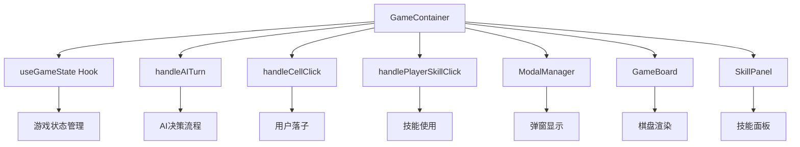
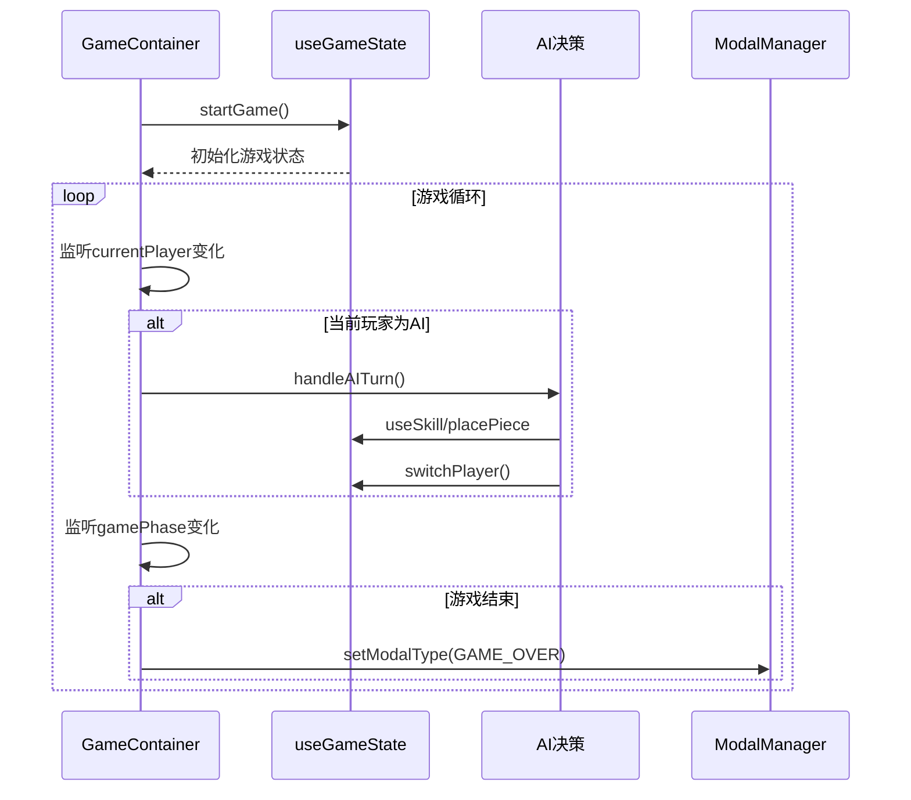
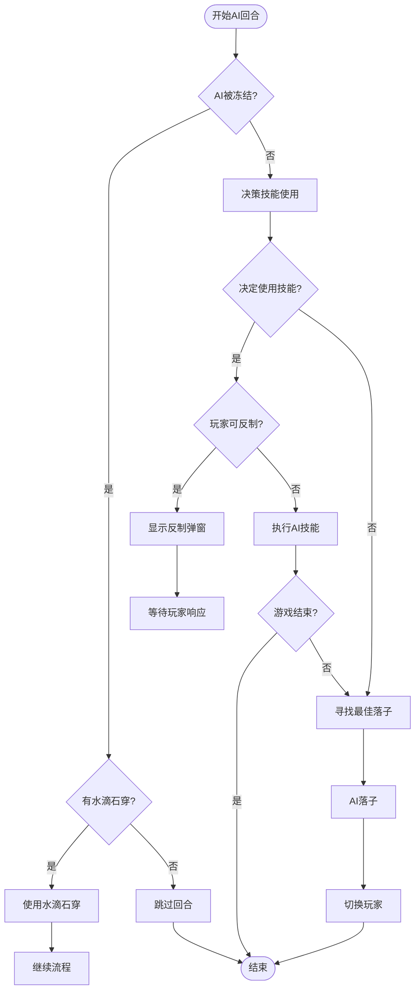

# 游戏容器组件

<cite>
**Referenced Files in This Document**   
- [GameContainer.js](file://src/components/GameContainer.js)
- [useGameState.js](file://src/hooks/useGameState.js)
- [ModalManager.js](file://src/components/ModalManager.js)
- [GameBoard.js](file://src/components/GameBoard.js)
- [SkillPanel.js](file://src/components/SkillPanel.js)
- [aiUtils.js](file://src/utils/aiUtils.js)
- [gameConstants.js](file://src/constants/gameConstants.js)
</cite>

## 目录
1. [简介](#简介)
2. [核心职责与架构](#核心职责与架构)
3. [游戏状态集成](#游戏状态集成)
4. [生命周期管理](#生命周期管理)
5. [内部状态管理](#内部状态管理)
6. [AI决策流程](#ai决策流程)
7. [用户交互处理](#用户交互处理)
8. [子组件通信机制](#子组件通信机制)
9. [常见问题排查](#常见问题排查)
10. [性能优化建议](#性能优化建议)

## 简介
`GameContainer` 组件是整个技能五子棋应用的核心协调者，负责整合游戏逻辑、管理游戏状态、协调用户与AI的交互流程。该组件通过集成 `useGameState` Hook 来获取和操作游戏状态，并利用 `useEffect` 钩子精确管理游戏的生命周期，包括游戏启动、AI回合处理和游戏结束检测。组件内部维护了多个状态变量，用于控制弹窗显示、技能使用和处理状态，确保在用户操作与AI决策之间实现平滑协调。通过精心设计的回调函数，`GameContainer` 与 `ModalManager`、`GameBoard` 和 `SkillPanel` 等子组件进行通信，保证了数据流的单向性和状态同步的准确性。

## 核心职责与架构
`GameContainer` 组件作为应用的顶层协调者，承担着整合所有游戏功能的重任。其主要职责包括初始化游戏状态、监听游戏阶段变化、驱动AI逻辑执行以及响应用户输入。该组件采用函数式组件结合 `useState` 和 `useEffect` 钩子的模式，构建了一个清晰、可维护的状态管理架构。通过将游戏逻辑与UI渲染分离，`GameContainer` 保持了代码的简洁性，同时通过回调函数将事件处理逻辑传递给子组件，实现了关注点分离的设计原则。

**Diagram sources**
- [GameContainer.js](file://src/components/GameContainer.js)

**Section sources**
- [GameContainer.js](file://src/components/GameContainer.js)

## 游戏状态集成
`GameContainer` 组件通过 `useGameState` Hook 与游戏的核心状态进行集成。该 Hook 返回一个包含 `state` 和 `actions` 的对象，其中 `state` 提供了当前游戏的所有状态信息，如棋盘布局、当前玩家、游戏阶段和技能状态；而 `actions` 则提供了一系列用于修改状态的方法，如 `startGame`、`placePiece` 和 `useSkill`。`GameContainer` 通过解构赋值获取这些状态和动作，从而能够在组件内部直接访问和操作游戏数据，实现了状态管理的集中化和逻辑的解耦。

**Section sources**
- [GameContainer.js](file://src/components/GameContainer.js)
- [useGameState.js](file://src/hooks/useGameState.js)

## 生命周期管理
`GameContainer` 组件利用 `useEffect` 钩子精确地管理游戏的生命周期。

### 游戏启动
组件通过一个空依赖数组的 `useEffect` 钩子，在组件挂载时仅执行一次 `actions.startGame()`，从而初始化游戏状态，将游戏阶段设置为 `PLAYING`，并重置棋盘。

### AI回合处理
另一个 `useEffect` 钩子监听 `state.currentPlayer`、`state.gamePhase`、`isProcessing` 和 `modalType` 的变化。当满足条件（当前玩家为AI、游戏正在进行、未在处理中且无弹窗显示）时，自动调用 `handleAITurn` 函数，触发AI的决策和行动流程。

### 游戏结束检测
第三个 `useEffect` 钩子监听 `state.gamePhase` 的变化。当游戏阶段变为 `ENDED` 且无弹窗显示时，会延迟1秒后设置 `modalType` 为 `GAME_OVER`，从而触发游戏结束弹窗的显示。

**Diagram sources**
- [GameContainer.js](file://src/components/GameContainer.js#L59-L142)
- [useGameState.js](file://src/hooks/useGameState.js)

**Section sources**
- [GameContainer.js](file://src/components/GameContainer.js#L30-L55)
- [useGameState.js](file://src/hooks/useGameState.js)

## 内部状态管理
`GameContainer` 组件维护了多个本地状态，用于协调复杂的用户交互和游戏流程。

| 状态变量 | 类型 | 描述 |
| :--- | :--- | :--- |
| `modalType` | string/null | 控制当前显示的弹窗类型，如技能确认、反制或游戏结束 |
| `modalData` | object/null | 传递给弹窗组件的附加数据，如技能ID或获胜者信息 |
| `pendingSkill` | object/null | 存储待确认使用的技能信息，包括技能ID和所有者 |
| `isProcessing` | boolean | 标记AI是否正在处理回合，防止并发操作 |

这些状态变量与从 `useGameState` 获取的全局状态协同工作，共同管理游戏的UI流程。例如，`isProcessing` 状态用于禁用用户输入，防止在AI执行时产生冲突；`pendingSkill` 状态则用于在用户确认使用技能前暂存技能信息。

**Section sources**
- [GameContainer.js](file://src/components/GameContainer.js#L18-L25)

## AI决策流程
`handleAITurn` 函数是AI决策流程的核心，它是一个异步函数，通过 `useCallback` 进行优化，确保在组件重新渲染时不会重新创建。

### 异步处理机制
该函数使用 `async/await` 语法，通过 `Promise` 和 `setTimeout` 实现了非阻塞的延迟，模拟了AI的思考过程，为用户提供流畅的视觉反馈。

### 技能使用判断
AI首先检查自身是否被冻结。如果被冻结，它会优先尝试使用“水滴石穿”技能解除冻结；否则，它会调用 `decideSkillUsage` 工具函数来评估是否使用技能。该函数会分析对手的威胁（如活四或双活三），并决定使用“飞沙走石”、“静如止水”或“力拔山兮”等技能。

### 反制逻辑触发
如果AI决定使用一个可被反制的技能（如“飞沙走石”），`GameContainer` 会设置 `modalType` 为 `COUNTER_SKILL`，并显示反制弹窗，等待玩家的响应。

### 落子决策执行
在技能处理完成后，AI调用 `findBestMove` 函数计算最佳落子位置。该函数通过评估每个空位的进攻和防守价值，选择综合评分最高的位置。落子后，通过 `actions.switchPlayer()` 将回合交还给玩家。

**Diagram sources**
- [GameContainer.js](file://src/components/GameContainer.js#L59-L142)
- [aiUtils.js](file://src/utils/aiUtils.js)

**Section sources**
- [GameContainer.js](file://src/components/GameContainer.js#L59-L142)
- [aiUtils.js](file://src/utils/aiUtils.js)

## 用户交互处理
`GameContainer` 组件通过两个关键的 `useCallback` 函数来处理用户输入。

### 棋盘点击处理
`handleCellClick` 函数响应用户在棋盘上的点击。它首先进行一系列条件检查，包括游戏是否在进行中、是否为玩家回合、玩家是否被冻结以及是否正在处理中。如果正在选择技能目标（如“飞沙走石”），则调用 `handleSkillTarget` 处理目标选择；否则，执行正常的落子操作，并在落子后切换回合。

### 技能点击处理
`handlePlayerSkillClick` 函数响应用户点击技能按钮。它同样进行条件检查，并特别处理被冻结状态——此时只允许使用“水滴石穿”解控。对于需要选择目标的技能，它会打开目标选择弹窗；对于其他技能，则打开确认弹窗，并将技能信息暂存于 `pendingSkill` 状态中。

**Section sources**
- [GameContainer.js](file://src/components/GameContainer.js#L162-L252)

## 子组件通信机制
`GameContainer` 通过回调函数与子组件进行通信，确保了数据流的单向性。

### 与ModalManager通信
`GameContainer` 将 `modalType` 和 `modalData` 作为props传递给 `ModalManager`，控制弹窗的显示和内容。同时，它将 `handleConfirmSkill`、`handleCancelSkill` 等函数作为回调传递，使 `ModalManager` 能够在用户操作后通知 `GameContainer`。

### 与GameBoard通信
`GameContainer` 将 `handleCellClick` 作为 `onCellClick` prop 传递给 `GameBoard`，将用户在棋盘上的点击事件传递回容器进行处理。

### 与SkillPanel通信
`GameContainer` 将 `handlePlayerSkillClick` 作为 `onSkillClick` prop 传递给玩家的 `SkillPanel`，并将 `getCounterSkillId` 函数的返回值作为 `counterSkillId` prop 传递，用于高亮可反制的技能。

**Section sources**
- [GameContainer.js](file://src/components/GameContainer.js)
- [ModalManager.js](file://src/components/ModalManager.js)
- [GameBoard.js](file://src/components/GameBoard.js)
- [SkillPanel.js](file://src/components/SkillPanel.js)

## 常见问题排查
### AI未响应
- **检查点**: 确认 `isProcessing` 状态是否为 `false`，`modalType` 是否为 `null`，且 `state.currentPlayer` 是否为 `PLAYER.WHITE`。
- **原因**: 如果AI被冻结且没有“水滴石穿”技能，它会跳过回合。检查 `state.effectStates.frozenPlayer` 和 `state.aiSkillStates[SKILL_ID.WATER_DROP]` 的状态。

### 弹窗不显示
- **检查点**: 确认 `setModalType` 函数是否被正确调用，且 `modalType` 的值与 `ModalManager` 中定义的类型匹配。
- **原因**: `ModalManager` 组件仅在 `modalType` 不为 `null` 时渲染。检查 `handleAITurn` 或技能处理函数中设置 `modalType` 的逻辑。

## 性能优化建议
- **useCallback 依赖数组**: `handleAITurn`、`handleCellClick` 和 `handlePlayerSkillClick` 等函数的 `useCallback` 依赖数组应精确包含所有引用的外部变量（如 `state`、`actions`、`isProcessing`）。避免将整个 `state` 对象作为依赖，这可能导致不必要的重新渲染。
- **避免不必要的重渲染**: `GameContainer` 的子组件（如 `GameBoard` 和 `SkillPanel`）应使用 `React.memo` 进行包裹，以防止在父组件状态更新时进行不必要的重渲染。

**Section sources**
- [GameContainer.js](file://src/components/GameContainer.js)