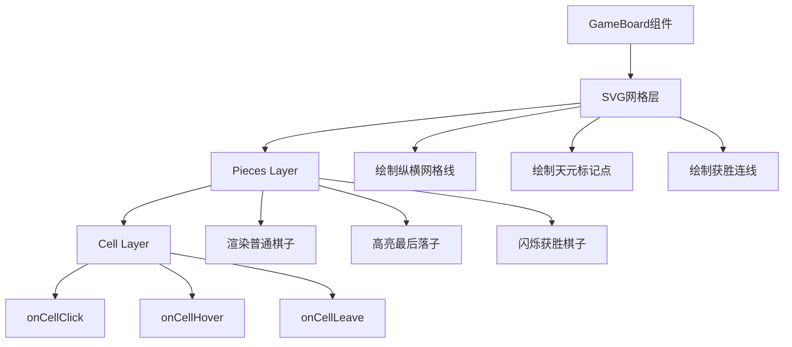
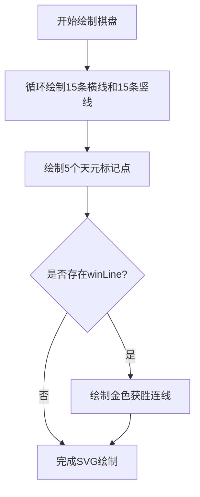
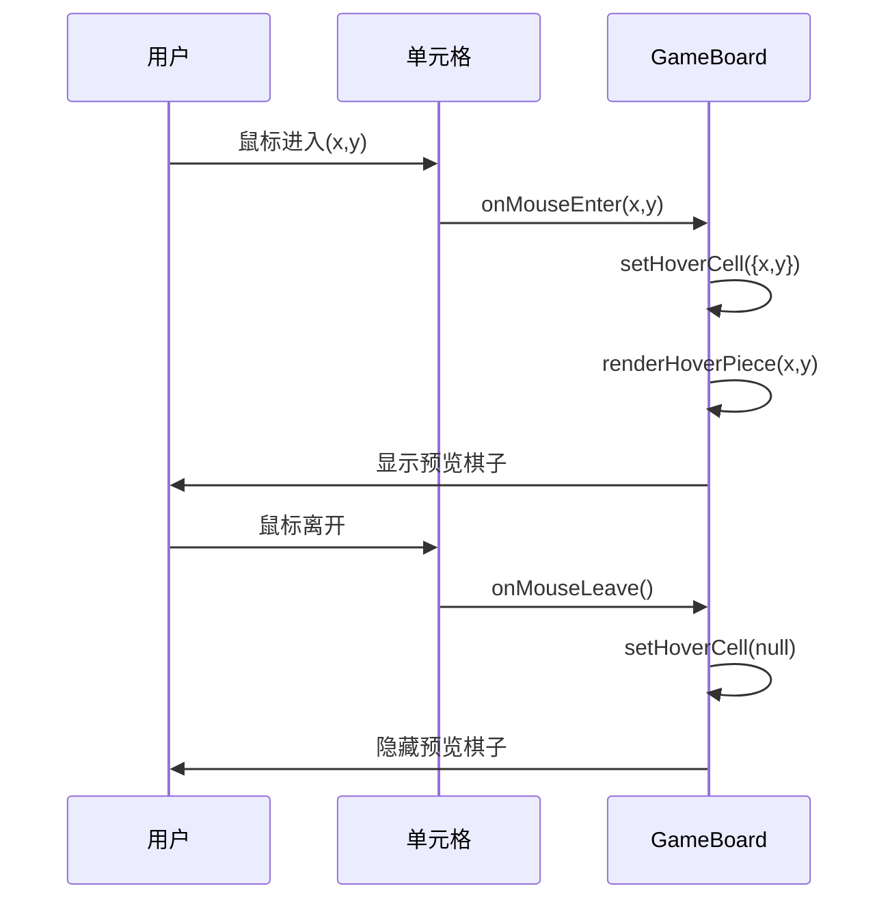
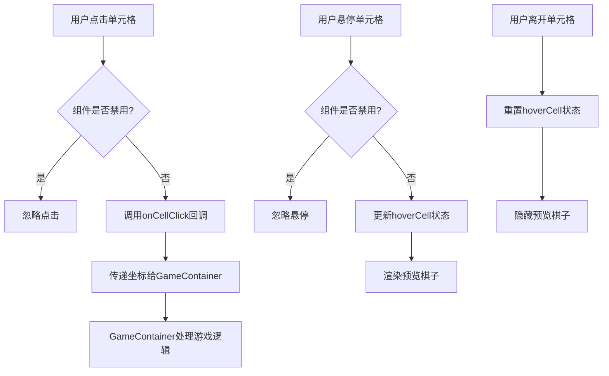
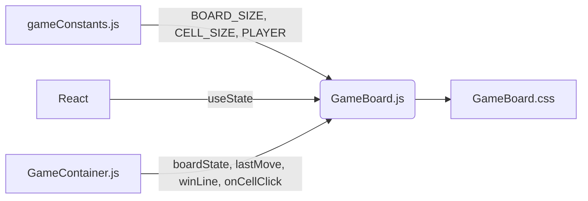

# 游戏棋盘组件

<cite>
**Referenced Files in This Document**  
- [GameBoard.js](file://src/components/GameBoard.js)
- [GameBoard.css](file://src/components/GameBoard.css)
- [gameConstants.js](file://src/constants/gameConstants.js)
- [GameContainer.js](file://src/components/GameContainer.js)
</cite>

## 目录
1. [简介](#简介)
2. [项目结构](#项目结构)
3. [核心组件](#核心组件)
4. [架构概述](#架构概述)
5. [详细组件分析](#详细组件分析)
6. [依赖分析](#依赖分析)
7. [性能考量](#性能考量)
8. [故障排除指南](#故障排除指南)
9. [结论](#结论)

## 简介
本文档全面阐述了GameBoard组件的UI渲染机制与交互设计。该组件作为五子棋游戏的核心视觉呈现部分，负责将游戏状态数据转化为直观的15x15棋盘界面。文档详细描述了组件如何接收boardState、lastMove、winLine等状态并将其可视化，解析SVG网格绘制逻辑，说明棋子渲染策略，分析hover效果实现方式，并解释事件处理系统的工作流程。

## 项目结构
游戏棋盘组件位于`src/components/`目录下，由`GameBoard.js`和`GameBoard.css`两个主要文件构成。该组件作为独立的UI单元，通过props接收来自`GameContainer`的状态和回调函数，实现了展示逻辑与业务逻辑的分离。

```mermaid
graph TD
subgraph "组件"
GameBoard[GameBoard.js + GameBoard.css]
GameContainer[GameContainer.js]
end
subgraph "常量"
gameConstants[gameConstants.js]
end
GameContainer --> GameBoard : 传递状态和回调
GameBoard --> gameConstants : 引用棋盘配置
```

**Diagram sources**
- [GameBoard.js](file://src/components/GameBoard.js#L1-L155)
- [GameContainer.js](file://src/components/GameContainer.js#L1-L438)
- [gameConstants.js](file://src/constants/gameConstants.js#L1-L181)

**Section sources**
- [GameBoard.js](file://src/components/GameBoard.js#L1-L155)
- [GameBoard.css](file://src/components/GameBoard.css#L1-L105)

## 核心组件
GameBoard组件是游戏界面的核心，负责渲染15x15的棋盘网格、棋子、获胜连线以及交互反馈。它通过接收boardState数组来确定每个位置的棋子状态，通过lastMove对象高亮最后落子位置，并通过winLine数组在获胜时绘制胜利连线。组件采用SVG绘制静态网格和动态连线，使用CSS实现棋子的视觉效果和动画。

**Section sources**
- [GameBoard.js](file://src/components/GameBoard.js#L5-L152)
- [GameBoard.css](file://src/components/GameBoard.css#L1-L105)

## 架构概述
GameBoard组件采用React函数式组件模式，结合React Hooks管理hover状态。其架构分为三个主要层次：SVG网格层负责绘制棋盘背景和获胜连线，棋子层负责渲染所有棋子，单元格层负责处理用户交互。这种分层设计确保了视觉元素的正确叠加顺序和交互的精确性。



**Diagram sources**
- [GameBoard.js](file://src/components/GameBoard.js#L25-L152)
- [GameBoard.css](file://src/components/GameBoard.css#L1-L105)

## 详细组件分析

### UI渲染机制分析
GameBoard组件通过组合SVG和CSS-in-JS技术实现高效的UI渲染。组件首先定义棋盘尺寸常量，然后构建三层叠加的视觉结构：底层SVG负责静态网格和动态获胜连线，中层棋子容器负责所有棋子的定位，顶层单元格网格负责捕捉用户交互。

#### 棋盘网格绘制逻辑
组件使用SVG元素绘制15x15的棋盘网格。通过循环生成15条横向和15条纵向的线条元素，每条线的坐标基于CELL_SIZE常量计算得出。天元标记点通过预定义的坐标数组`[[3, 3], [3, 11], [7, 7], [11, 3], [11, 11]]`定位并绘制为小圆点。



**Diagram sources**
- [GameBoard.js](file://src/components/GameBoard.js#L70-L115)

#### 棋子渲染策略
棋子渲染采用条件渲染策略，区分三种特殊状态：普通棋子、最后落子和获胜棋子。组件通过`renderPiece`函数判断每个位置的棋子类型和状态，应用相应的CSS类名。获胜棋子通过`winning`类名触发动画，最后落子通过`last-move`类名触发放大脉冲动画。

```mermaid
classDiagram
class GameBoard {
+boardState : number[][]
+currentPlayer : number
+lastMove : {x : number, y : number}
+winLine : number[][]
+onCellClick(x : number, y : number) : void
+selectingSkillTarget : {skillId : string, owner : number}
+disabled : boolean
-hoverCell : {x : number, y : number} | null
+renderPiece(x : number, y : number) : JSX.Element | null
+renderHoverPiece(x : number, y : number) : JSX.Element | null
+isWinningCell(x : number, y : number) : boolean
+isLastMoveCell(x : number, y : number) : boolean
}
class CSSClasses {
+piece : 基础棋子样式
+black : 黑子样式
+white : 白子样式
+winning : 获胜闪烁动画
+last-move : 脉冲放大动画
+hover-piece : 悬停预览样式
+remove-indicator : 移除指示器样式
}
GameBoard --> CSSClasses : 使用
```

**Diagram sources**
- [GameBoard.js](file://src/components/GameBoard.js#L117-L152)
- [GameBoard.css](file://src/components/GameBoard.css#L25-L70)

### 交互设计分析
组件的交互设计围绕用户在棋盘上的操作展开，通过事件处理系统实现流畅的用户体验。交互系统由状态管理、事件处理和视觉反馈三个部分组成。

#### Hover效果实现
hover效果通过`hoverCell`状态变量实现。当鼠标进入单元格时，`handleCellHover`函数更新`hoverCell`状态；当鼠标离开时，`handleCellLeave`函数将其重置为null。`renderHoverPiece`函数根据当前hover状态和游戏模式（选择技能目标或正常落子）渲染预览棋子或移除指示器。



**Diagram sources**
- [GameBoard.js](file://src/components/GameBoard.js#L40-L55)
- [GameBoard.css](file://src/components/GameBoard.css#L45-L50)

#### 事件处理系统
事件处理系统由`onCellClick`、`onCellHover`和`onCellLeave`三个回调函数协同工作。点击事件首先检查组件是否被禁用，然后通过`onCellClick`回调将坐标传递给父组件`GameContainer`。悬停和离开事件共同管理hover状态，为用户提供实时反馈。



**Diagram sources**
- [GameBoard.js](file://src/components/GameBoard.js#L30-L55)

## 依赖分析
GameBoard组件依赖于多个外部模块和常量。它从`gameConstants.js`导入棋盘配置常量，从React导入useState Hook管理hover状态。作为`GameContainer`的子组件，它接收父组件传递的多种状态和回调函数，形成了清晰的单向数据流。



**Diagram sources**
- [GameBoard.js](file://src/components/GameBoard.js#L1-L10)
- [gameConstants.js](file://src/constants/gameConstants.js#L1-L20)

**Section sources**
- [GameBoard.js](file://src/components/GameBoard.js#L1-L155)
- [gameConstants.js](file://src/constants/gameConstants.js#L1-L181)
- [GameContainer.js](file://src/components/GameContainer.js#L1-L438)

## 性能考量
对于15x15棋盘的大规模DOM渲染，组件采用了多项优化策略。通过将棋盘划分为SVG层和棋子层，减少了重绘区域。使用CSS动画而非JavaScript动画确保了60fps的流畅体验。事件委托通过在每个单元格上设置事件处理器实现精确的交互捕获，避免了事件冒泡的性能开销。

## 故障排除指南
当遇到棋盘渲染异常时，应首先检查`boardState`数组的结构是否正确，确保其为15x15的二维数组。若hover效果失效，需验证`hoverCell`状态是否被正确更新。对于获胜连线不显示的问题，应确认`winLine`数组包含至少两个坐标点。事件无响应时，需检查`disabled`属性是否被意外设置为true。

**Section sources**
- [GameBoard.js](file://src/components/GameBoard.js#L30-L60)
- [GameBoard.css](file://src/components/GameBoard.css#L1-L105)

## 结论
GameBoard组件通过精心设计的分层架构和高效的渲染策略，实现了功能完整且性能优良的五子棋界面。其模块化的代码结构和清晰的API设计使得组件易于维护和扩展。通过结合SVG矢量图形和CSS动画，组件在各种分辨率下都能保持清晰的视觉效果，为玩家提供了流畅的游戏体验。