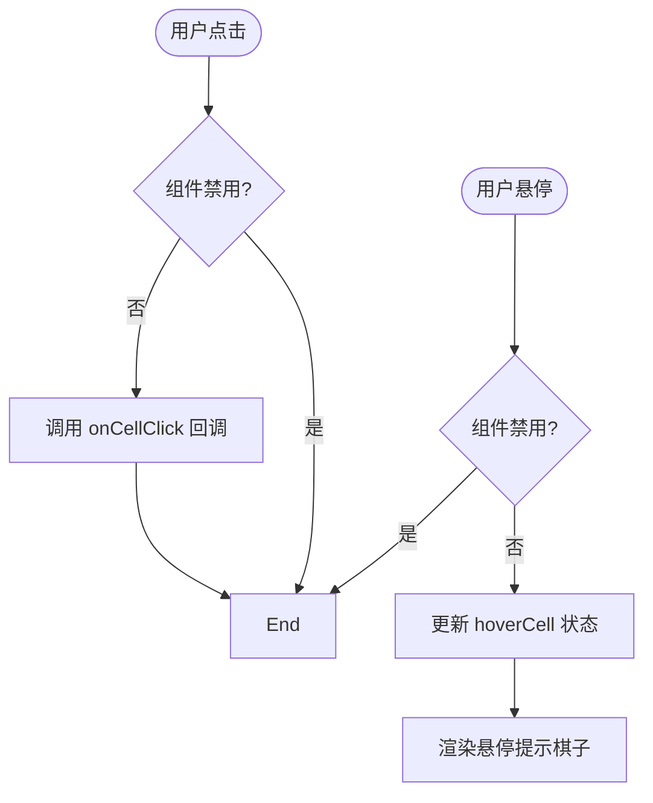
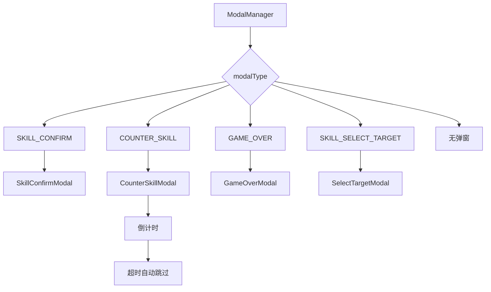
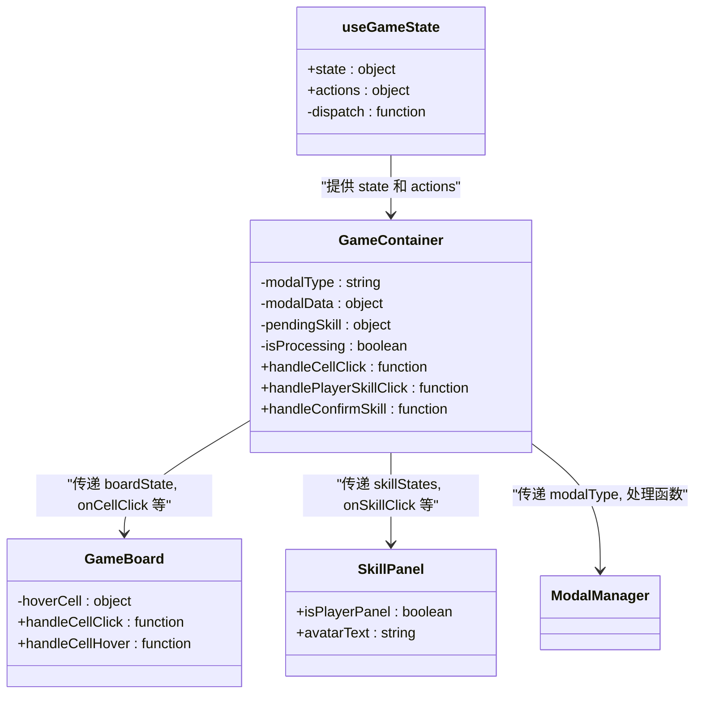
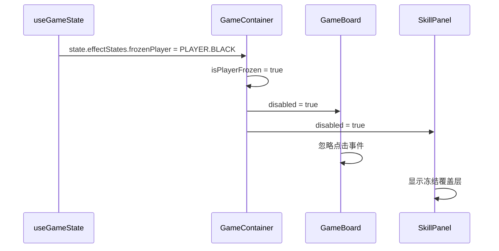

# 组件架构

<cite>
**Referenced Files in This Document**   
- [App.js](file://src/App.js)
- [GameContainer.js](file://src/components/GameContainer.js)
- [GameBoard.js](file://src/components/GameBoard.js)
- [SkillPanel.js](file://src/components/SkillPanel.js)
- [ModalManager.js](file://src/components/ModalManager.js)
- [useGameState.js](file://src/hooks/useGameState.js)
- [gameConstants.js](file://src/constants/gameConstants.js)
</cite>

## 目录
1. [组件层次结构](#组件层次结构)
2. [核心组件分析](#核心组件分析)
3. [组件间通信与状态管理](#组件间通信与状态管理)
4. [UI状态同步机制](#ui状态同步机制)
5. [组件树关系图示](#组件树关系图示)

## 组件层次结构

本系统采用自上而下的组件层次结构，以`App`组件为根节点，逐层向下传递状态与行为。整个应用的组件树遵循单一数据流原则，确保状态变更的可预测性和可追踪性。

```mermaid
graph TD
A[App] --> B[GameContainer]
B --> C[SkillPanel<br/>(AI技能面板)]
B --> D[GameBoard<br/>(游戏棋盘)]
B --> E[SkillPanel<br/>(玩家技能面板)]
B --> F[ModalManager<br/>(弹窗管理器)]
```

**Diagram sources**
- [App.js](file://src/App.js#L5-L11)
- [GameContainer.js](file://src/components/GameContainer.js#L16-L435)

**Section sources**
- [App.js](file://src/App.js#L5-L11)
- [GameContainer.js](file://src/components/GameContainer.js#L16-L435)

## 核心组件分析

### GameContainer 组件

`GameContainer`作为应用的核心协调中心，承担着状态管理、逻辑处理和组件协调的职责。它通过`useGameState` Hook获取全局游戏状态和操作方法，并根据游戏状态决定何时显示何种弹窗，以及如何处理AI的自动行为。

该组件通过多个`useEffect`监听器实现对游戏状态的响应式更新：
- 监听游戏阶段变化，自动触发游戏开始和结束流程
- 监听当前玩家变化，驱动AI自动执行回合
- 监听特殊效果状态，更新技能可用性

**Section sources**
- [GameContainer.js](file://src/components/GameContainer.js#L16-L435)

### GameBoard 组件

`GameBoard`组件负责棋盘的渲染与用户交互。它接收来自`GameContainer`的棋盘状态、当前玩家、最后落子位置和获胜连线等props，并将其转化为可视化的棋盘界面。

该组件实现了以下关键交互机制：
- **落子响应**：通过`onCellClick`回调处理用户点击，验证落子合法性后触发状态更新
- **悬停反馈**：通过`hoverCell`状态显示预落子位置的提示棋子
- **视觉反馈**：高亮显示获胜连线、最后落子位置和获胜棋子

特别地，当组件处于技能目标选择模式时（`selectingSkillTarget`），悬停提示会变为移除指示器，为"飞沙走石"等技能提供直观的目标选择反馈。



**Diagram sources**
- [GameBoard.js](file://src/components/GameBoard.js#L5-L152)

**Section sources**
- [GameBoard.js](file://src/components/GameBoard.js#L5-L152)

### SkillPanel 组件

`SkillPanel`组件用于展示玩家或AI的技能状态，并处理技能点击事件。它接收技能所有者、技能状态、点击回调和反制技能ID等props，实现个性化的技能面板渲染。

该组件的关键特性包括：
- **动态禁用**：当技能所有者被冻结时，除了解控技能"水滴石穿"外，其他技能均不可点击
- **反制提示**：当存在可反制的对手技能时，对应技能卡会显示特殊视觉提示
- **冻结覆盖层**：被冻结时显示半透明覆盖层和冻结动画，直观传达状态

技能面板通过`skillIds`数组遍历所有技能ID，为每个技能渲染一个`SkillCard`子组件，实现了代码的复用和维护的便利性。

**Section sources**
- [SkillPanel.js](file://src/components/SkillPanel.js#L6-L58)

### ModalManager 组件

`ModalManager`组件作为弹窗系统的中央管理器，根据当前`modalType`决定渲染何种弹窗。它不直接管理弹窗状态，而是通过props接收`modalType`和`modalData`，并传递相应的事件处理函数。

该组件实现了以下弹窗类型：
- **技能确认弹窗**：确认是否使用特定技能
- **反制技能弹窗**：在限定时间内决定是否反制对手技能
- **游戏结束弹窗**：显示游戏结果并提供重新开始选项
- **目标选择弹窗**：提示用户选择技能作用目标

通过将弹窗渲染逻辑集中在一个组件中，系统实现了弹窗行为的一致性和可维护性，同时避免了多个弹窗组件同时存在的混乱状态。



**Diagram sources**
- [ModalManager.js](file://src/components/ModalManager.js#L155-L207)

**Section sources**
- [ModalManager.js](file://src/components/ModalManager.js#L155-L207)

## 组件间通信与状态管理

### useGameState Hook

`useGameState`是整个应用的状态中枢，采用`useReducer`模式管理复杂的游戏状态。它返回当前`state`和一组`actions`，实现了状态与行为的清晰分离。

该Hook管理的核心状态包括：
- **棋盘状态**：15x15的二维数组，记录每个位置的棋子
- **游戏阶段**：准备、进行中、暂停、结束
- **技能状态**：每个技能的使用情况和可用性
- **效果状态**：冻结、被移除棋子、棋盘损坏等特殊状态

通过`actions`对象暴露的操作方法（如`placePiece`、`useSkill`、`switchPlayer`等），子组件可以安全地修改全局状态，而无需直接访问reducer。



**Diagram sources**
- [useGameState.js](file://src/hooks/useGameState.js#L493-L541)
- [GameContainer.js](file://src/components/GameContainer.js#L16-L435)

**Section sources**
- [useGameState.js](file://src/hooks/useGameState.js#L493-L541)

### 状态传递路径

从`GameContainer`到子组件的状态传递遵循严格的单向数据流：
1. `GameContainer`从`useGameState`获取`state`
2. 将相关状态片段作为props传递给子组件
3. 子组件通过回调函数通知`GameContainer`用户交互
4. `GameContainer`调用`actions`修改状态
5. 状态更新触发重新渲染，形成闭环

这种模式确保了状态变更的可预测性，任何UI变化都可以追溯到明确的状态变更。

## UI状态同步机制

### 冻结状态同步

当玩家或AI被"静如止水"技能冻结时，系统通过以下机制实现UI同步：
1. `effectStates.frozenPlayer`记录被冻结的玩家
2. `GameContainer`计算`isPlayerFrozen`和`isAIFrozen`布尔值
3. 将`disabled`和`isPlayerFrozen`作为props传递给`GameBoard`和`SkillPanel`
4. `GameBoard`根据`disabled`禁用点击交互
5. `SkillPanel`根据`disabled`显示冻结覆盖层，并禁用除"水滴石穿"外的所有技能



**Diagram sources**
- [useGameState.js](file://src/hooks/useGameState.js#L493-L541)
- [GameContainer.js](file://src/components/GameContainer.js#L16-L435)
- [GameBoard.js](file://src/components/GameBoard.js#L5-L152)
- [SkillPanel.js](file://src/components/SkillPanel.js#L6-L58)

### 技能反制机制

技能反制是系统中最复杂的交互流程，涉及多个组件的协同工作：
1. 玩家使用可被反制的技能（如"飞沙走石"）
2. `GameContainer`检测到反制可能性，设置`modalType`为`COUNTER_SKILL`
3. `ModalManager`渲染`CounterSkillModal`，启动5秒倒计时
4. AI根据策略决定是否反制，调用`handleCounterSkill`或`handleSkipCounter`
5. `GameContainer`调用`actions.counterSkill`或`actions.skipCounter`更新状态
6. 状态更新触发UI重新渲染，显示反制结果

**Section sources**
- [GameContainer.js](file://src/components/GameContainer.js#L16-L435)
- [ModalManager.js](file://src/components/ModalManager.js#L155-L207)
- [useGameState.js](file://src/hooks/useGameState.js#L493-L541)

## 组件树关系图示

以下是完整的组件树关系图，展示了各组件之间的层级和通信关系。

```mermaid
graph TD
subgraph "根组件"
A[App]
end
subgraph "核心协调层"
B[GameContainer]
end
subgraph "UI展示层"
C[SkillPanel<br/>(AI技能面板)]
D[GameBoard<br/>(游戏棋盘)]
E[SkillPanel<br/>(玩家技能面板)]
F[ModalManager<br/>(弹窗管理器)]
end
subgraph "状态管理层"
G[useGameState]
end
A --> B
B --> C
B --> D
B --> E
B --> F
G --> B : "提供 state 和 actions"
D --> B : "onCellClick"
E --> B : "onSkillClick"
F --> B : "各种处理函数"
style A fill:#f9f,stroke:#333
style B fill:#bbf,stroke:#333
style C fill:#f96,stroke:#333
style D fill:#9f9,stroke:#333
style E fill:#f96,stroke:#333
style F fill:#99f,stroke:#333
style G fill:#ff9,stroke:#333
```

**Diagram sources**
- [App.js](file://src/App.js#L5-L11)
- [GameContainer.js](file://src/components/GameContainer.js#L16-L435)
- [GameBoard.js](file://src/components/GameBoard.js#L5-L152)
- [SkillPanel.js](file://src/components/SkillPanel.js#L6-L58)
- [ModalManager.js](file://src/components/ModalManager.js#L155-L207)
- [useGameState.js](file://src/hooks/useGameState.js#L493-L541)