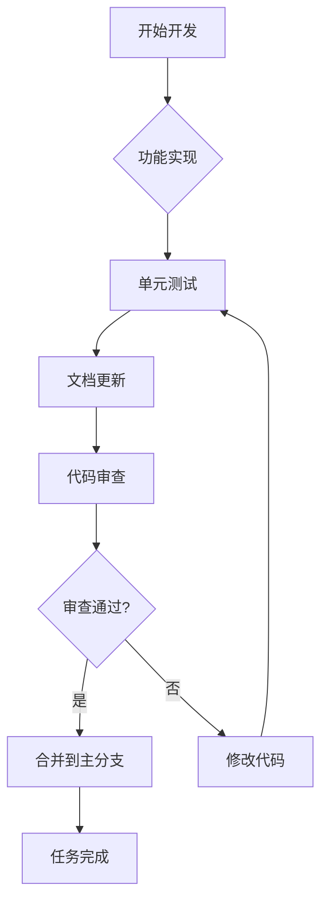
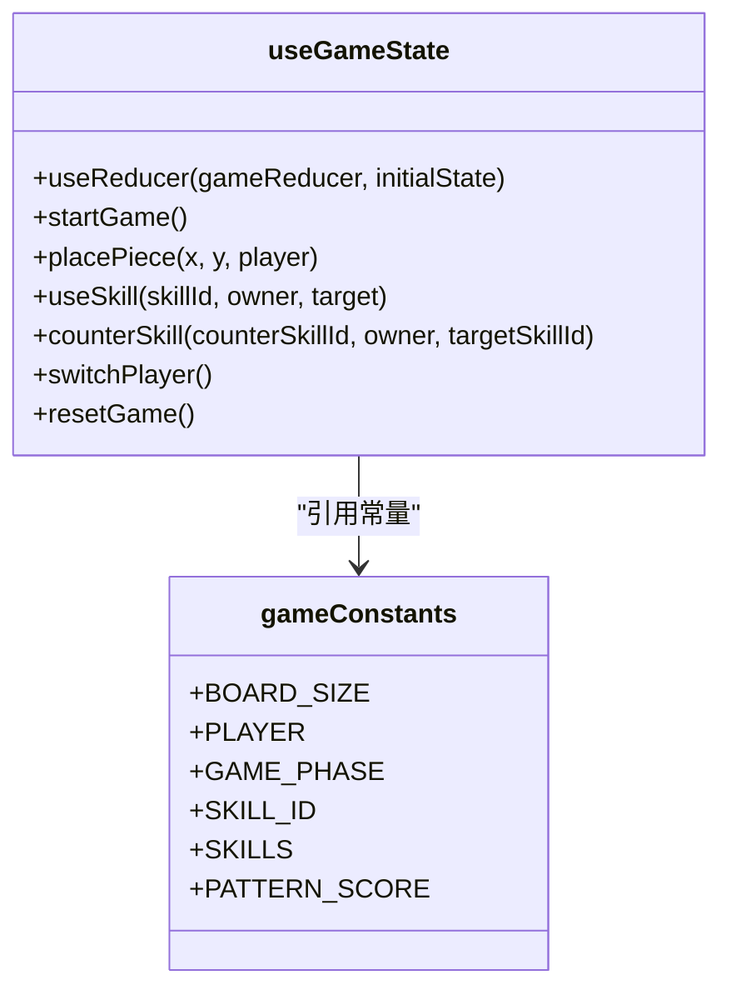

# 贡献指南

<cite>
**Referenced Files in This Document**   
- [FIX_REPORT.md](file://FIX_REPORT.md)
- [COMPLETION_REPORT.md](file://COMPLETION_REPORT.md)
- [README.md](file://README.md)
- [SKILL_RELATIONSHIPS.md](file://SKILL_RELATIONSHIPS.md)
- [src/hooks/useGameState.js](file://src/hooks/useGameState.js)
- [src/constants/gameConstants.js](file://src/constants/gameConstants.js)
</cite>

## 目录
1. [问题报告规范](#问题报告规范)
2. [功能请求提交方式](#功能请求提交方式)
3. [代码提交流程](#代码提交流程)
4. [任务完成标准](#任务完成标准)
5. [代码风格与质量要求](#代码风格与质量要求)
6. [社区协作建议](#社区协作建议)

## 问题报告规范

在提交问题报告时，请遵循 `FIX_REPORT.md` 文件中展示的规范格式。一个完整的问题报告应包含以下要素：

- **问题描述**：清晰说明问题现象和根本原因
- **修复内容**：详细列出代码修改点，包括文件路径和行号
- **技能关系梳理**：对于涉及技能系统的修改，需说明技能间的关系变化
- **关键修改点**：突出显示最重要的代码变更
- **用户体验改进**：描述修复前后用户体验的对比
- **测试验证**：提供具体的测试场景和预期结果
- **验证方法**：说明如何验证修复效果，包括控制台日志检查和UI状态检查

**Section sources**
- [FIX_REPORT.md](file://FIX_REPORT.md#L1-L203)

## 功能请求提交方式

功能请求应通过创建新的 `.md` 文档来提交，文档应包含以下内容：

- **功能描述**：详细说明新功能的目的和预期效果
- **设计思路**：阐述功能的实现原理和技术方案
 - **用户场景**：列举功能使用的典型场景
- **界面设计**：如有UI变更，提供设计草图或描述
- **技术影响**：分析新功能对现有代码结构的影响
- **依赖关系**：说明与其他功能或组件的关联

提交功能请求时，应在文档中明确指出需要修改的文件和代码位置，以便其他开发者评估实现难度和影响范围。

**Section sources**
- [README.md](file://README.md#L1-L211)
- [COMPLETION_REPORT.md](file://COMPLETION_REPORT.md#L1-L323)

## 代码提交流程

### 分支管理策略

采用基于功能的分支管理模型：

1. 从主分支创建功能分支，命名格式为 `feature/功能名称` 或 `fix/问题描述`
2. 在功能分支上进行开发和测试
3. 完成开发后，提交 Pull Request 进行代码审查

### Pull Request 审查流程

1. **创建 Pull Request**：
   - 明确描述变更目的和实现方式
   - 引用相关的问题报告或功能请求文档
   - 标注修改涉及的文件和关键代码段

2. **代码审查要点**：
   - 代码是否符合项目风格规范
   - 是否包含必要的单元测试
   - 文档是否同步更新
   - 是否影响现有功能的稳定性
   - 性能影响评估

3. **合并条件**：
   - 至少一名核心维护者批准
   - 所有自动化测试通过
   - 代码覆盖率达标
   - 文档更新完成

**Section sources**
- [COMPLETION_REPORT.md](file://COMPLETION_REPORT.md#L1-L323)
- [README.md](file://README.md#L1-L211)

## 任务完成标准

根据 `COMPLETION_REPORT.md` 中定义的任务完成标准，一个功能或修复任务必须满足以下条件才能视为完成：

- **功能完整性**：实现设计文档中描述的所有功能点
- **代码质量**：代码结构清晰，注释完善，遵循项目编码规范
- **测试覆盖**：核心功能经过充分测试，包含边界情况验证
- **文档同步**：更新相关文档，包括使用说明和技术文档
- **用户体验**：界面交互流畅，反馈及时，符合用户预期
- **性能要求**：不引入明显的性能瓶颈

对于技能系统相关的修改，特别需要验证技能间的克制关系是否正确实现，如 `SKILL_RELATIONSHIPS.md` 中所述的技能链条。

**Diagram sources**
- [COMPLETION_REPORT.md](file://COMPLETION_REPORT.md#L1-L323)
- [SKILL_RELATIONSHIPS.md](file://SKILL_RELATIONSHIPS.md#L1-L237)

**Section sources**
- [COMPLETION_REPORT.md](file://COMPLETION_REPORT.md#L1-L323)
- [SKILL_RELATIONSHIPS.md](file://SKILL_RELATIONSHIPS.md#L1-L237)

## 代码风格与质量要求

### 代码风格

建议代码风格遵循项目现有规范，主要特点包括：

- **命名规范**：采用驼峰命名法，变量和函数名具有明确语义
- **代码组织**：逻辑相关的代码集中放置，使用空行分隔不同功能块
- **注释要求**：关键算法和复杂逻辑需添加详细注释
- **模块化设计**：功能分离到独立的文件和组件中

### 质量要求

- **单元测试**：核心功能必须有相应的单元测试覆盖
- **文档同步**：代码变更必须同步更新相关文档
- **性能优化**：避免不必要的计算和渲染
- **可维护性**：代码结构清晰，便于后续修改和扩展

特别强调，在修改状态管理逻辑时，如 `useGameState.js` 中的 reducer 函数，必须确保状态转换的纯函数性和可预测性。

**Diagram sources**
- [src/hooks/useGameState.js](file://src/hooks/useGameState.js#L1-L543)
- [src/constants/gameConstants.js](file://src/constants/gameConstants.js#L1-L182)

**Section sources**
- [src/hooks/useGameState.js](file://src/hooks/useGameState.js#L1-L543)
- [src/constants/gameConstants.js](file://src/constants/gameConstants.js#L1-L182)

## 社区协作建议

鼓励社区协作，建立可持续的维护生态。建议：

- **积极沟通**：在提出重大变更前，先在社区讨论达成共识
- **代码共享**：分享优秀的实现方案和设计模式
- **知识传承**：为新贡献者提供指导和帮助
- **持续改进**：定期回顾项目发展，优化开发流程

通过建立良好的社区文化，确保项目能够长期健康发展，吸引更多开发者参与贡献。

**Section sources**
- [README.md](file://README.md#L1-L211)
- [COMPLETION_REPORT.md](file://COMPLETION_REPORT.md#L1-L323)