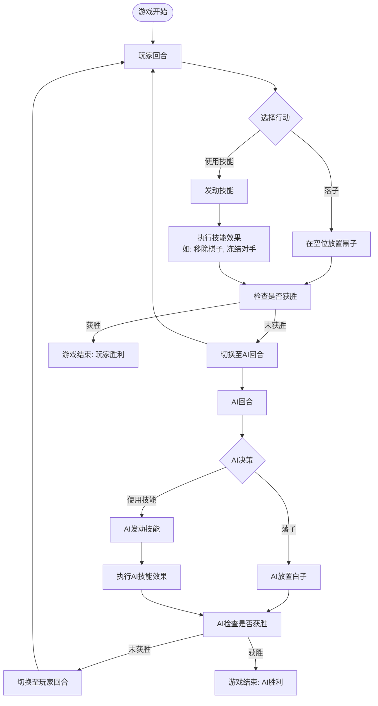
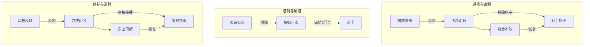

# 项目概述

<cite>
**Referenced Files in This Document**   
- [README.md](file://README.md)
- [PROJECT_SUMMARY.md](file://PROJECT_SUMMARY.md)
- [App.js](file://src/App.js)
- [GameContainer.js](file://src/components/GameContainer.js)
- [useGameState.js](file://src/hooks/useGameState.js)
- [gameConstants.js](file://src/constants/gameConstants.js)
- [GameBoard.js](file://src/components/GameBoard.js)
- [SkillPanel.js](file://src/components/SkillPanel.js)
- [SkillCard.js](file://src/components/SkillCard.js)
- [ModalManager.js](file://src/components/ModalManager.js)
- [aiUtils.js](file://src/utils/aiUtils.js)
</cite>

## Table of Contents
1. [项目定位与核心创新](#项目定位与核心创新)
2. [游戏基本流程与核心玩法](#游戏基本流程与核心玩法)
3. [技能系统与克制机制](#技能系统与克制机制)
4. [技术选型与架构设计](#技术选型与架构设计)
5. [系统设计全景图](#系统设计全景图)

## 项目定位与核心创新

本项目是一款基于React框架构建的前端单页应用（SPA），其核心定位是在经典五子棋游戏的基础上，通过引入创新的技能系统，极大地提升游戏的策略深度和趣味性。该项目成功地将传统棋类游戏的静态规则与现代角色扮演游戏（RPG）的动态技能机制相结合，创造出一种全新的对战体验。

项目的核心创新在于“技能五子棋”这一概念。它保留了传统五子棋15x15棋盘、五子连珠获胜的基本规则，但在此之上叠加了一套完整的技能系统。玩家和AI在对战过程中，除了常规的落子策略外，还可以使用八种各具特色的技能，这些技能能够直接影响棋盘状态、改变游戏规则或直接决定胜负，从而将一场简单的棋局演变为一场充满变数和心理博弈的战术对决。

**Section sources**
- [README.md](file://README.md#L1-L210)
- [PROJECT_SUMMARY.md](file://PROJECT_SUMMARY.md#L1-L251)

## 游戏基本流程与核心玩法

游戏的基本流程遵循标准的回合制对战模式。玩家执黑先行，与AI（白子）进行对抗。游戏的主要目标依然是在横、竖或斜方向上形成五子连线以获胜。当棋盘被填满且无任何一方获胜时，游戏判定为平局。

游戏的核心玩法围绕着“落子”与“用技能”两大行动展开。每回合，玩家可以选择在棋盘的任意空位落子，或者使用一个技能。使用技能不消耗落子机会，这为玩家提供了极大的策略灵活性。例如，玩家可以在自己的回合先使用“飞沙走石”移除AI的关键棋子，然后再进行落子，从而实现一次行动完成攻防转换。

AI对手的设计达到了中等难度，具备智能决策能力。它不仅能识别基本的攻防形势，优先防守玩家的获胜威胁，还能根据局势自主判断是否使用技能以及使用何种技能。例如，当AI检测到玩家即将形成“活四”时，它会优先使用“静如止水”冻结玩家两回合，为自己争取扭转局势的时间。



**Diagram sources**
- [GameContainer.js](file://src/components/GameContainer.js#L16-L435)
- [useGameState.js](file://src/hooks/useGameState.js#L493-L541)

**Section sources**
- [README.md](file://README.md#L30-L50)
- [PROJECT_SUMMARY.md](file://PROJECT_SUMMARY.md#L50-L100)

## 技能系统与克制机制

本项目最核心的创新点是其精心设计的八种技能系统，以及技能之间存在的复杂克制与联动关系。每个技能在单局游戏中只能使用一次，且每回合只能发动一个技能，这要求玩家必须审慎地选择使用时机。

### 八大核心技能

1.  **飞沙走石 (进攻型)**：允许玩家移除AI棋盘上的一颗棋子，用于破坏AI的进攻或防守阵型。
2.  **拾金不昧 (防御型)**：用于恢复被“飞沙走石”移除的己方棋子，是一种重要的防御和补救手段。
3.  **擒擒拿拿 (反制型)**：当AI使用“飞沙走石”时，玩家可以立即使用此技能进行反制，阻止其生效。
4.  **静如止水 (控制型)**：使对手（AI）在接下来的两个回合内无法行动，是强大的控场技能。
5.  **水滴石穿 (解控型)**：用于解除“静如止水”带来的冻结效果，是唯一的解控手段。
6.  **力拔山兮 (终结型)**：一种高风险高回报的技能，可以直接“摔坏棋盘”并获胜。
7.  **两极反转 (克制型)**：当AI使用“力拔山兮”时，玩家可以使用此技能进行反制，阻止其获胜。
8.  **东山再起 (复活型)**：用于恢复被“力拔山兮”摔坏的棋盘，使游戏得以继续。

### 技能克制关系

技能之间并非孤立存在，而是构成了一个精妙的克制网络，极大地增加了游戏的博弈深度。这种关系可以概括为“反制”和“恢复”两种类型：

-   **反制关系**：`飞沙走石` ←→ `擒擒拿拿`，`力拔山兮` ←→ `两极反转`。当一方使用技能时，另一方若拥有对应的反制技能，系统会弹出倒计时窗口，允许其在限定时间内进行反制。
-   **恢复关系**：`飞沙走石` → `拾金不昧`，`力拔山兮` → `东山再起`。这些技能的效果可以被后续的“恢复”技能撤销，形成了“破坏-重建”的循环。



**Diagram sources**
- [gameConstants.js](file://src/constants/gameConstants.js#L57-L127)
- [ModalManager.js](file://src/components/ModalManager.js#L155-L207)

**Section sources**
- [README.md](file://README.md#L55-L150)
- [PROJECT_SUMMARY.md](file://PROJECT_SUMMARY.md#L100-L150)

## 技术选型与架构设计

项目采用React 18作为核心前端框架，充分利用了其组件化和声明式UI的优势。在状态管理方面，项目没有使用第三方库（如Redux），而是采用了React内置的`useReducer` Hook来构建一个集中式的状态管理系统，这体现了现代React应用的最佳实践。

### React Hooks架构优势

技术选型的核心是React Hooks架构，其优势体现在以下几个方面：
1.  **状态集中管理**：通过`useGameState`自定义Hook，将游戏的所有状态（棋盘、玩家、技能、效果等）统一管理，确保了状态的一致性和可预测性。
2.  **逻辑复用**：自定义Hook（如`useGameState`）将复杂的业务逻辑从组件中抽离，实现了逻辑的复用和封装，使得`GameContainer`等组件更加简洁。
3.  **性能优化**：广泛使用`useCallback`来缓存事件处理函数，避免了因父组件重新渲染而导致子组件不必要的重渲染，提升了应用性能。
4.  **代码可维护性**：Hooks使得代码更加函数式和模块化，相较于传统的类组件，代码更易于理解和维护。

### 核心组件交互

项目的UI由多个高度模块化的组件构成，它们通过props和回调函数进行通信：
-   **App.js**：应用的根组件，负责渲染`GameContainer`。
-   **GameContainer.js**：游戏的主容器，是整个应用的“大脑”。它通过`useGameState`获取状态和操作方法，并协调`GameBoard`、`SkillPanel`和`ModalManager`等子组件。
-   **GameBoard.js**：负责渲染15x15的棋盘，处理玩家的落子和技能目标选择。
-   **SkillPanel.js** 和 **SkillCard.js**：分别负责渲染技能面板和单个技能卡片，展示技能状态（可用、已用、可反制等）。
-   **ModalManager.js**：统一管理所有弹窗，如技能确认、反制倒计时和游戏结束提示。

```mermaid
classDiagram
class App {
+render()
}
class GameContainer {
-state : GameState
-actions : GameActions
-modalType : string
+useGameState() : {state, actions}
+handleCellClick()
+handlePlayerSkillClick()
+handleAITurn()
}
class GameBoard {
+boardState
+onCellClick()
+renderPiece()
}
class SkillPanel {
+skillStates
+onSkillClick()
}
class SkillCard {
+skillId
+skillState
+onClick()
}
class ModalManager {
+modalType
+onConfirmSkill()
+onCounterSkill()
}
class useGameState {
-state : object
-dispatch : function
+startGame()
+placePiece()
+useSkill()
+counterSkill()
+switchPlayer()
}
App --> GameContainer : "renders"
GameContainer --> GameBoard : "passes props"
GameContainer --> SkillPanel : "passes props"
GameContainer --> ModalManager : "passes props"
GameContainer --> useGameState : "uses"
SkillPanel --> SkillCard : "renders multiple"
useGameState ..> GameContainer : "provides state/actions"
```

**Diagram sources**
- [App.js](file://src/App.js#L1-L14)
- [GameContainer.js](file://src/components/GameContainer.js#L16-L435)
- [useGameState.js](file://src/hooks/useGameState.js#L493-L541)

**Section sources**
- [PROJECT_SUMMARY.md](file://PROJECT_SUMMARY.md#L200-L251)
- [useGameState.js](file://src/hooks/useGameState.js#L1-L542)

## 系统设计全景图

整个系统的设计思想是“状态驱动”。游戏的所有行为和UI变化都源于`useGameState`中`state`对象的变更。当玩家落子或使用技能时，会调用`actions`中的相应方法，这些方法会`dispatch`一个action到`gameReducer`。`gameReducer`是一个纯函数，它根据action的类型和当前state，计算出一个新的state对象。

这种设计模式（类似于Redux）确保了应用状态的不可变性和可追溯性。UI组件（如`GameBoard`和`SkillPanel`）作为“观察者”，只负责根据最新的`state`来渲染界面。当`state`更新时，React会自动触发UI的重新渲染，从而保证了视图与状态的同步。

AI的决策逻辑被封装在`aiUtils.js`中，它接收当前的游戏状态作为输入，通过评估棋型、检测威胁等方式，输出最佳的落子位置或技能使用决策。`GameContainer`在AI回合时调用这些工具函数，并将决策结果通过`actions`应用到全局状态中。

综上所述，该项目通过清晰的组件分层、集中的状态管理和智能的AI算法，构建了一个功能完整、交互流畅且策略丰富的技能五子棋游戏。其架构设计既保证了代码的可维护性，也为未来的功能扩展（如添加音效、更多技能或多人对战）奠定了坚实的基础。

**Section sources**
- [useGameState.js](file://src/hooks/useGameState.js#L1-L542)
- [aiUtils.js](file://src/utils/aiUtils.js#L1-L275)
- [GameContainer.js](file://src/components/GameContainer.js#L16-L435)